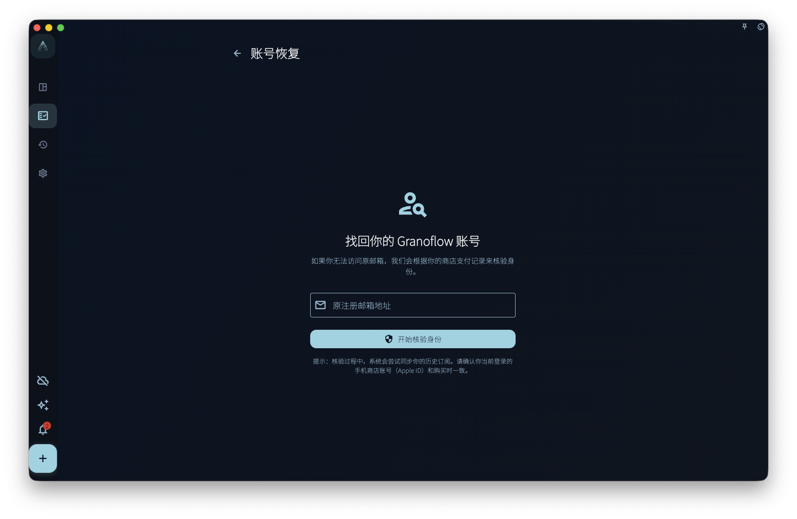

如果你在 App Store 或 Google Play 买过 GranoFlow 会员，但当前账号看不到会员权益，账号恢复可以帮你提交一次核对申请：系统会检查商店购买记录和你填写的邮箱是否能对应上。

账号恢复只处理“购买记录可能连错账号”这个问题。它不是删除账号、退出登录、恢复购买、恢复本地数据，或找回加密密钥的入口。

<!-- manual-screenshot:id=account-recovery-main -->

## 什么时候用账号恢复

适合使用账号恢复的情况：

- 你确定自己曾经在 App Store 或 Google Play 购买过 GranoFlow
- 你现在登录的账号看不到会员权益
- 你不确定当时注册或绑定的是哪个邮箱

不适合使用账号恢复的情况：

- 你只是想恢复当前平台的订阅：请使用“恢复购买”
- 你的本地数据丢失了：请查看“备份与恢复”
- 你想找回加密密钥：请查看“加密与恢复密钥”

## 操作步骤

1. 在登录页面或账号相关页面找到“账号恢复”链接。
2. 填写你希望用来核对的邮箱。
3. 确认这台设备可以访问当时购买 GranoFlow 的 App Store 或 Google Play 账号。
4. 提交申请，然后按照页面提示等待核对结果，或查看相关邮件。

## 可能的结果

| 结果 | 含义 |
| --- | --- |
| 申请已提交 | 系统已经收到申请。请按页面提示等待，或查看邮件 |
| 没有历史记录 | 当前平台下找不到可用于核对的购买记录 |
| 记录不匹配 | 商店购买记录和你填写的邮箱无法通过当前校验连接起来 |
| 暂时失败 | 网络或服务暂时不可用。你可以稍后重试 |

:::caution[别急着删数据]
如果你怀疑自己登录了错误账号，**先不要删除本机数据**。先确认当前登录邮箱，再检查订阅页和设备管理。
:::
