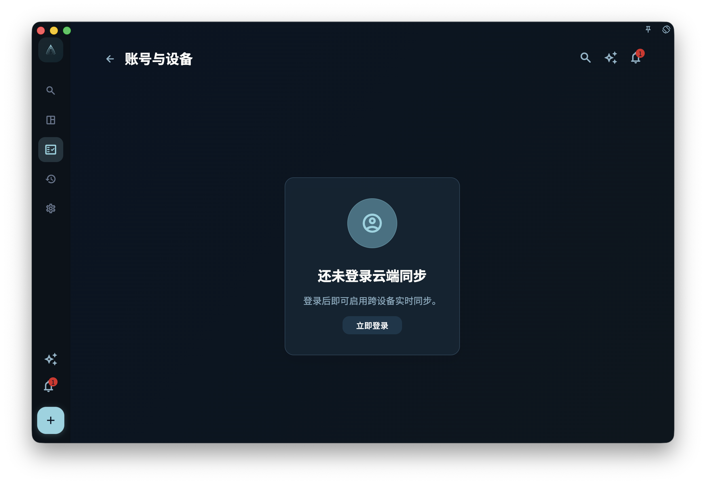

注册和登录听起来简单，但 GranoFlow 用的是"无密码登录"——没有你平时熟悉的用户名+密码，而是通过邮件链接验证身份。

## 怎么登录

1. 输入你的邮箱地址
2. 去邮箱找验证邮件，点击里面的链接
3. 回到 GranoFlow，登录完成

没有密码，不用记，也不用担心忘记。

## 为什么要用同一个邮箱

同步、设备识别、订阅权益都绑定在你的账号（也就是邮箱）上。如果你在手机用 `a@gmail.com` 登录，在电脑用 `b@gmail.com` 登录，它们是**两个独立账号**，数据互不共享。

## 未登录时的情况

不登录也可以用 GranoFlow——任务、日记、所有功能都正常工作。  
但以下功能需要登录：

- 跨设备同步
- 会员订阅识别
- 云端加密备份

## 退出登录会怎样

退出登录**不会删除本机的任何数据**。你的所有 tasks、日记、项目都还在，只是下次再用需要重新登录。

:::note[邮件找不到？]
验证邮件有时会进垃圾邮件，先去那里找找。如果 5 分钟还没收到，可以重新发送。
:::
