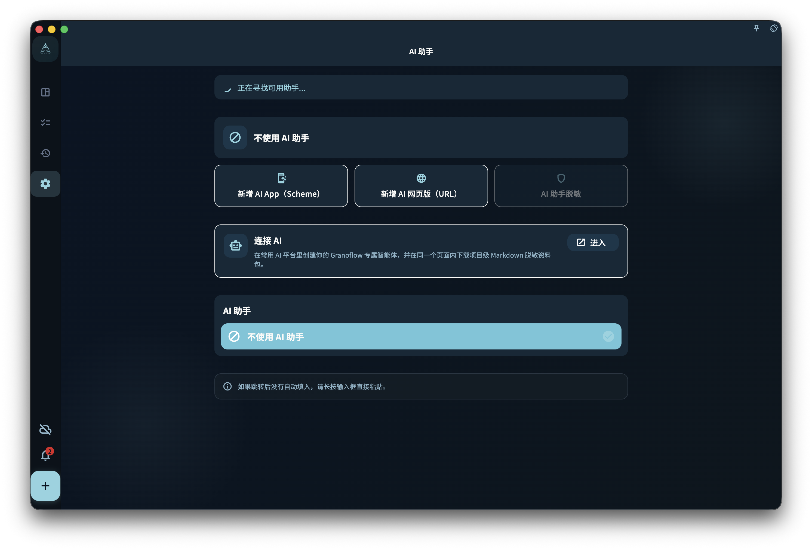

想象你刚开完会，议事录复制到了剪贴板，里面有一堆"要做的事"。剪贴板助手可以帮你把这些文字整理成一张任务清单，你确认后再写入。

## 怎么用

1. 先复制你想整理的内容（会议纪要、邮件片段、随手记……）
2. 打开 GranoFlow 的剪贴板助手入口
3. AI 会分析内容，提取出它认为是"待办事项"的部分
4. 你看一下预览，调整或确认
5. 写入任务

## 什么内容适合用

- 会议纪要里的行动项
- 邮件里需要跟进的事
- 聊天记录里答应过别人的事
- 笔记里的随手待办

## 注意事项

- AI 整理的是它「理解」出来的任务，可能有误判，比如把背景说明当成待办
- 确认前一定要看一遍预览
- 内容不会在后台自动发送，只有主动触发才进入处理流程

:::tip[不想发整段文字？]
可以先删掉剪贴板里不相关的内容，只保留你真正想整理的部分，再触发助手。
:::
