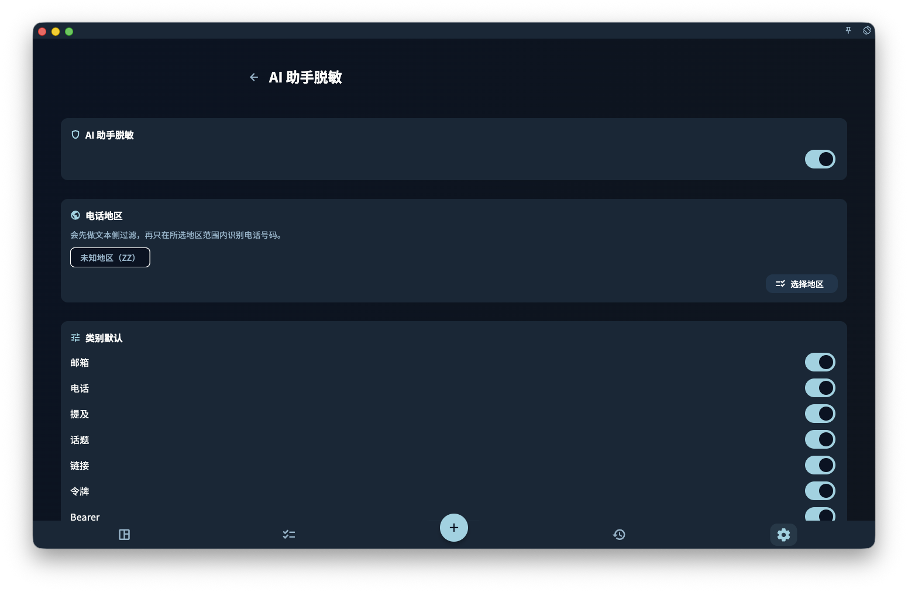

如果你只是浏览任务、写日记、做回顾，GranoFlow 不会把这些内容发给 AI。只有当你主动点了某个 AI 功能时，和这次操作有关的文本才可能进入 AI 处理流程。

<!-- manual-screenshot:id=ai-redaction-settings -->

## 不同功能会发送什么

| AI 功能 | 可能发送的内容 |
| --- | --- |
| 标题解析 | 你当前正在输入的任务标题 |
| 剪贴板助手 | 你复制到剪贴板的文字 |
| Helper 提示词 | 当前页面的说明 + 你设置的提示词 |
| 任务助手 | 当前任务的标题、状态、截止日期、提醒、任务回顾、标签、描述摘要、附件名称摘要、节点、所属项目 / 里程碑摘要、资料包摘要，以及这条任务已关联的卡片摘要 |
| 回顾 AI 整理 | 你这次触发整理的回顾内容 |

任务助手不会默认发送当前专注会话、哪条任务被置顶、任务详情按钮是否可点这类页面运行状态。它看到的是任务内容和上下文；如果你只是想问任务详情里的“专注”“完成”“当前任务”是什么意思，更适合用该页面的 Helper 提示词。

## AI 脱敏设置有什么用

AI 脱敏设置只影响内容发出前的替换，不代表 AI 会自动判断所有敏感信息。

这里有四个关键项：

- **总开关**：关闭后，GranoFlow 不会执行出站脱敏替换。
- **类别默认策略**：当系统按规则发现邮箱、链接、日期、长数字、金额、银行卡、IBAN 等内容时，默认处理为「脱敏」或「允许」；电话默认允许，可以按需要开启。
- **电话、数字和金额配置**：电话开启后可以选择识别地区，地区选择器支持搜索地区名、英文名、代码或电话区号；电话区号只帮助你找到地区，实际识别按你保存的地区选择执行。数字可以设置最少位数和替换成「数字」或「编号」；金额可以选择是否识别符号/货币代码和中文大写金额，并设置替换成「金额」或「数额」。
- **脱敏词管理**：维护你手动确认的固定「敏感词 → 代号」规则，例如客户名、公司名或项目代号。

自动发现只是规则辅助，不是智能审查。它可能漏掉特殊写法，也可能把普通数字误判为敏感内容。类别默认策略为「脱敏」时，自动发现值会临时替换成更容易读懂的短期脱敏值，例如 `13xxxxx4821`、`foxxxx3920@1846.com`、`2026-08-17`、`192.43.18.206`，并在 AI 返回后尝试还原；它不会自动写进你的长期脱敏词表。**发送前仍需要你自己检查。**

## 自动脱敏值长什么样

规则型自动发现会尽量保留类型形状，让 AI 能判断它看到的是电话、邮箱、链接、日期、金额、银行卡、IBAN、IP、MAC、token 或文件路径。

- 数字、电话、银行卡和类似账号：6 位及以上保留前两位真实数字，中间用 `x`，最后 4 位用短期稳定随机数字；不足 6 位会替换成同长度随机数字。
- 金额：保留币种或金额标记，并保留大致金额量级，便于 AI 做粗略分析，但不会保留精确金额。
- 日期：保留年份，月份和日期替换成合法随机值。
- 邮箱和链接：保留可识别结构，域名会变成短期随机数字域名，例如 `1846.com`。
- 路径：保留常见结构词和扩展名，其他片段替换成随机字母。

AI 请求包和本地 HTTP AI 助手导出结果还会带 `isRedacted` 和 `redactionReason`。`isRedacted: true` 表示这次请求已完成脱敏流程；`false` 表示脱敏被关闭、请求包无法确认或缺少脱敏元数据，具体原因会写在 `redactionReason` 里。

## 脱敏词会做什么

你在「脱敏词管理」里维护的词表，会在内容发出前按你设置的代号自动替换。具体用法请看「脱敏词」页面。

## 一句话总结

> GranoFlow 的 AI 只在你主动触发功能时才涉及数据；不会后台采集，不会自动上传，发送范围只限当前功能需要处理的相关文本。
