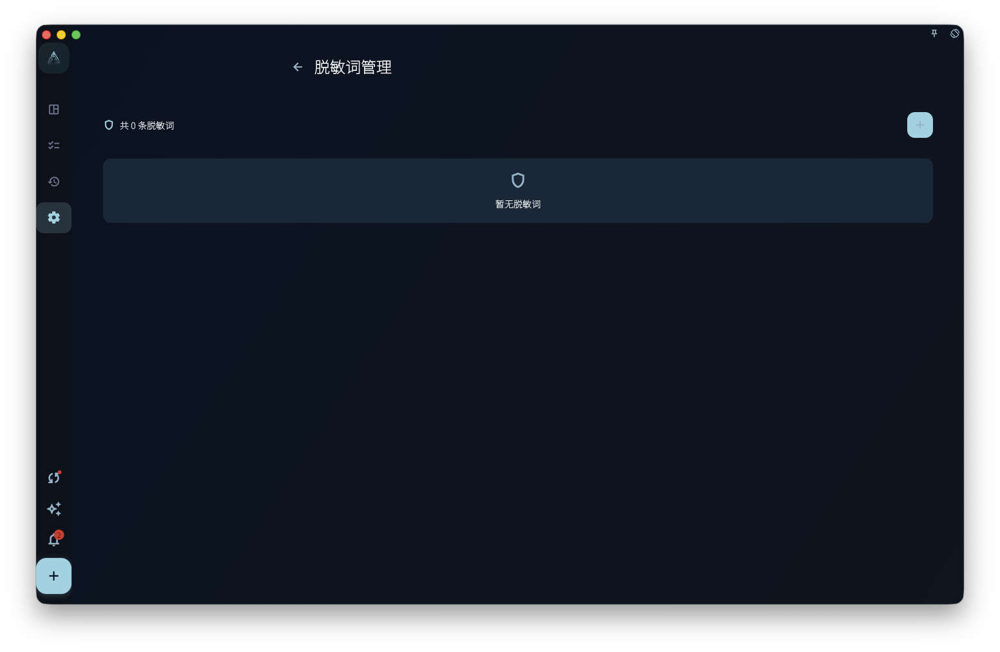

如果你不想把客户名、公司名、项目代号等原文直接发给外部 AI，可以把它们加到「脱敏词」里。GranoFlow 会在发送给外部 AI 之前，按你设置的规则把敏感词替换成代号，例如把「客户A公司」替换成 `CLIENT_A`；AI 返回结果后，GranoFlow 会尝试把代号还原回来。

这张表只保存你手动维护的固定替换规则。系统按规则自动发现的邮箱、金额、链接、日期、长数字、银行卡、IBAN、电话等内容，会按 AI 脱敏设置里的类别默认策略临时替换成 `EMAIL_1`、`MONEY_1`、`ID_1` 这类短期代号，不会自动写进这里的长期词表。

<!-- manual-screenshot:id=ai-redaction-terms-settings -->

## 适合添加什么词

适合添加的是那些你经常会写进内容里、但不希望原样发给外部 AI 的固定词语：

- 客户名、公司名
- 项目代号，例如「猎鹰计划」这类内部叫法
- 固定邮箱、固定地址
- 合同金额、账号信息
- 其他你认为不适合直接暴露给外部 AI 的常用词

## 添加词条的步骤

1. 打开「设置 → AI 脱敏 → 脱敏词管理」。
2. 新增一条词条。
3. 在「敏感词」里填写原文，例如「客户A公司」。
4. 在「代号」里填写替换后的占位符，例如 `CLIENT_A` 或 `PROJECT_X`。
5. 保存。下次使用 AI 功能并需要发送内容时，这条规则会自动生效。

即使截图无法显示，你也只需要记住：一条脱敏词就是一组「原文 → 代号」规则。

## 脱敏 vs 允许

每个词条有两个状态：

- **脱敏**：发送给外部 AI 之前，GranoFlow 会把敏感词替换成代号；AI 返回后，会尝试把代号还原。
- **允许**：GranoFlow 不会替换这个词。适合你确认这个词不敏感、不需要脱敏的情况。

如果你不确定，先用「脱敏」更稳妥；如果你确认某个词可以原样发送，再设为「允许」。

## 这能保证绝对安全吗

不能。脱敏词是辅助工具，不是安全保证。

它有这些边界：

- 可能漏掉缩写、别名、错别字或其他变体写法。
- 只处理你已经设置的固定词；规则型自动发现会走短期代号，不会替你维护长期词表。
- 外部 AI 收到脱敏后的内容后，GranoFlow 无法控制外部 AI 如何处理这些内容。

发送重要内容前，仍然建议你手动检查一遍。

:::tip[会员功能]
脱敏词是会员专属功能。非会员可以查看界面，但无法自定义编辑。
:::
