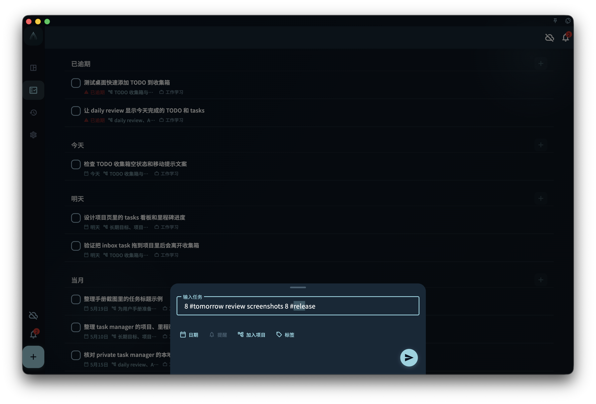

你有没有这种感觉：任务标题写着"明天下午三点和张总开会 #工作"，但还要手动去设截止日期、加标签、加提醒——明明刚才都写进去了。

标题解析就是为了解决这个问题的。

## 标题解析能识别什么

GranoFlow 在你输入任务标题时，会尝试识别里面的结构化信息：

- **时间表达**：今天、明天、下周三、3月15日、下午三点……
- **标签**：#工作 #个人 之类的井号标签
- **项目提及**：自动匹配你已有的项目名称
- **提醒触发词**：提醒我、别忘了、记得……之类的措辞

## 识别后发生什么

AI 识别到这些信息后，会以建议的形式显示出来，**不会自动写入**。你可以：

- ✅ 接受全部建议
- ✅ 只接受部分（比如只加标签，不加日期）
- ✅ 忽略建议，保持原样输入

没有确认的建议不会对任务产生任何影响。

## 识别不准怎么办

AI 识别是基于规则和模型的，不是100%准确。如果某个词被误识别了：

- 直接忽略该建议，不接受就不会写入
- 在任务详情里手动调整字段

:::note[英文日期表达也能识别]
标题里写 "tomorrow 3pm" 或 "next Monday" 也能被识别，不必一定用中文。
:::
