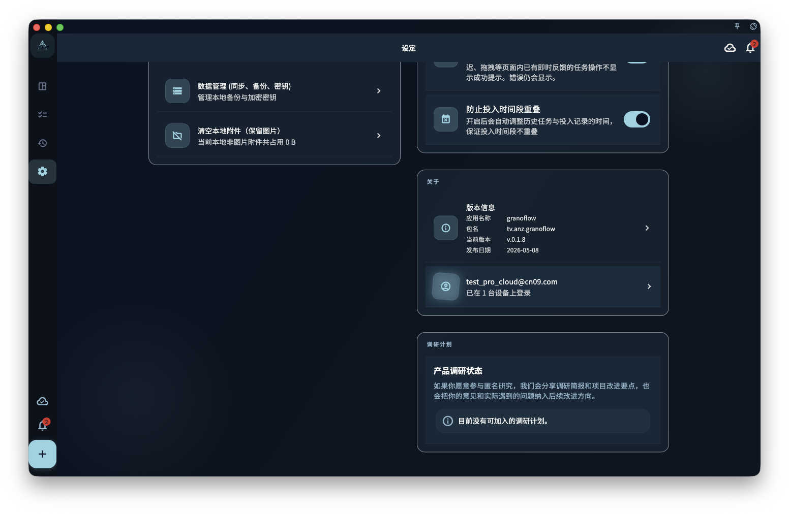

在任务或回顾里附上图片，这些图片会和任务一起保存——但图片的存储和同步方式和文字任务有一些不同。

## 图片和文字的存储区别

- **文字任务**：存储体积小，同步快，本地和云端几乎实时保持一致
- **图片附件**：体积大，同步慢，可能在文字已经同步后还在传输中

这意味着：你在一台设备上看到任务已经同步了，但图片可能还需要等一会儿才能在另一台设备上显示。

## 删除图片附件

删除图片有两种层级：

- **从任务移除**：删除任务和图片的关联，但本地文件可能仍然保留
- **清除附件缓存**：删除这台设备上存储的附件文件，释放空间

清除缓存后，如果云端仍有备份，图片可以重新下载；如果图片从未成功上传，清除后就找不回来了。

## 备份包含图片吗

本地备份通常只包含文字数据（任务、项目、回顾记录等），**不一定包含图片文件**。图片的长期保存需要云端同步处于正常状态。

:::note[图片上传需要网络]
图片不会离线上传。在地铁里拍了一张照片附到任务，这张图的云端上传会等到下次有网络时才完成。
:::
