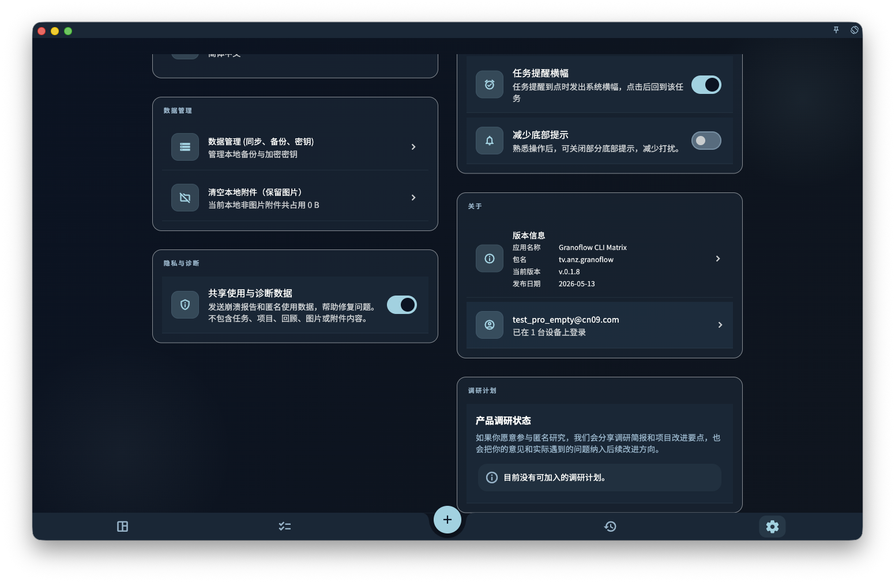
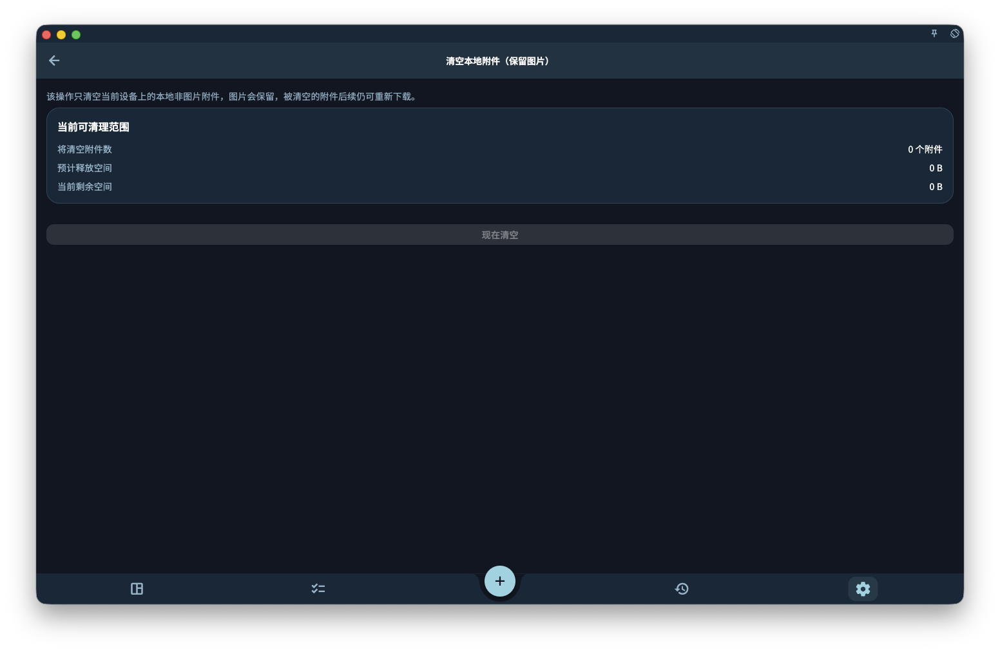

如果你担心图片会不会跟任务一起安全保存，先记住一句话：文字任务和图片附件是分开存储、分开同步的。文字可能已经到另一台设备，图片还在上传；清空本地附件只清这台设备上的附件文件，如果图片从未成功上传，清掉后就找不回来了。

## 图片和文字有什么不同

- **文字任务**：内容小，同步快，通常很快就能在本地和云端保持一致
- **图片附件**：文件大，同步慢，可能在文字任务已经同步后还没有传完

所以，你在另一台设备上看到任务已经出现，但图片暂时没有显示，不一定是任务丢了。通常先等网络稳定，再给图片一些上传和下载时间。

## 删除图片附件是什么意思

删除图片相关内容时，要分清两件事：

- **从任务移除**：只是不再让这个任务关联这张图片；这台设备上的本地文件可能还在
- **清除附件缓存**：删除这台设备上保存的附件文件，用来释放本地存储空间

清除附件缓存以后，如果图片之前已经成功上传到云端，之后通常可以重新下载。可是，如果图片从来没有成功上传，清除本地附件后就没有可恢复的来源。

## 本地备份会包含图片吗

本地备份通常只包含文字数据，比如任务、项目、回顾记录等，**不一定包含图片文件**。如果你需要图片长期保留，关键是让云端同步处于正常状态，并确认图片有机会在有网络时完成上传。

:::note[图片上传需要网络]
图片不会离线上传。比如你在地铁里拍了一张照片并附到任务上，这张图片要等到下次有网络时才会继续上传到云端。
:::
