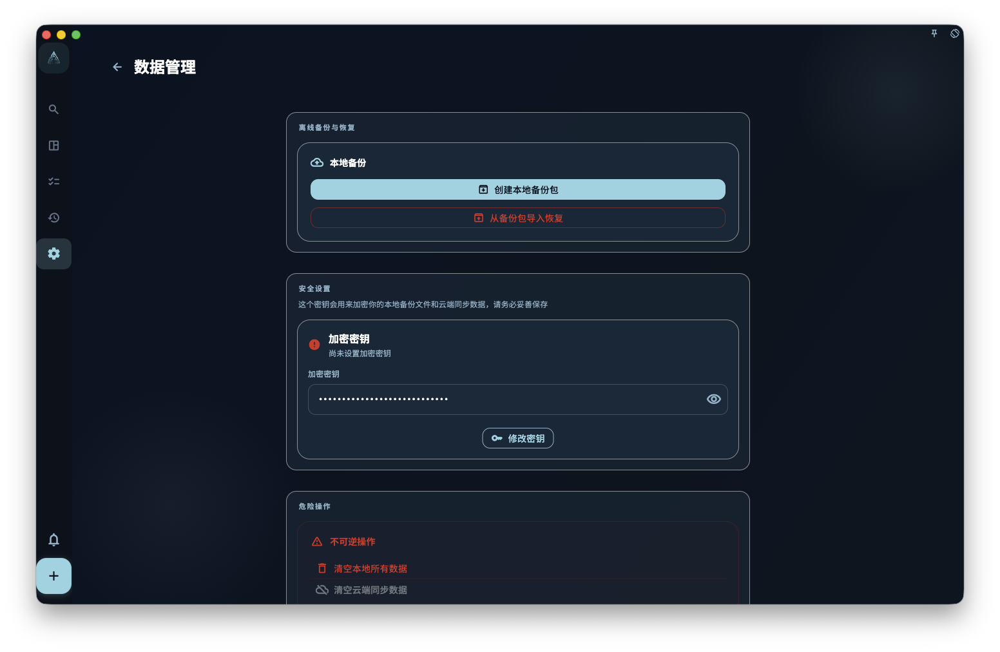

当你准备换设备、重装系统、删除大量内容，或者只是想在一个重要阶段结束后留下可回退的副本时，应该先创建一份本地备份。它不是后台自动发生的同步，而是你主动导出的 `.flow.grano` 文件。这个文件会保存当时这台设备上可打包的数据和附件，并用数据密钥加密。

这里最容易误解的一点是：备份不是“另一个同步按钮”。同步追求多台设备保持当前一致；备份保存的是一个时间点。同步可以让新任务出现在另一台设备上，但如果你误删了任务，删除也会同步过去。备份的价值正好相反：它让你在重要操作前留下一份你自己控制的安全副本。

<!-- manual-screenshot:id=data-backup-restore-management -->

## 先记住一件事：文件和数据密钥要一起保存

本地备份包会被加密。创建备份前，GranoFlow 会先显示“数据密钥”，默认用掩码隐藏；你可以点眼睛图标查看。只有勾选“我已抄录数据密钥并妥善保存”后，才能开始备份。

这个确认不是形式上的提醒。以后恢复这份备份时，如果当前设备无法用本机保存的密钥自动打开它，GranoFlow 会要求你输入这份备份当时的数据密钥。重新生成新的数据密钥只会影响本次和之后创建的备份，不能打开旧备份。因此，最稳妥的做法是把备份文件和对应的数据密钥分别保存到你能找回的位置，例如密码管理器、安全笔记、外部硬盘或你信任的云盘。

如果你同时使用云端同步，这把数据密钥可能和当前云端同步密码是同一串，也可能不是。判断时看目标：恢复 `.flow.grano` 备份，用创建这份备份时抄录的数据密钥；新设备加入云端同步或看到云端同步恢复，用当前账号云端数据对应的云端同步密码。更多关系见 [加密与恢复密钥](/manual/data-security-and-recovery/encryption-and-recovery-key/)。

一个真实场景是：你要在换电脑前创建备份。不要只把 `.flow.grano` 文件放进网盘就结束；还要把这次显示的数据密钥保存到密码管理器，并在备注里写清“GranoFlow 2026-06 换电脑前备份”。半年后如果旧电脑已经不在手边，这条备注会比你想象中重要。

## 备份和同步有什么区别

备份是一份“某个时间点的数据副本”。同步是把当前数据同步到云端或其他设备。它们解决的问题不一样，也不能互相替代。

<!-- markdownlint-disable MD060 -->
|  | 备份 | 云端同步 |
| --- | --- | --- |
| 是否保留历史状态？ | ✅ 是某个时间点的快照 | ❌ 只代表当前状态 |
| 误删后能不能回到旧状态？ | ✅ 可以恢复到备份创建时的状态 | ❌ 删除通常也会同步到云端 |
| 是否需要你主动操作？ | ✅ 需要手动导出并保存文件 | ✅/❌ 同步会自动进行，但不保存历史版本 |
| 是否依赖当前设备已有附件？ | ✅ 只打包当前设备已有内容 | ✅ 会按同步能力补齐云端数据和附件 |
<!-- markdownlint-enable MD060 -->

如果你是 Pro 用户，并且想让备份尽量包含云端附件，请先在 Pro 设置中开启“全量同步附件”。如果没有开启，GranoFlow 会阻止你继续创建本地备份，并引导你去设置。开启后，如果同步服务暂时不可达、同步仍有待处理内容，或者某些云端附件还没有落到本机，GranoFlow 会提示“备份可能不完整”。这时你可以取消，等同步完成后再备份；也可以继续，只导出当前设备已有内容。

## 什么时候应该做备份

建议在这些时候先导出一份备份：

- 升级 App 大版本之前
- 换手机、换电脑或重装系统之前
- 删除大量任务或项目之前
- 完成一个重要阶段后，想保留当时的记录
- 导入外部卡片盒、整理大量复习卡片或清理附件缓存之前

## 卡片盒包与完整备份

数据管理页以卡片展示几类不同的数据操作。`本地备份` 卡片创建 `.flow.grano` 文件，适合换机、重装和整机恢复；`卡片盒` 卡片处理 `.deck.grano` 卡片盒包，可迁移选定卡片盒、卡片和可打包的本地图片媒体，但不能替代完整备份，也不会自动同步到云端。卡片盒卡片还会显示当前卡片缓存占用与上限，并提供清空缓存入口。更多边界阅读 [卡片盒、导入与导出](/manual/review-cards/decks-import-export/)。

在 `卡片盒` 卡片点「导出卡片盒」会进入卡片盒列表，由你在列表里选定顶层卡片盒后再导出。

## 怎么做备份

1. 打开 GranoFlow 设置。
2. 进入数据管理页面。
3. 在「本地备份」卡片选择「创建本地备份包」。
4. 如果看到同步或全量附件提示，先按提示确认是否继续。
5. 在弹出的备份前确认中查看“数据密钥”。需要时点眼睛图标显示完整密钥。
6. 把数据密钥保存到安全位置，然后勾选“我已抄录数据密钥并妥善保存”。
7. 点击「开始备份」。
8. 按平台能力选择保存位置或完成分享保存。桌面端会先要求选择保存位置；Android 通常保存到下载目录；iOS 会通过分享或 Files 导出。
9. 等待导出完成，不要在处理中重复点击或强行关闭应用。
10. 确认备份文件保存到了你能控制的位置，例如 iCloud、本地文件夹、外部硬盘或电脑。

如果你取消保存位置或关闭系统分享面板，GranoFlow 不会把这次操作显示为备份完成。备份已经在进行时，再次点击创建备份会被阻止，避免同时生成两份互相干扰的备份。

## 怎么从备份恢复

1. 打开 GranoFlow 设置。
2. 进入数据管理页面。
3. 在「本地备份」卡片选择恢复备份。
4. 找到之前保存的 `.flow.grano` 文件。
5. 在恢复前确认设备已接通电源，尤其是移动设备。
6. 查看备份时间、备份版本和内容摘要，确认这就是你要恢复的备份。
7. 如果 GranoFlow 要求输入“数据密钥”，输入这份备份创建时保存的那一把。
8. 确认恢复后，等待流程完成，不要在处理中重复操作。

恢复时，GranoFlow 会先尝试用当前设备已保存的密钥打开备份。能打开时，不会额外要求你输入；打不开时，才会进入数据密钥输入。这里要输入的是创建这份备份时抄录的数据密钥，不是登录密码，也不是随手新生成的数据密钥。输入错误不会改变当前数据。

如果这台设备已经加入过云端同步，恢复备份时 GranoFlow 会尽量保持这台设备和当前账号的同步保护关系不变：备份里的内容会被带入当前设备，而不是让一个旧备份改变当前账号的云端同步身份。如果这台设备从未加入过云端同步，备份会成为这台设备接下来继续使用的基础。你不需要判断这些技术差异；恢复过程中只要按提示输入对应的数据密钥，并等待进度完成即可。

恢复不是合并。GranoFlow 会以备份包为准恢复当前设备上的本地数据和本地附件：备份包里的业务记录会写回本机，备份包没有的本机旧记录和本机旧附件文件不会保留。附件仍会跟随父任务、项目或里程碑的恢复计划，父记录不能安全恢复时，相关附件不会被硬塞进来。

如果备份包缺少附件文件，默认会阻止恢复。只有在你明确选择“忽略缺失附件继续恢复”后，GranoFlow 才会带着这个缺口恢复其余可恢复记录。这个选择适合你已经确认缺失附件不重要，或只想尽快恢复任务、项目和文本记录的情况。

:::caution[恢复会覆盖当前数据]
从备份恢复会替换当前设备上的本地数据和本地附件状态。恢复旧备份前，如果你想保留当前设备的最新内容，请先创建一份当前备份，并保存好这份新备份的数据密钥。
:::

理解了本地备份后，下一步自然是区分它和 [多端同步](/manual/data-security-and-recovery/sync/) 的分工：备份负责让你有可回退副本，同步负责让多台设备继续向同一个当前状态收敛。
