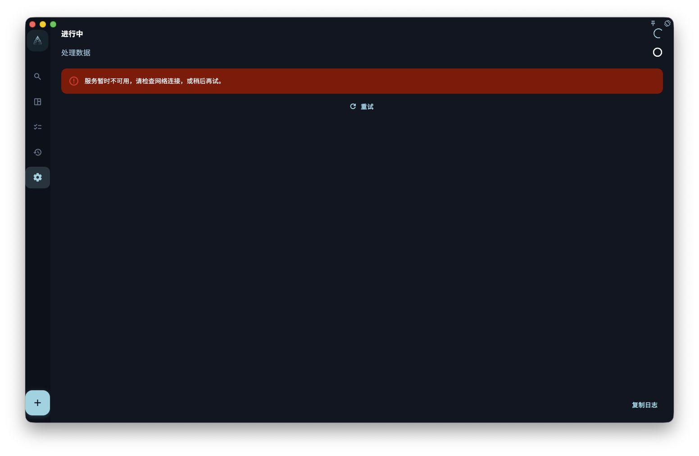

如果你想在误删、换设备或重装前保留一份可回退的数据，请在 GranoFlow 设置里的数据/备份页面手动导出备份文件，并把文件保存到你自己能找到、能控制的位置。

## 备份和同步有什么区别

备份是一份“某个时间点的数据副本”。同步是把当前数据同步到云端或其他设备。它们解决的问题不一样。

| | 备份 | 云端同步 |
| --- | --- | --- |
| 是否保留历史状态？ | ✅ 是某个时间点的快照 | ❌ 只代表当前状态 |
| 误删后能不能回到旧状态？ | ✅ 可以恢复到备份创建时的状态 | ❌ 删除通常也会同步到云端 |
| 是否需要你主动操作？ | ✅ 需要手动导出并保存文件 | ✅/❌ 同步会自动进行，但不保存历史版本 |

## 什么时候应该做备份

建议在这些时候先导出一份备份：

- 升级 App 大版本之前
- 换手机、换电脑或重装系统之前
- 删除大量任务或项目之前
- 完成一个重要阶段后，想保留当时的记录

## 怎么做备份

1. 打开 GranoFlow 设置。
2. 进入数据/备份相关页面。
3. 选择导出备份。
4. 等待导出完成，不要在处理中重复点击或关闭页面。
5. 把导出的备份文件保存到你能控制的位置，例如 iCloud、本地文件夹或电脑。

## 怎么从备份恢复

1. 打开 GranoFlow 设置。
2. 进入数据/备份相关页面。
3. 选择导入备份。
4. 找到之前保存的备份文件。
5. 确认导入后，等待恢复完成，不要在处理中重复操作。

:::caution[恢复会覆盖当前数据]
从备份恢复是覆盖操作。导入后，当前设备上的数据会被备份文件里的数据替换。如果你想保留当前设备的最新内容，请先导出一份当前备份，再导入旧备份。
:::
