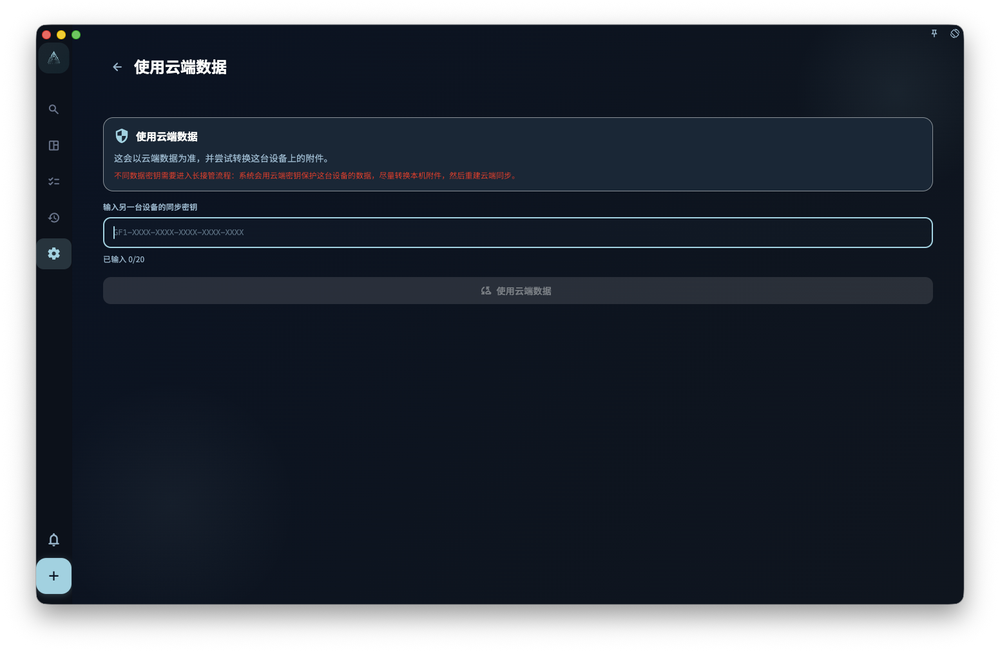

你现在最需要做的是：在旧设备还能打开 GranoFlow 时，把云端同步密钥保存到密码管理器或安全的地方。以后换设备、重装 App，或看到“同步密钥不匹配”时，GranoFlow 可能会要求你输入这把密钥；没有它，云端加密数据可能打不开。

GranoFlow 的云端同步数据使用端对端加密。加密密钥像保险箱钥匙：**没有它，连 GranoFlow 自己的服务器也无法读取你的数据**。这也意味着：**如果你自己把密钥弄丢了，GranoFlow 无法帮你重置或找回。**

## 密钥 vs 登录密码，有什么区别

| | 登录密码（或验证邮件） | 加密/同步密钥 |
| --- | --- | --- |
| 用来做什么 | 证明你是谁 | 打开云端加密数据 |
| 忘了怎么办 | 重新发验证邮件 | **无法找回** |
| 换了会怎样 | 只影响登录 | 影响是否能访问云端数据 |

## 我的密钥在哪里

在 GranoFlow 设置 → 数据/安全/同步 里，可以查看和保存当前设备的云端同步密钥。

**建议马上保存：**把密钥抄下来，或保存到你的密码管理器里。不要只存在 GranoFlow 里，因为需要密钥时，往往正是你换了设备或打不开旧环境的时候。

## 在新设备上什么时候需要密钥

以下情况可能需要输入旧设备上的云端同步密钥：

- 换了手机或电脑
- 重装了 GranoFlow
- 看到“同步密钥不匹配”的提示

输入正确密钥后，新设备才有机会访问云端已有的加密数据。

## 输入密钥后会发生什么

GranoFlow 会先检查这把密钥能不能打开当前云端数据：

- **密钥匹配，云端和本地是同一份数据** → 直接连接同步
- **密钥匹配，但本地有新数据** → 显示选择界面，让你决定保留哪份数据
- **密钥不对** → 不改变任何数据，让你重新输入

## 忘了密钥怎么办

按这个顺序检查：

1. **旧设备还能用吗？** → 在旧设备上打开 GranoFlow，找到密钥并复制
2. **密码管理器里有吗？** → 检查你常用的密码管理器
3. **旧设备还在，但 App 打不开？** → 联系 GranoFlow 支持，说明旧设备和当前情况

如果以上都没有，云端加密数据可能无法恢复。本地备份（如果有的话）仍然可用。

## 看到“输入云端同步密钥”时怎么办

如果 GranoFlow 提示“密钥不一致。请输入云端同步密钥。”，请填入当前云端数据对应的完整密钥。

输入正确后，GranoFlow 会先判断本机数据和云端数据是不是同一份：

- 如果是同一份数据，只会更新这台设备的同步密钥设置。
- 如果不是同一份数据，才会进入“使用云端数据”的确认流程。继续前请先确认本机数据和云端数据哪一份更重要。

:::caution[密钥不是密码，不能重置]
加密密钥丢失后，GranoFlow 无法帮你重置或找回。现在就去保存你的密钥，不要等到用到的时候才后悔。
:::
