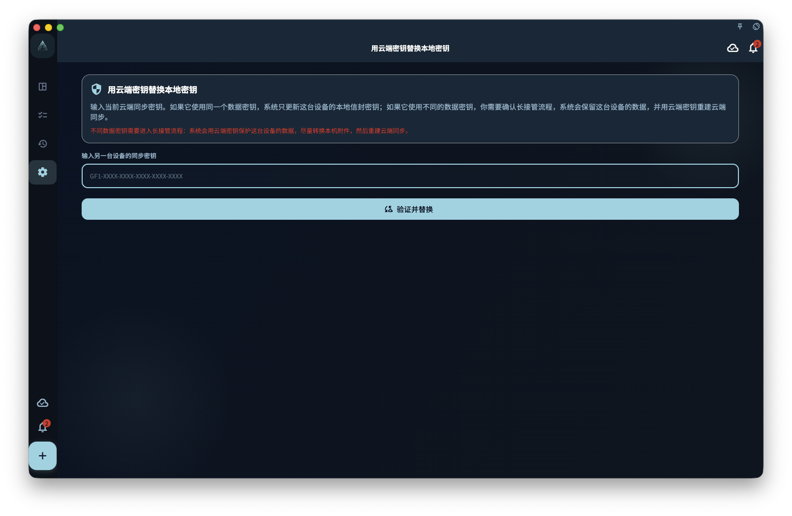

GranoFlow 用加密密钥保护需要同步或备份的数据。登录账号只能证明你是谁；加密密钥决定这台设备能不能打开已有的云端加密数据。

如果你正在迁移设备、重装 App、恢复备份，或同步页提示“云端同步设置需要处理”，先把当前设备上还可见的重要数据确认一遍，再继续密钥恢复或接管。

<!-- manual-screenshot:id=data-encryption-recovery-key -->

## 从哪里进入

你可能从这些位置进入相关页面：

- 设置里的数据、安全、同步或备份入口。
- 同步失败提示、顶部同步状态提示，或云端数据概览中的恢复提示。
- 数据管理页里的“用云端密钥替换本地密钥”。

这些入口的共同点是：当前设备和云端之间的密钥、数据来源或同步状态还没有对齐。它们不是普通刷新按钮。

## 输入另一台设备的同步密钥

当页面要求你输入另一台设备的同步密钥时，GranoFlow 会先检查这把密钥能不能打开当前云端数据。检查完成前，不会保存你输入的密钥，不会清空本机数据，也不会开始下载云端数据。

检查后可能出现几种结果：

- 如果云端和本机使用的是同一份数据密钥，GranoFlow 只更新这台设备的同步设置，让它继续使用同一组云端数据。
- 如果云端和本机不是同一份数据，页面会让你选择保留本机数据、使用云端数据，或取消。
- 如果密钥格式不对、密钥不是这份云端数据的密钥，或网络暂时不可用，恢复不会继续。

这条路径不能保证找回你没有保存的同步密钥。能恢复到什么程度，取决于当前设备、旧设备、云端数据和本地备份里还保留了哪些可验证材料。

## 没有密钥时检查这台设备

有些情况下，即使你忘了云端同步密钥，这台设备仍可能保留能验证云端数据的本机材料。页面可能会提供“没有密钥，检查这台设备”这样的次级入口。

这一步只做检查。通过检查后，GranoFlow 还会让你再次确认是否只修复云端同步密钥。确认后，它只修复云端同步所需的密钥材料，不会上传这台设备的业务数据、不会清空云端，也不会下载云端数据。

如果检查失败、云端没有可用检查记录，或这台设备已经无法读取本机加密材料，就需要回到输入同步密钥、使用备份，或取消后先找旧设备。

## 用云端密钥替换本地密钥

“用云端密钥替换本地密钥”用于当前设备还有本地数据，但你决定让这台设备改用云端同步密钥的场景。它通常从数据管理页或密钥不匹配提示进入。

操作前先确认两件事：

1. 你输入的是当前云端同步数据对应的完整密钥。
2. 你知道这台设备上的本地数据和附件是否仍需要保留。

如果本机和云端实际使用同一份数据密钥，GranoFlow 只更新这台设备的保护方式。如果它们不同，页面会要求你确认一次更长的接管流程：保留这台设备的数据，用云端密钥保护，并在可行时处理本机附件，随后重建云端同步。

这个流程可能耗时，尤其是本机附件较多时。不要在不确定数据来源时把它当成普通登录或同步修复。

## 选择来源时怎么判断

- 想保留这台设备的数据：选择“重建云端同步”或相近路径前，确认本机任务、项目、回顾和附件就是你要保留的版本。后续云端会改用这台设备的数据。
- 想使用云端数据：选择“使用云端数据”或“清空本地数据”前，确认本机新建但未同步的内容可以放弃，或已经另行保存。
- 不确定：取消操作，先检查旧设备、云端概览和本地备份。

同步和密钥恢复不会替你判断哪份数据更重要，也不能保证所有未同步附件、旧设备残留或丢失密钥后的云端数据一定可恢复。

## 下一步

如果你是在新设备上恢复已有云端数据，继续读“新设备同步已有云端数据”。如果你手上有本地备份文件，继续读“备份与恢复”。
