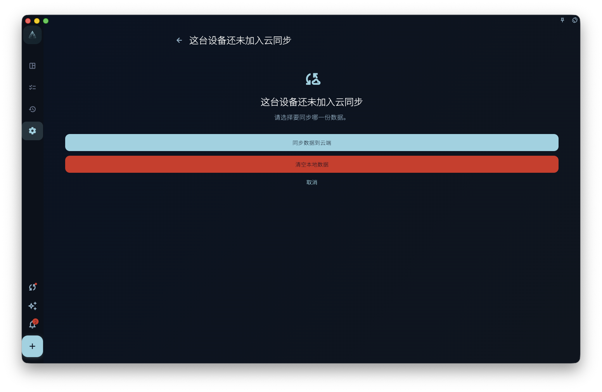
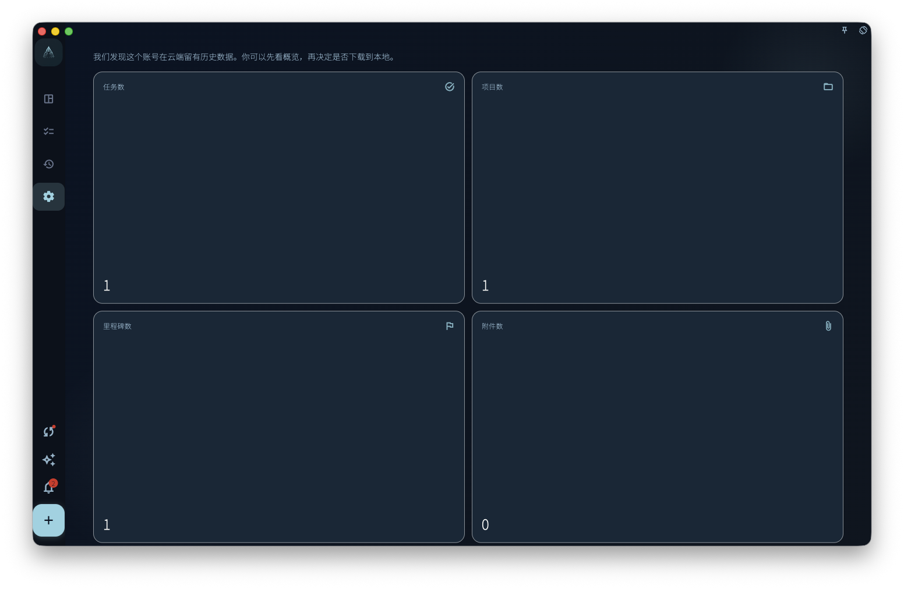
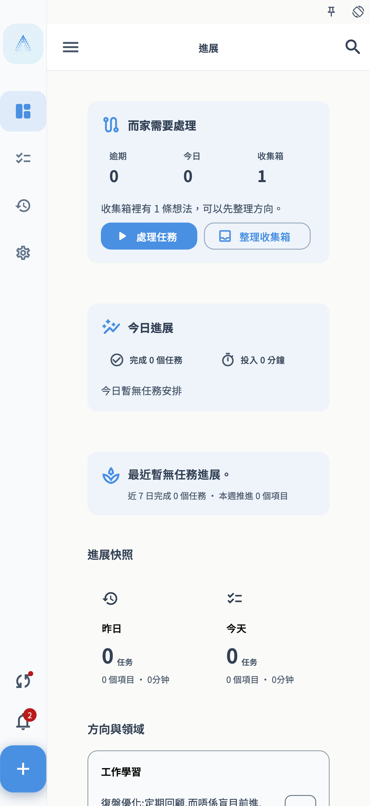

这页适用于一种很具体的情况：云端已经有你的 GranoFlow 同步数据，你又安装了一台新设备，想把云端数据同步到这台设备。

如果这台新设备还没有添加任务、项目、回顾或图片，按“空设备同步”操作。如果你已经在这台设备上添加过内容，先看后面的“本地已经有数据时”。

## 开始前准备

先确认 4 件事：

- 旧设备上已经成功同步过数据，或者你曾经保存过云端同步密钥。
- 新设备登录的是同一个 GranoFlow 账号。
- 新设备网络可用，并且账号状态允许读取云端同步数据。
- 你知道云端同步密钥在哪里；它不是登录密码，而是打开云端加密数据的密钥。

最稳妥的做法是：先在旧设备上确认数据还在，再拿到同步密钥，然后再操作新设备。

<!-- manual-screenshot:id=data-new-device-sync-old-device-key -->

## 空设备同步

空设备指的是：刚安装、刚重装，或还没有录入真实数据的设备。即使 GranoFlow 已经在这台设备上自动生成了本地密钥，它仍然会被当作空设备处理，不会用空设备覆盖云端数据。

1. 在旧设备上打开 GranoFlow，进入保存或查看同步密钥的页面。
2. 复制或记录当前云端同步密钥。不要只记登录密码；登录密码不能代替同步密钥。
3. 在新设备上安装并打开 GranoFlow。
4. 用同一个账号登录。
5. 进入同步入口。如果页面提示“输入另一台设备的同步密钥”，把旧设备上的云端同步密钥填进去。
6. 点击“加入已有云端同步”，然后等待验证和下载完成。
7. 回到任务、项目、回顾等页面，确认云端数据已经出现在新设备上。

<!-- manual-screenshot:id=data-new-device-sync-enter-key -->

<!-- manual-screenshot:id=data-new-device-sync-join-existing -->

<!-- manual-screenshot:id=data-new-device-sync-restored-data -->

完成后，这台设备就加入了原来的云端同步。之后你在任一设备上产生的新变化，会按普通多端同步继续上传和下载。

## 空设备不会做什么

空设备同步的目标是“下载已有云端数据”，不是“用新设备重建云端”。

- 不会因为新设备生成了新的本地密钥，就把云端同步密钥换掉。
- 不会默认显示“用这台设备覆盖云端”这类高风险选择。
- 不会把一台没有真实数据的新设备当作数据来源。

如果你看到“同步数据到云端”“重建云端同步”“清空本地数据”一类选择，说明当前设备已经不是最简单的空设备场景。先停下来，按下一节判断。

## 这台设备尚未加入云端同步

有时 GranoFlow 会发现：当前设备和云端属于同一个账号，但这台设备还没有加入当前云端同步。页面会让你在“同步数据到云端”“清空本地数据”和“取消”之间选择。

<!-- manual-screenshot:id=data-sync-device-join -->

这个页面通常在同步入口、数据管理页或顶部同步状态提示中出现。它不是普通同步按钮，而是一次数据来源选择。

- 选择“同步数据到云端”前，先确认这台设备上的任务、项目、回顾和附件就是你想保留的版本。确认后，云端会改用这台设备的数据，其他设备后续也会受到影响。
- 选择“清空本地数据”前，先确认云端数据才是你要保留的版本。确认后，这台设备会清掉本机当前数据和本机同步设置，再从云端下载。
- 选择“取消”不会继续这次入云处理。你可以先回到旧设备、云端概览或备份页面核对数据。

无论选哪条路径，都不能保证未上传成功的本机附件、另一台设备上的未同步改动，或你没有保存密钥的数据一定能恢复。做选择前，先确认当前设备和旧设备上最重要的数据还能看到。

## 云端数据概览

如果账号里已经有云端历史数据，GranoFlow 可能先显示云端数据概览。它会展示云端里大致有多少任务、项目、里程碑、附件、最近更新时间和数据时间跨度，帮助你判断这份云端数据是不是你要找的。

<!-- manual-screenshot:id=data-cloud-data-overview -->

这个页面常见于已登录账号的同步入口，尤其是当前设备还没启用上传能力、但云端已经有可下载历史数据时。它的主动作是“下载云端数据”；在部分可上传且风险更高的场景里，页面也可能出现“清空云端数据”。

- “下载云端数据”是一次恢复动作，不等于自动开启日常云端同步。下载后先回到任务、项目和回顾页面检查内容。
- “清空云端数据”会要求再次确认，并可能要求系统验证。确认后，云端同步数据会被清空；不要把它当成刷新或重新加载。
- 如果页面提示本机和云端加密状态不同，先去“加密与恢复密钥”处理密钥问题，不要反复尝试下载。

云端概览只能帮你识别云端历史数据的大致范围。它不能保证每个附件都已经完整下载到当前设备，也不能替你判断另一台设备上是否还有未同步内容。

## 本地已经有数据时

如果你在新设备上已经添加过任务、项目、回顾，或者给任务上传过图片，再去同步已有云端数据，情况会变复杂。此时本地和云端都可能有数据，GranoFlow 需要先判断你想保留哪一份。

<!-- manual-screenshot:id=data-new-device-sync-local-image-task -->

先做这几件事：

1. 不要连续点“同步数据到云端”或“重建云端同步”。
2. 先确认旧设备或云端里有哪些重要数据。
3. 如果新设备上的新内容也重要，先确认它是否还能在当前设备看到，必要时先导出或截图留存。
4. 按页面提示输入旧设备上的云端同步密钥，让 GranoFlow 先确认这份云端数据是否能打开。

接下来根据页面出现的选择判断：

<!-- manual-screenshot:id=data-new-device-sync-local-data-choice -->

- 如果你只想把云端数据同步到这台设备，选择偏向“使用云端数据”或“清空本地数据”的路径。这样做会让这台设备改用云端数据，本机刚添加但还没同步成功的内容可能不会保留。
- 如果你确实要以这台设备为准，才选择“同步数据到云端”或“重建云端同步”。这类操作会让云端改用当前设备的数据，影响其他设备后续同步，不能当成普通下载按钮使用。
- 如果你不确定，选择取消，回到旧设备检查数据和同步密钥，再继续。

有图片或附件时更要谨慎：图片需要本地文件、附件记录和云端上传状态一起收敛。不要把“任务文字已经出现”误认为“图片也一定已经安全同步到云端”。

## 常见问题

**输入密钥后提示无法打开云端同步设置怎么办？**  
先检查有没有复制完整，尤其是开头、结尾和空格。确认你输入的是云端同步密钥，不是账号密码，也不是本地备份文件的其他说明文字。

**旧设备不在身边怎么办？**  
如果你之前保存过云端同步密钥，可以直接使用保存的那一份。如果既没有旧设备，也没有密钥，GranoFlow 可能无法解开已有云端加密数据。

**新设备上刚建了一个任务，还能直接按空设备流程走吗？**  
不要按空设备流程理解。只要这台设备已经有真实本地数据，就按“本地已经有数据时”处理，先弄清楚要保留云端数据、本机数据，还是先取消操作。

**同步完成后为什么有些图片还在加载？**  
任务和图片附件不是完全同一个进度。普通同步可能先恢复任务和附件记录，图片文件再继续上传、下载或按需加载。保持网络可用，等同步完成后再检查图片。

## 下一步

同步完成后，去“多端同步”了解日常同步如何继续工作；如果你担心密钥丢失，再去“加密与恢复密钥”保存必要凭证。
