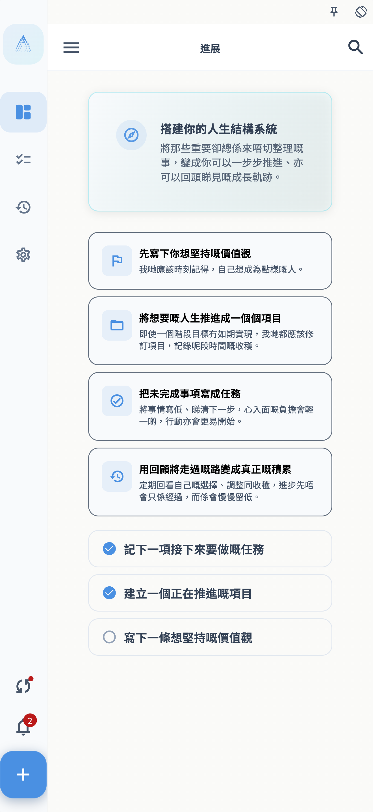
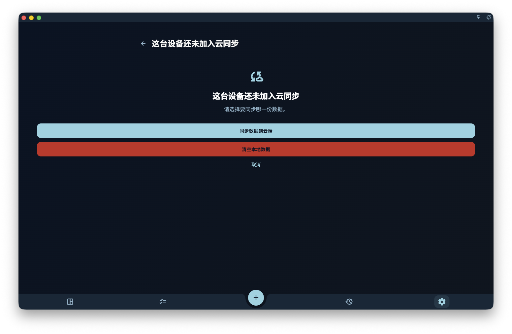
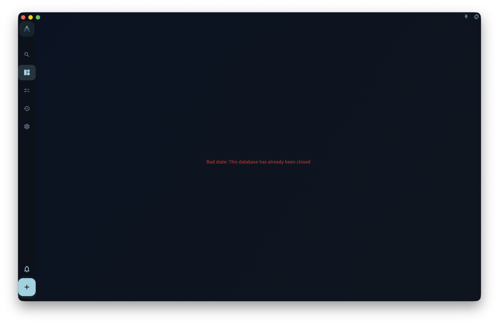

如果你换了新手机、新电脑，或刚重装 GranoFlow，想把以前已经同步到云端的数据取回来：先在旧设备或你保存的记录里找到云端同步密钥，再在新设备登录同一个账号，输入这把密钥并选择加入已有云端同步。

如果新设备还没有添加任务、项目、回顾或图片，按下面的“空设备同步”走。如果新设备已经有你新建的内容，先看“本地已经有数据时”，不要直接当空设备处理。

## 开始前准备

先确认 4 件事：

- 旧设备曾经成功同步过，或者你之前保存过云端同步密钥。
- 新设备登录的是同一个 GranoFlow 账号。
- 新设备可以联网，并且账号状态允许读取云端同步数据。
- 你拿到的是云端同步密钥。它不是登录密码，而是用来打开云端加密数据的密钥。

最稳妥的顺序是：先在旧设备确认数据还在，再复制或记录同步密钥，最后操作新设备。

<!-- manual-screenshot:id=data-new-device-sync-old-device-key -->

## 空设备同步

这里的空设备，指刚安装、刚重装，或还没有录入真实数据的设备。即使 GranoFlow 已经在这台设备上生成了本地密钥，只要你还没有添加真实内容，它仍然按空设备处理，不会用空设备覆盖云端数据。

1. 在旧设备打开 GranoFlow，进入保存或查看同步密钥的页面。
2. 复制或记录当前云端同步密钥。不要只记登录密码，登录密码不能代替同步密钥。
3. 在新设备安装并打开 GranoFlow。
4. 用同一个账号登录。
5. 进入同步入口。如果页面要求“输入另一台设备的同步密钥”，填入旧设备上的云端同步密钥。
6. 点击“加入已有云端同步”，等待验证和下载完成。
7. 回到任务、项目、回顾等页面，确认云端数据已经出现在新设备上。

<!-- manual-screenshot:id=data-new-device-sync-enter-key -->

<!-- manual-screenshot:id=data-new-device-sync-join-existing -->

<!-- manual-screenshot:id=data-new-device-sync-restored-data -->

完成后，这台设备就加入了原来的云端同步。之后你在任一设备上产生的新变化，会按普通多端同步继续上传和下载。

## 空设备不会做什么

空设备同步的目的，是把已有云端数据下载到新设备，不是用新设备重新建立云端数据。

- 不会因为新设备生成了新的本地密钥，就替换云端同步密钥。
- 不会默认让你用这台新设备覆盖云端数据。
- 不会把一台没有真实数据的新设备当作数据来源。

如果你看到“同步数据到云端”“重建云端同步”“清空本地数据”这类选择，说明当前情况已经不是最简单的空设备同步。先停下来，按下一节判断。

## 这台设备尚未加入云端同步

有时 GranoFlow 会发现：当前设备登录的是同一个账号，但这台设备还没有加入当前云端同步。页面会让你在“同步数据到云端”“清空本地数据”和“取消”之间选择。

<!-- manual-screenshot:id=data-sync-device-join -->

这个页面通常出现在同步入口、数据管理页，或顶部同步状态提示里。它不是普通的同步按钮，而是在问你要保留哪一边的数据。

- 选择“同步数据到云端”前，先确认这台设备上的任务、项目、回顾和附件就是你想保留的版本。确认后，云端会改用这台设备的数据，其他设备后续也会受到影响。
- 选择“清空本地数据”前，先确认云端数据才是你要保留的版本。确认后，这台设备会清掉本机当前数据和本机同步设置，再从云端下载。
- 选择“取消”会停止这次处理。你可以先回到旧设备、同步密钥记录或备份页面核对数据。

无论选哪条路，都不能保证未上传成功的本机附件、另一台设备上的未同步改动，或没有密钥的数据一定能恢复。做选择前，先确认当前设备和旧设备上最重要的数据还能看到。

## 下载已有云端数据

如果账号里已经有可解密的云端历史数据，GranoFlow 会直接进入同步进度页下载恢复。这个动作只是把云端数据取回当前设备，不等于自动开启日常上传同步。下载完成后，先回到任务、项目和回顾页面检查内容。

如果 GranoFlow 需要原来的云端同步密钥，会显示“输入云端同步密钥”的轻量入口。你可以输入密钥继续恢复，也可以选择“清空云端数据”重新开始；如果暂时找不到密钥，选择“暂不同步”会回到本机继续使用，不会下载、上传或清空云端。

## 本地已经有数据时

如果你已经在新设备上添加过任务、项目、回顾，或者给任务上传过图片，再同步已有云端数据就要更谨慎。此时本地和云端都可能有数据，GranoFlow 需要先确认你想保留哪一份。

<!-- manual-screenshot:id=data-new-device-sync-local-image-task -->

先做这几件事：

1. 不要连续点击“同步数据到云端”或“重建云端同步”。
2. 先确认旧设备或云端里有哪些重要数据。
3. 如果新设备上的新内容也重要，先确认它是否还能在当前设备看到。必要时先导出或截图留存。
4. 按页面提示输入旧设备上的云端同步密钥，让 GranoFlow 先确认这份云端数据是否能打开。

接下来根据页面上的选择判断：

<!-- manual-screenshot:id=data-new-device-sync-local-data-choice -->

- 如果你只想把云端数据同步到这台设备，选择偏向“使用云端数据”或“清空本地数据”的路径。这样会让这台设备改用云端数据，本机刚添加但还没同步成功的内容可能不会保留。
- 如果你确实要以这台设备为准，才选择“同步数据到云端”或“重建云端同步”。这类操作会让云端改用当前设备的数据，并影响其他设备后续同步，不能当成普通下载按钮使用。
- 如果你不确定，选择取消，回到旧设备检查数据和同步密钥，再继续。

有图片或附件时更要谨慎。图片需要本地文件、附件记录和云端上传状态都完成，才算真正稳定。不要因为任务文字已经出现，就以为图片也一定已经安全同步到云端。

## 常见问题

**输入密钥后提示无法打开云端同步设置怎么办？**
先检查有没有复制完整，尤其是开头、结尾和空格。确认你输入的是云端同步密钥，不是账号密码，也不是本地备份文件里的其他说明文字。

**旧设备不在身边怎么办？**
如果你之前保存过云端同步密钥，可以直接使用保存的那一份。如果既没有旧设备，也没有密钥，GranoFlow 可能无法解开已有云端加密数据。

**新设备上刚建了一个任务，还能按空设备流程走吗？**
不要按空设备处理。只要这台设备已经有真实本地数据，就按“本地已经有数据时”处理，先弄清楚要保留云端数据、本机数据，还是先取消操作。

**同步完成后为什么有些图片还在加载？**
任务和图片附件不一定同时完成。普通同步可能先恢复任务和附件记录，图片文件再继续上传、下载或按需加载。保持网络可用，等同步完成后再检查图片。

## 下一步

同步完成后，去“多端同步”了解日常同步如何继续工作。如果你担心密钥丢失，再去“加密与恢复密钥”保存必要凭证。
