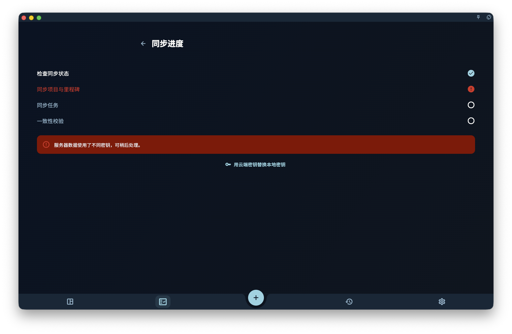

多端同步的作用是：你在一台设备上新增、修改或删除内容后，其他登录同一账号的设备也会尽量变成同样的状态。它方便你在多台设备上继续使用 GranoFlow，但它不是用来找回误删内容的备份功能。

<!-- manual-screenshot:id=data-sync-status-main -->

## 同步什么、不同步什么

✅ 会同步的内容：

- 任务，例如标题、截止日期、标签、状态等
- 项目和里程碑
- 回顾记录
- 图片和附件，在网络允许的情况下同步

⚠️ 需要特别记住：同步不是备份。

- **你删了，其他设备也会删**：同步是双向的，不会把删除操作只留在一台设备上。
- **没有版本历史**：同步不会保存「3 天前是什么样」。
- **图片可能晚一点出现**：文字内容可能先同步完成，图片和附件可能稍后才同步完成。

## 同步的常见状态

| 状态 | 含义 |
| --- | --- |
| 同步中 | 正在上传或下载变更。 |
| 已同步 | 当前设备的数据和云端一致。 |
| 等待中 | 有变更正在排队，通常和网络有关。 |
| 错误 | 同步遇到问题，需要检查账号或密钥。 |

## 离线和服务不可达时会怎样

如果暂时没有网络，GranoFlow 里的本地数据仍然可以使用。你可以继续记录任务、整理项目、写回顾、搜索内容，也可以导出本地备份。

如果你开启了「离线模式」，同步、登录、订阅确认和恢复购买会暂时不可用。你点击这些需要联网的功能时，App 会提示当前无法连接对应服务；关闭离线模式后，可以再重试。

如果设备有网络，但同步服务暂时不可达，App 也不会阻止你使用本机已有的数据。已经在这台设备上的内容仍然可以编辑；需要上传到云端或从云端下载的变化，会等你稍后再次同步。

## 新设备加入同步

如果你换了新手机，或者重装了 App，想接上原来的云端数据，需要使用旧设备上的**云端同步密钥**。

详细步骤见 → [新设备同步已有云端数据](/manual/data-security-and-recovery/new-device-sync/)

:::caution[同步不替代备份]
请定期导出本地备份。误删的任务不能靠同步恢复，因为云端和其他设备也会跟着删除。
:::
