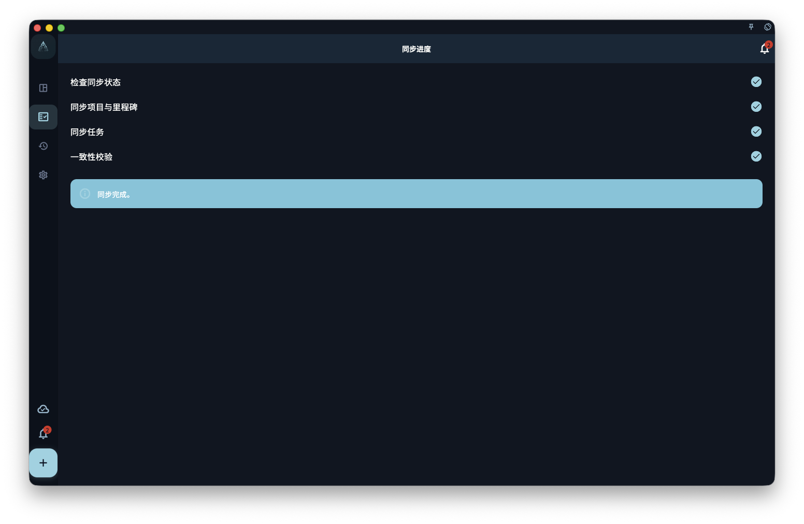

了解同步会把哪些状态带到其他设备，以及网络、账号和冲突情况下应如何判断。

## 从哪里开始

从设置里的数据、安全、同步、备份或账号相关入口开始。先判断你要处理的是日常同步、设备迁移、误删恢复，还是账号删除。

<!-- manual-screenshot:id=data-sync-status-main -->

## 怎么操作

- 日常使用先确认本设备数据是否可见，再看是否需要同步到其他设备。
- 涉及加密、恢复密钥、备份导入或账号删除前，先读完确认信息并保存必要凭证。
- 操作后检查当前设备和其他设备的状态；如果需要恢复，优先使用明确的备份文件或恢复入口。

## 新设备加入已有同步

如果云端已经有数据，你正在新手机、新电脑或重装后的空设备上同步回来，先看[新设备同步已有云端数据](/manual/data-security-and-recovery/new-device-sync/)。那一页会按空设备和本地已有数据两种情况分别说明操作顺序和风险判断。

## 结果和边界

GranoFlow 采用本地优先思路：本地可用是基础，同步和备份负责扩展到多设备和恢复场景。它们互相补充，但不能彼此替代。

- 同步不是备份；备份也不会保证替你解决所有账号或密钥问题。
- 加密和恢复密钥能保护数据，但忘记密钥或丢失本地备份时，恢复能力会受到限制。

## 下一步

不确定从哪排查时，先进入“数据与安全总览”或“同步问题排查”。
