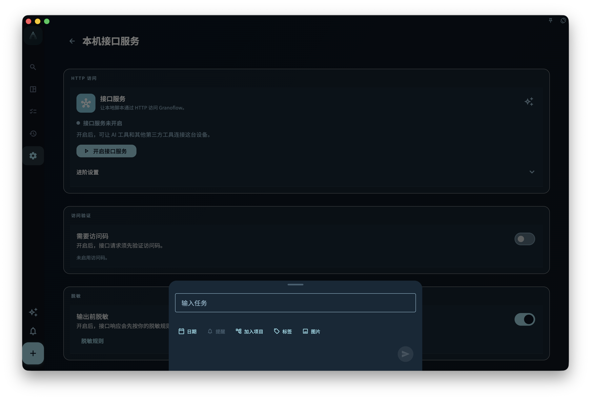

`granoflow` 桌面版提供本机 HTTP API，监听在 `http://127.0.0.1:<port>`。

你可以通过**命令行工具**（`granoflow` CLI）、**curl** 或**脚本**直接与 API 交互。

本机 HTTP API 只绑定到 `127.0.0.1`，不暴露到局域网或公网。

如果需要从 `granoflow.com` 文档页调试本机接口，必须在 App 中临时开启官方文档调试并使用 1 小时访问码；它不再默认允许文档页访问业务接口。允许任何设备来源也必须先开启访问码保护。

## 先看这个导航

- 想先理解工作原理：读 [本机 HTTP API 工作原理](/manual/desktop/cli-how-it-works/)
- 想确认访问码、本地访问、App Lock、密钥区别：读 [安全设置与密钥边界](/manual/desktop/cli-security-and-settings/)
- 想查完整 CLI 命令和 HTTP 端点：读 [命令参考与 HTTP 映射](/manual/desktop/cli-command-reference/)
- 想按真实场景走流程：读 [工作流](/manual/desktop/cli-workflows/)
- 想给脚本或 AI 助手用：读 [JSON、环境变量与直接调用](/manual/desktop/cli-json-and-scripting/)
- 遇到报错：读 [排障](/manual/desktop/cli-troubleshooting/)

## 安装与首次检查

在 macOS 上，先把 GranoFlow 拖入「应用程序」，再在 App 的「命令行工具」设置页点「安装命令行工具」或「修复命令行工具」。首次安装时，macOS 可能要求你在「系统设置 → 通用 → 登录项目」中允许「Granoflow 后台项目」；批准后再次点击安装，App 即可创建 `/usr/local/bin/granoflow` 符号链接，后续修复或重装通常不再需要额外操作。需要 macOS 13 或更新版本。

<!-- manual-screenshot:id=desktop-command-line-tool-settings-main -->


安装后先确认 API 可达：

```bash
curl -s http://127.0.0.1:42667/v1/health
granoflow version --json
granoflow bridge config show --json
```

## 读者常见误解

- `granoflow lang` 只影响 CLI 输出语言，不修改 App 语言。
- `granoflow backup-package` 是 native CLI 本地工具，不依赖运行中的 App。
- 业务对象、备份、真实数据 AI 命令都依赖运行中的本机 HTTP API。

## 下一步

建议先读 [本机 HTTP API 工作原理](/manual/desktop/cli-how-it-works/)，再看命令参考。
