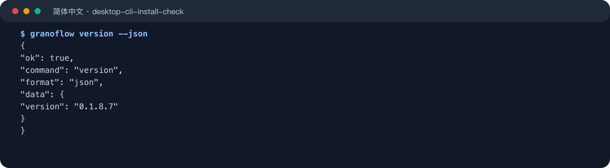
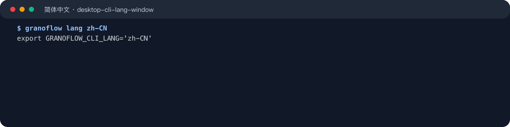
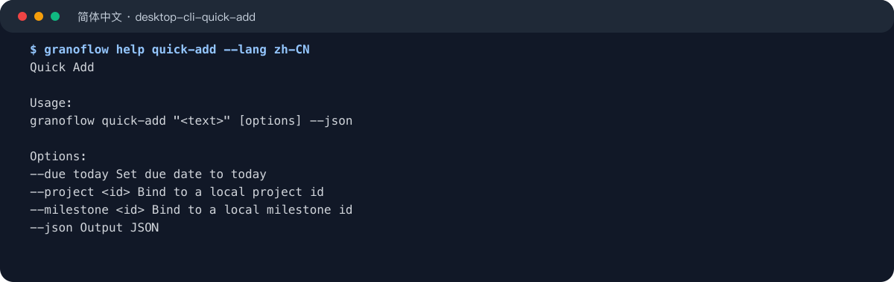
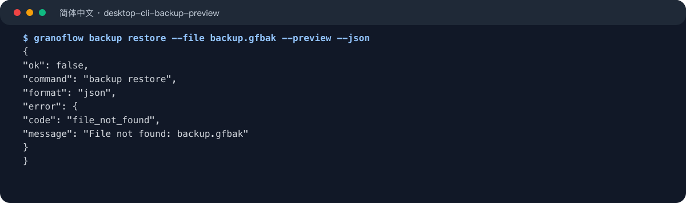
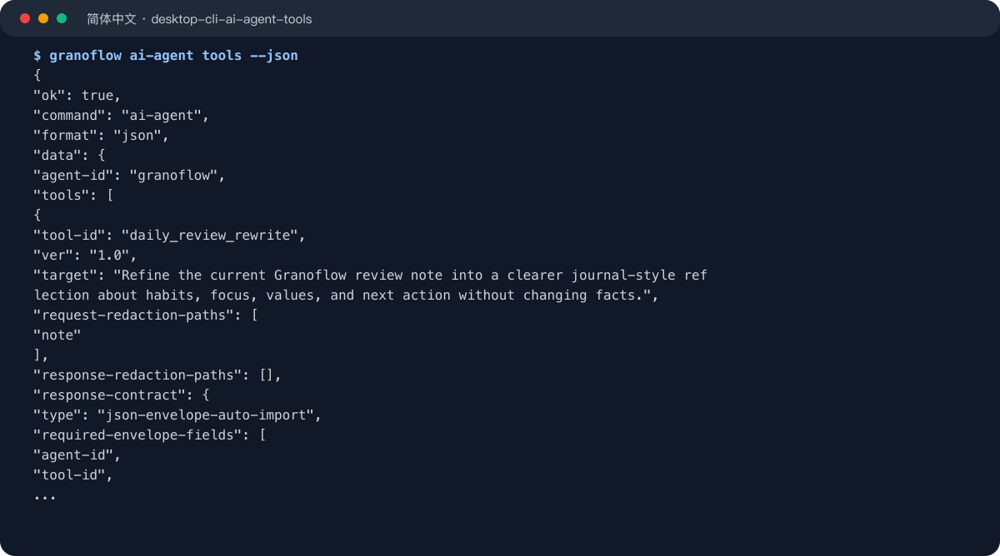

命令行工具适合希望从终端、脚本或自动化流程打开 GranoFlow 的用户。先确认命令可用，再复制下面的示例；截图用于对照输出形态，完整命令以代码块为准。

## 安装与确认

桌面版安装后，设置页的“命令行工具”入口会集中显示当前平台的安装或命令别名状态、系统脱敏和 Token 验证设置。正式发布包会分发已编译好的 `granoflow` 命令，用户不需要安装 Dart SDK。

- Windows 安装包会自动注册终端命令，修复时请重新运行安装包。
- macOS 可以在设置页安装或修复 `/usr/local/bin/granoflow`。
- Linux AppImage 需要手动配置命令别名，设置页会提供可复制命令。
- Android / iOS 不展示命令行工具入口。

```bash
granoflow version --json
```



常用发现命令：

```bash
granoflow
granoflow help
granoflow help version
granoflow version
```

## 输出语言

`--lang` 只影响单次命令输出。`granoflow lang <locale>` 会打印一行设置当前终端窗口语言的命令；执行后只影响这个终端窗口，关闭窗口后失效，也不会改变 App 内语言设置。

```bash
granoflow --lang zh-CN help version
eval "$(granoflow lang zh-CN)"
granoflow lang zh-CN | Invoke-Expression
```



支持的 locale 是 `en`、`zh-CN`、`zh-HK`、`zh-TW`。

## 基础命令

所有当前命令都支持 `--json`。JSON 模式只输出 JSON envelope，不混入人类提示、进度日志或 Token 原文。

```bash
granoflow status --json
granoflow open --json
granoflow open today --json
granoflow logout --json
```

`granoflow open` 不带页面时会尝试启动桌面 App；`status`、`open today` 和 `logout` 需要运行中的 GranoFlow App。App 不可达时，命令会返回稳定错误，而不是绕过 App 直接读取本地数据库。

## 命令速查

如果你只想判断该用哪个命令，可以先看这一组：

| 命令 | 用途 | 是否需要运行中的 App |
| --- | --- | --- |
| `help` | 查看整体帮助或某个命令的帮助 | 否 |
| `version` | 查看 CLI 版本 | 否 |
| `lang` | 设置当前终端窗口的输出语言 | 否 |
| `open` | 打开首页、收件箱、今日、项目、回顾、设置等页面 | 视用法而定 |
| `status` | 输出运行中 App 的脱敏状态摘要 | 是 |
| `quick-add` | 把一段文字交给 App 创建任务 | 是 |
| `logout` | 清除本机登录会话 | 是 |
| `export` | 导出用户数据包 | 是 |
| `import` | 导入用户数据包 | 是 |
| `backup create` | 创建本地备份包 | 是 |
| `backup restore --preview` | 预览本地备份包恢复影响 | 是 |
| `backup restore --confirm` | 执行本地备份恢复 | 是 |
| `ai-agent tools` | 查看可用 AI 自动化工具 | 否 |
| `ai-agent system-template` | 输出某个 AI 工具的系统提示模板 | 否 |
| `ai-agent package` | 生成给外部 AI 使用的受控 JSON 包 | 否 |
| `ai-agent <resource> request` | 从本地上下文生成 AI 请求包 | 视资源而定 |
| `ai-agent <resource> validate` | 校验 AI 返回 JSON | 否 |
| `ai-agent <resource> apply` | 校验并应用 AI 返回结果 | 视资源而定 |
| `ai-agent assets cleanup` | 清理 AI 自动化资产引用 | 否 |

AI 自动化资源包括 `task`、`milestone task-draft`、`daily-review rewrite`、`journal daily`、`journal weekly`、`journal monthly`、`domain-values` 和 `work-learning report`。

## 打开与快速录入

`open` 可以打开常用页面，`quick-add` 可以把一段文本交给运行中的 App 创建任务。

```bash
granoflow open inbox --json
granoflow open today --json
granoflow quick-add "整理周回顾提纲" --json
granoflow quick-add "今天跟进备份检查" --due today --json
```



`quick-add` 不会在 App 不可达时直接写入本地数据库；失败时请先打开 GranoFlow 桌面版，再重试命令。

## 数据导入、导出与备份

数据命令同样通过运行中的 App 执行，用于复用 App 内的导出、导入、备份、同步风险和附件检查逻辑。

```bash
granoflow export --scope local --out granoflow-export.gflow --json
granoflow import --file granoflow-export.gflow --json
granoflow backup create --out granoflow-backup.gfbak --json
granoflow backup restore --file granoflow-backup.gfbak --preview --json
granoflow backup restore --file granoflow-backup.gfbak --confirm --backup-secret-file backup-secret.txt --json
```



先使用 `--preview` 查看备份包摘要，再用 `--confirm` 执行恢复。备份密钥只能通过 `--backup-secret-file` 传入，避免密钥进入 shell 历史、进程列表或日志。

## AI 自动化

`ai-agent` 命令面向希望把 GranoFlow 数据包交给外部 AI 或自动化流程的用户。CLI 负责生成、校验和应用受控 JSON 包；它不会替你调用外部模型，也不会在本地数据不可安全读取时伪造结果。

```bash
granoflow ai-agent tools --json
granoflow ai-agent diagnostics local-store --json
granoflow ai-agent system-template single_task_ai --json
granoflow ai-agent package single_task_ai --input data.json --json
```



资源化入口使用完整路径：

```bash
granoflow ai-agent task request --id <task-id> --json
granoflow ai-agent task validate --input reply.json --json
granoflow ai-agent task apply --input reply.json --json
```

## 安全设置与下一步

- 打开设置页里的“命令行工具”，确认安装状态、系统脱敏和 Token 验证。
- 需要机器读取时优先使用 `--json`，需要给人阅读时使用普通 help。
- 涉及导入、恢复和 AI 应用前，先看预览或验证结果，再执行写入命令。
- 如果命令返回 App 不可达，先启动 GranoFlow 桌面版，再重试。
