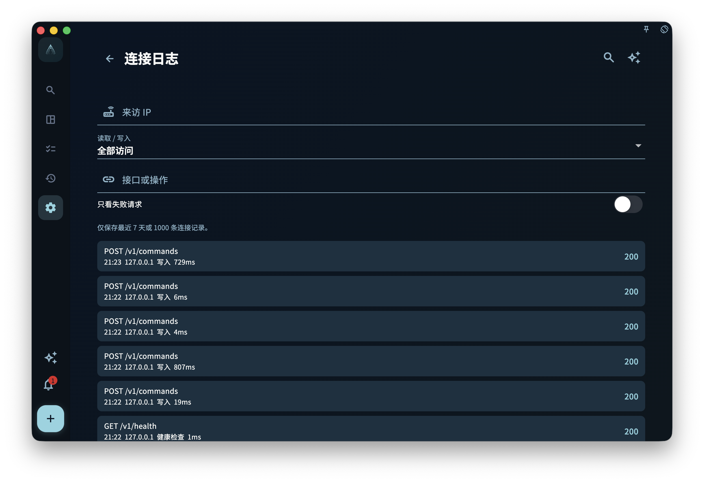

GranoFlow 桌面端面向自动化的主入口是本机 HTTP API。它监听在本机回环地址
`http://127.0.0.1:<port>`，用于让脚本、AI 助手或命令行客户端读取和写入 App
已经公开的自动化能力。

`granoflow` CLI 是这个 API 的可选客户端。它由 Rust 重写，作为独立包下载，不随
macOS、Windows 或 Linux 桌面安装包一起安装。换句话说，安装桌面 App 之后，你已经
可以在 App 里开启本机 HTTP API；如果还想在终端里使用 `granoflow` 命令，需要另外
安装 CLI。

本机 HTTP API 默认只绑定 `127.0.0.1`，不会自动暴露到局域网或公网。如果需要在
`granoflow.com` 文档页调试本机接口，必须在 App 中临时开启官方文档调试，并使用
1 小时访问码；它不再默认允许文档页访问业务接口。允许任何设备来源也必须先开启访问码
保护。

## 先看这个导航

- 想先理解工作原理：读 [本机 HTTP API 工作原理](/manual/desktop/cli-how-it-works/)
- 想确认访问码、本地访问、App Lock、密钥区别：读 [安全设置与密钥边界](/manual/desktop/cli-security-and-settings/)
- 想查 CLI 命令和 HTTP 端点：读 [命令参考与 HTTP 映射](/manual/desktop/cli-command-reference/)
- 想按真实场景组合调用：读 [工作流](/manual/desktop/cli-workflows/)
- 想给脚本或 AI 助手用：读 [JSON、环境变量与直接调用](/manual/desktop/cli-json-and-scripting/)
- 遇到报错：读 [排障](/manual/desktop/cli-troubleshooting/)

## 安装与首次检查

先安装并打开 GranoFlow 桌面版，然后在设置里的本机接口服务页面开启本机 HTTP API。
这一步只开启 App 里的本机接口，不会安装 `granoflow` 终端命令，也不会写入 PATH、
MSIX App Execution Alias 或 `/usr/local/bin/granoflow` symlink。

<!-- manual-screenshot:id=desktop-command-line-tool-settings-main -->


如果你只想确认接口是否可达，可以直接用 curl：

```bash
curl -s http://127.0.0.1:56789/v1/health
curl -s http://127.0.0.1:56789/v1/version
```

如果你已经单独安装了 CLI，可以再检查 CLI 读取到的连接配置：

```bash
granoflow config --json
granoflow health --json
```

默认 API 地址是 `http://127.0.0.1:56789`。如果你在 App 里修改了端口，CLI 也需要
使用同一个地址；可以通过配置文件、`--api-base-url` 或 `GRANOFLOW_API_BASE_URL`
指定。

## 读者常见误解

- 桌面 App 不负责安装、修复或卸载 CLI。CLI 的下载、升级、签名和 PATH 配置由官网
  或 release 说明承接。
- CLI 不直接读写 GranoFlow 数据库。任务、项目、回顾和卡片等写操作都会转发给运行中
  的本机 HTTP API，由 App 服务层处理。
- `granoflow backup decrypt/encrypt` 是离线备份包转换工具，不依赖运行中的 App；它不
  等于“创建 App 备份”或“恢复到 App”。
- 公开能力以 OpenAPI 和 CLI help 为准。旧 Dart CLI、App 内置 CLI 安装器和
  `bin/granoflow.dart` 入口已经退役。

## 当前状态

当前公开 CLI 包按平台单独发行：

- macOS Apple Silicon：signed/notarized zip
- Linux x64：tar.gz
- Windows x64：先发布 unsigned zip，再由 Windows 签名设备补 signed zip

不提供 macOS Intel CLI 包。桌面 App 安装包也不会附带这些 CLI 资产。

## 参考：规则与边界

本页用于查边界，不影响你完成前面的首次检查。

- 本机 HTTP API 的公开端点以 OpenAPI 文档为准。
- CLI 的公开命令以 `granoflow help --json` 和本手册命令参考为准。
- 桌面三平台安装包不得写 PATH、不得注入 MSIX App Execution Alias、不得嵌入 macOS
  CLI helper，也不得提供 App 内安装 CLI 的按钮。
- 访问受保护端点时，仍会经过本机接口总开关、来源检查、App Lock、nonce 与访问码保护。

## 连接日志用于排查本机访问

如果命令行或浏览器能打开接口，但结果和预期不一致，可以从本机接口服务页进入“连接日志”。连接日志会记录最近访问的 IP、HTTP 方法、端点、读写类型、耗时和状态码，并提供 IP、端点、读写类型和“仅失败”过滤。

这个页面适合回答这类问题：

- 请求有没有真正到达当前设备？
- 访问来自 `127.0.0.1`，还是来自局域网设备？
- 失败集中在哪个端点？
- 是健康检查、读取请求还是写入请求出错？

连接日志只用于本机排障，不是云端审计，也不会替代系统级防火墙或账号安全记录。截图、反馈或求助时，注意不要暴露真实局域网地址、访问码、token、设备名或账号信息。

<!-- manual-screenshot:id=local-api-access-log -->


## 下一步

现在你已经分清了“本机 HTTP API”和“独立 CLI”的关系。下一页可以继续看它们如何一起
工作，以及为什么很多自动化问题要先从本机地址和权限边界判断。
