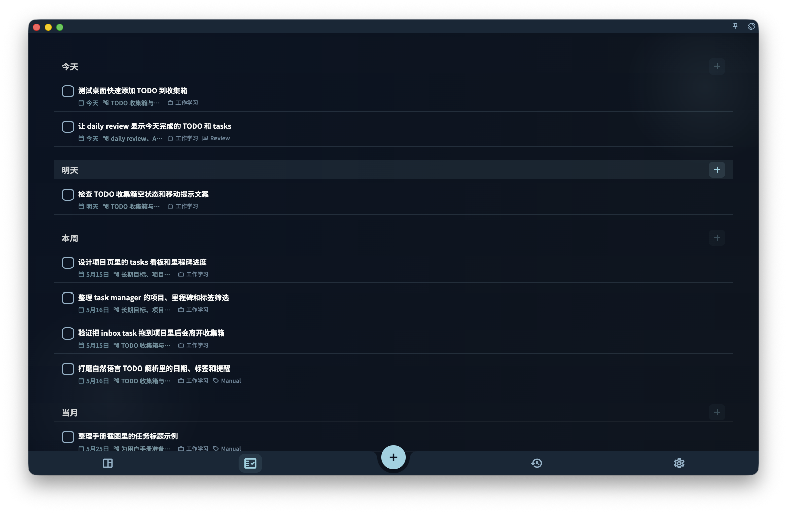

在桌面端找功能时，先看左边切换页面，再看中间的任务列表或页面内容；如果窗口够宽，点开任务后，详情通常会出现在右边，不需要离开当前列表。

## 宽屏布局的特点

桌面端和手机端最大的不同，是屏幕更宽。宽屏时，GranoFlow 可以把导航、列表和任务详情放在同一个窗口里，让你少来回切换页面。

- **左侧边栏**：这是导航区。你可以在这里切换不同视图，例如收件箱、项目、回顾等。
- **中间内容区**：这里显示任务列表，或者你当前打开的页面内容。
- **右侧详情面板**（宽屏时）：点击一个任务后，任务详情会在右侧展开。这样你可以一边看列表，一边查看或处理这个任务。

如果窗口比较窄，桌面端会把边栏折叠起来，使用方式会更接近手机版。遇到找不到左侧边栏的情况，可以先把窗口拉宽，或者寻找折叠菜单入口。

## 键盘优先

桌面端适合用键盘快速操作。你不一定要记住所有快捷键，先记住最常用的几类就够了。

- **快速添加任务**：通常通过全局快捷键打开。这个快捷键可以在偏好设置里配置。
- **在列表里导航**：可以使用方向键在任务之间移动。
- **完成任务**：在任务上按对应快捷键即可完成，具体按键以界面显示或你的设置为准。

如果快捷键和其他应用冲突，去 GranoFlow 的偏好设置里改成你更顺手、也不容易误触的组合。

## 拖拽排序

在桌面端，你可以用鼠标直接拖拽任务来调整顺序。也可以把任务拖到不同的项目或时间段，用来快速重新安排任务位置。

拖拽前先确认你拖的是任务本身，而不是打开详情、选择文字或点击其他按钮。如果拖动后位置没有变化，可能是当前视图不支持这种排序方式，或任务不能移动到目标位置。

:::tip[快捷键配置]
在 GranoFlow 偏好设置里可以自定义全局呼出快捷键。配置好之后，在其他应用里按这个快捷键，就可以打开 GranoFlow。
:::
