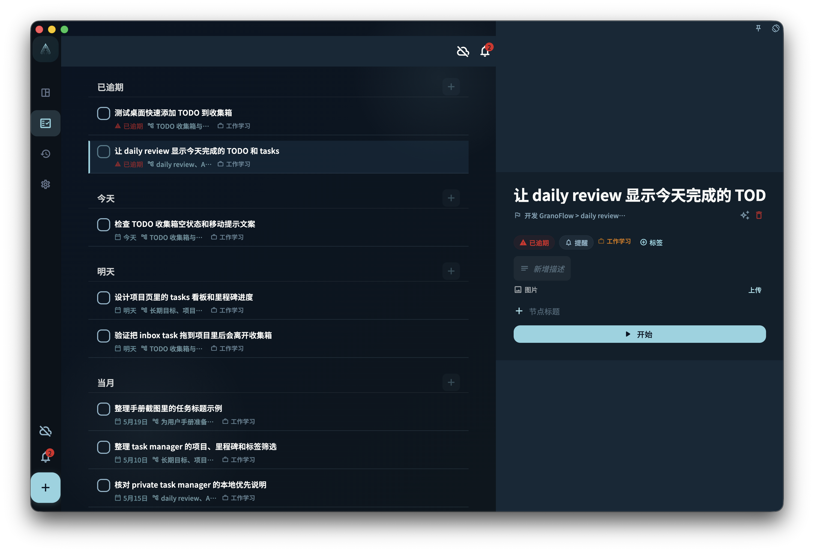

了解桌面端在宽屏、窄屏和详情面板上的交互习惯，快速找到任务与统计入口。

## 从哪里开始

从官网或可信下载入口安装桌面端，首次打开后再登录账号或进入本地数据。桌面端和网页版共享核心概念，但窗口、托盘和离线体验不同。

<!-- manual-screenshot:id=desktop-visual-interaction-wide -->

## 怎么操作

- 安装时按系统提示完成授权或打开确认；如果系统拦截，先确认下载来源。
- 使用时注意窗口关闭、托盘隐藏和真正退出的区别，避免以为应用已经结束运行。
- 离线时可以继续处理本地可用内容；重新联网后再观察同步和更新状态。

## 结果和边界

桌面端更适合常驻和快速回到任务，但它仍遵守本地优先、同步和账号边界。不同系统的托盘、热键和安装提示可能不完全一致。

- 关闭窗口不一定退出应用，尤其在支持托盘的系统上。
- 离线可用不代表所有云端状态都已同步完成。

## 下一步

安装或启动异常时，进入“下载与安装问题排查”。
