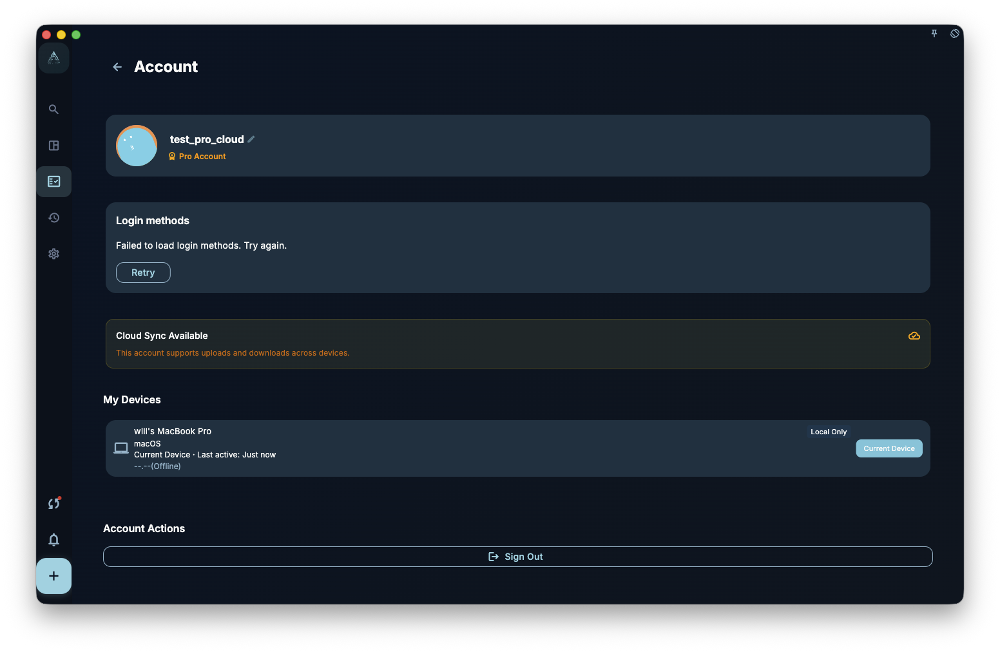

In GranoFlow, your account is mainly used to identify who you are, connect sync, and recognize subscription status. It is not the same as your local data, and it is not a backup by itself. In simple terms: your account is like a key, and your data is like what is inside the room. The key and the contents are not the same thing.

Many misunderstandings start here. Some people think deleting the account will clear all data. Others think signing up again will bring old data back. That is not how it works. Your account and your data are **two separate things**, so make sure you understand the difference before signing out, deleting, or resetting anything.

## What your account handles

- **Sign-in identity**: confirms who you are, so different devices can use the same account identity.
- **Sync**: cloud data sync and recognition depend on your account.
- **Device list**: shows which devices have signed in to your account.
- **Subscription recognition**: lets GranoFlow check whether this account has member benefits.

## What your account does not handle

- **Local data**: signing out does not delete the local data copy on this device.
- **Data backup**: your account is not a backup; if data is encrypted, the recovery key must be kept separately.
- **Cross-account migration**: if you used the wrong account, data will not automatically merge into another account.

## Think before acting

- Sign out ≠ delete account.
- Delete account ≠ wipe local data from every device.
- Reset ≠ recover data.

If you are not sure what an action will affect, stop first, read the relevant page, and continue only after you understand it.

:::tip[Subscription follows the account]
Member benefits are tied to your account, not your device. If you sign in with different accounts on different devices, you may see different membership status.
:::
