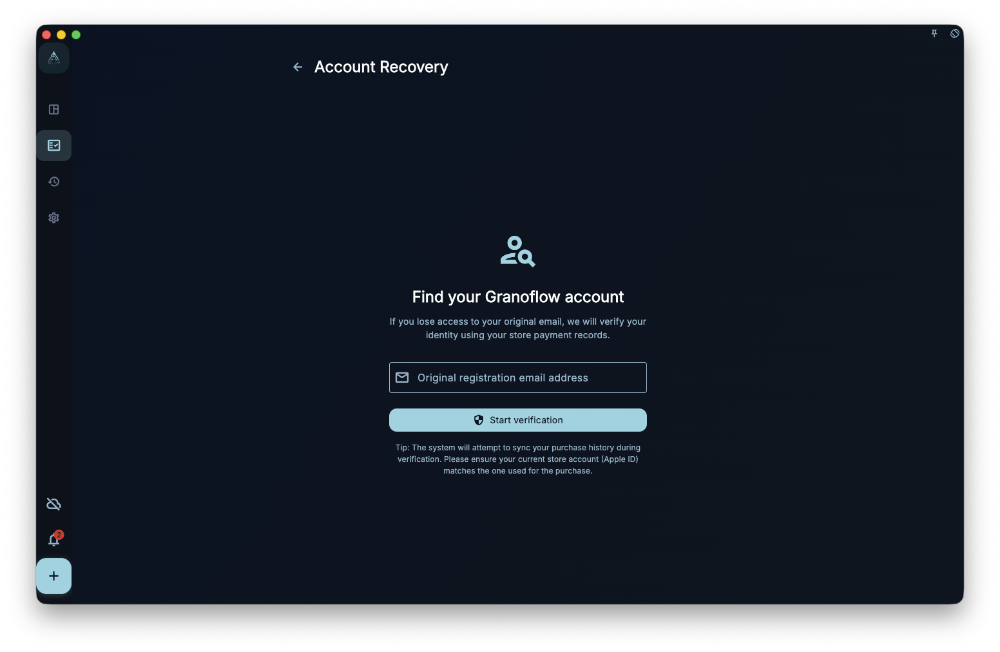

Account recovery is for one specific situation: you believe you previously bought GranoFlow through App Store, Google Play, or another store, but you are not sure which GranoFlow account that purchase is connected to.

It is not account deletion, sign-out, restore purchases, or data recovery. It only submits a recovery request so the system can try to check the email you provide against the store-side record.

## Where To Enter

Use the account recovery link from the sign-in or account area. The page asks for the email you want to recover, then starts the request.

<!-- manual-screenshot:id=account-recovery-main -->

Before starting, confirm:

- This device can access the store account where the purchase was made.
- The email you enter is the one you want connected to a GranoFlow account.
- If you only want to restore a current platform purchase, read “Platform purchases and restore purchases” first. If you want local data back, read “Backup and restore” or “Sync existing cloud data on a new device.”

## What Happens After Submitting

After you start recovery, GranoFlow first tries to read purchase history from the current platform, then submits the store record anchor and your declared email for server-side checking.

You may see several outcomes:

- Request submitted: the system received the recovery request. Follow the prompt and watch for email if needed.
- No history found: no usable purchase history was found for the current platform or account.
- Mismatch: the store record and the email you entered cannot be connected by the current check.
- Temporary failure: network, store service, or server checking may be unavailable. Try again later.

## What It Cannot Guarantee

Account recovery cannot guarantee that a purchase, account, subscription, or data will be restored to the account you are currently using. It also does not directly change local data, clear a device, cancel an account deletion request, or recover your encryption key.

If you may have signed in with the wrong account, do not delete local data yet. Return to the account page, check the current email, then review subscription, device management, and data security pages.

## Next Step

If subscription entitlement is missing, read “Platform purchases and restore purchases.” If the issue is cloud data or encryption keys, read “Sync existing cloud data on a new device” and “Encryption and recovery key.”
