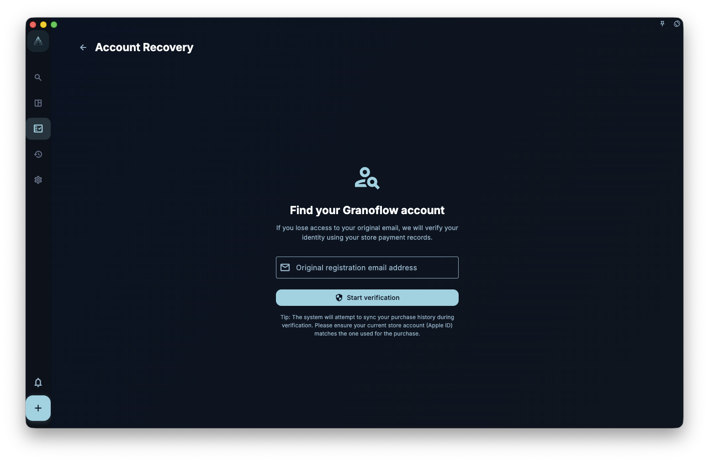

If you purchased GranoFlow membership through the App Store or Google Play but cannot see member benefits in your current account, account recovery lets you submit a verification request: the system checks whether the store purchase record can match the email you enter.

Account recovery only handles the case where a purchase may be connected to a different account. It is not for deleting an account, signing out, restoring a purchase, recovering local data, or recovering an encryption key.

<!-- manual-screenshot:id=account-recovery-main -->

## When to use account recovery

Use account recovery when:

- You are sure you purchased GranoFlow through the App Store or Google Play
- Your current signed-in account does not show member benefits
- You are not sure which email you used to register or connect the purchase

Do not use account recovery when:

- You only want to restore a subscription on the current platform: use "Restore purchase"
- Your local data is missing: see "Backup and restore"
- You need to recover an encryption key: see "Encryption and recovery key"

## Steps

1. Find the "Account recovery" link on the sign-in page or an account-related page.
2. Enter the email address you want to use for verification.
3. Make sure this device can access the App Store or Google Play account that was used to purchase GranoFlow.
4. Submit the request, then follow the page prompts while you wait for verification, or check the related email.

## Possible outcomes

| Result | Meaning |
| --- | --- |
| Request submitted | The system has received the request. Follow the page prompts or check your email |
| No history found | No purchase record that can be used for verification was found on the current platform |
| Records do not match | The store purchase record and the email you entered cannot be connected through the current verification |
| Temporary failure | The network or service is temporarily unavailable. You can try again later |

:::caution[Do not delete data yet]
If you suspect you are signed in to the wrong account, **do not delete local data first**. Confirm your current signed-in email, then check the subscription page and device management.
:::
