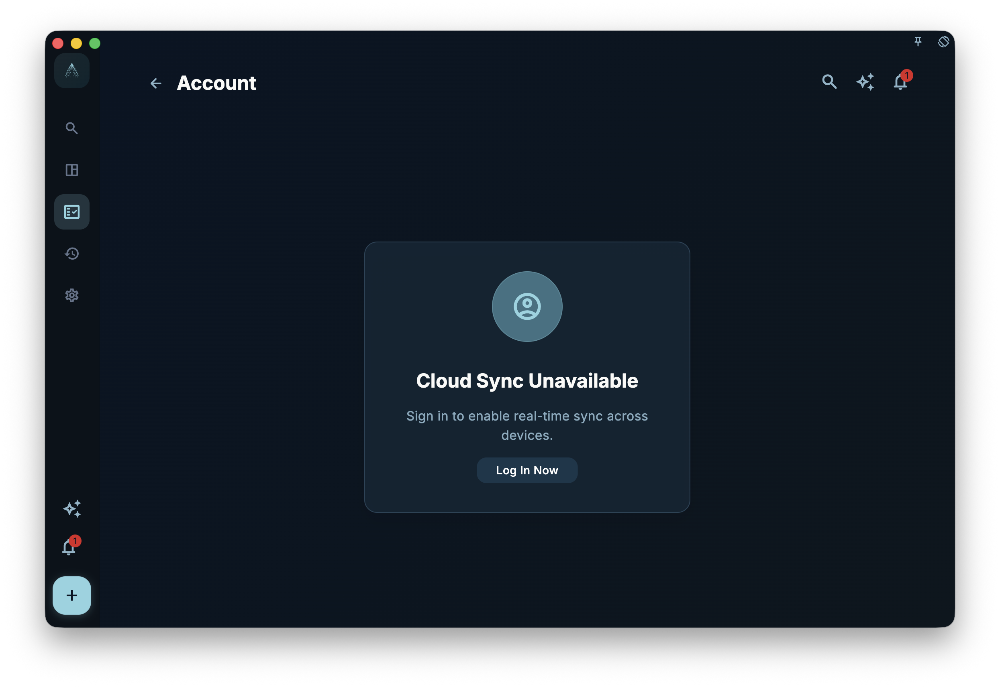

GranoFlow uses passwordless sign-in. No username-plus-password combo — just your email address and a verification link.

## How to sign in

1. Enter your email address
2. Check your inbox for the verification email and click the link
3. Return to GranoFlow — you are signed in

No password to remember or forget.

## Why the same email matters

Sync, device recognition, and subscription benefits are all tied to your account (your email address). If you sign in with `a@gmail.com` on your phone and `b@gmail.com` on your computer, those are **two separate accounts** — data does not sync between them.

## Using GranoFlow without signing in

You can use GranoFlow without an account — tasks, journals, and all features work normally.  
These features require sign-in:

- Cross-device sync
- Subscription recognition
- Encrypted cloud backup

## What signing out does

Signing out **does not delete any data on this device**. Your tasks, journals, and projects stay intact — you just need to sign in again next time.

:::note[Cannot find the verification email?]
Check your spam folder first. If 5 minutes have passed with no email, you can request a new one.
:::
