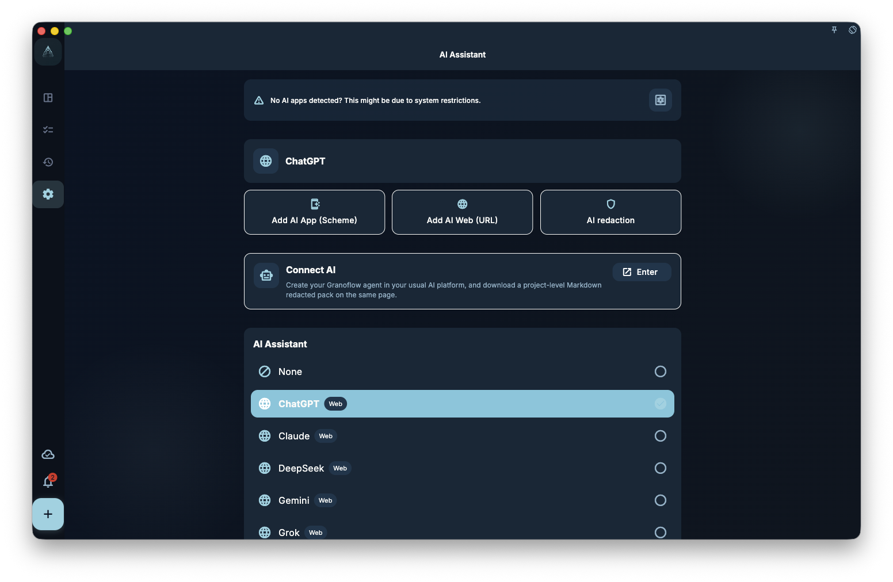

You just finished a meeting. The notes are on your clipboard, full of action items scattered across paragraphs. The clipboard assistant turns that mess into a task list, which you review and confirm before writing.

## How to use it

1. Copy the text you want to organize (meeting notes, email snippets, quick notes…)
2. Open GranoFlow's clipboard assistant
3. AI analyzes the content and extracts what it thinks are action items
4. Review the preview and adjust as needed
5. Confirm to write the tasks

## What works well

- Action items from meeting notes
- Follow-ups from emails
- Commitments from chat conversations
- Scattered to-dos from personal notes

## Things to watch out for

- AI extracts what it "understands" as tasks — background context may be misread as a to-do
- Always check the preview before confirming
- Content is not sent anywhere in the background — only when you actively trigger the assistant

:::tip[Want to limit what gets sent?]
Delete irrelevant parts from your clipboard before triggering the assistant, so only the content you actually want organized gets processed.
:::
