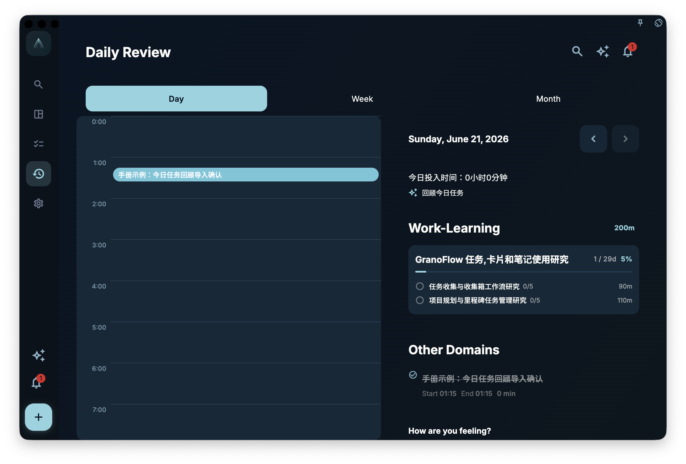

**Review Today's Tasks** is for the daily review. It helps you organize the day's tasks, lessons, and next steps, then save the confirmed details back to tasks and today's domain reports.

AI only prepares suggestions. Title, Task Review, report content, and optional new tasks are written only after you confirm them in GranoFlow. Task start time, end time, and duration are sent only as read-only context and cannot be written back through this flow.

## Where to start

Open the daily review and find **Review Today's Tasks** in the right sidebar. If there are no tasks to review today, the entry stays disabled and GranoFlow tells you there are no reviewable tasks yet.

When there are reviewable tasks, the sidebar shows **Review Today's Tasks** directly.

## What AI discusses with you

AI starts with a table ordered by the task times already recorded in GranoFlow. It can use that timing as context, but real time corrections must be made manually in the task list or task detail view. AI then summarizes domain, project, and milestone progress from the day.

You explain the real situation, difficulties, or lessons learned. AI records, understands, and organizes what you confirm; it does not invent the conclusion for you.

## Fields that can be written back

The import can update only these task fields, plus the domain reports involved that day and any new tasks you confirm:

| Field | What it is for |
| --- | --- |
| Task title | Improve the task title |
| Task Review | Save the task-level review you confirmed |

This flow cannot change task time, task description, tags, reminders, existing deadlines, or other fields. It can create tasks after you confirm them, but only with a title, date, and optional project / milestone binding. Project and milestone progress is saved only as part of the day's report content; it does not directly edit project or milestone records.

## Confirmation before import

After AI produces a result, copy it back into GranoFlow. GranoFlow shows a confirmation screen first, so you can check which tasks, fields, and report summaries will change.
If you do not confirm, nothing is written. After confirming, you can still adjust the task manually in task details.

<!-- manual-screenshot:id=ai-daily-task-review-import-confirm -->

## Where the result appears

The written Task Review appears in the detail view for completed or archived tasks. It is editable when the task is completed or archived. If you reopen the task later, the review is kept but hidden while the task is incomplete, and appears again when the task is completed or archived.
