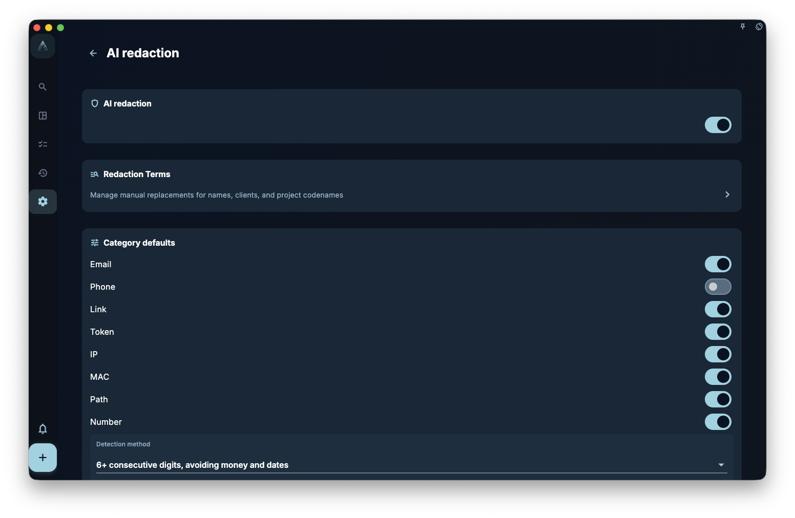

If you are just browsing tasks, writing a diary, or doing a review, GranoFlow does not send that content to AI. Only when you actively click an AI feature will the text relevant to that operation enter the AI processing flow.

<!-- manual-screenshot:id=ai-redaction-settings -->

## What Each Feature Sends

| AI Feature | Content That May Be Sent |
| --- | --- |
| Title Parsing | The task title you are currently typing |
| Clipboard Assistant | The text you copied to the clipboard |
| Helper Prompt | The current page's description + the prompt you set |
| Task Assistant | The current task's title, status, due date, reminder, task review, labels, description summary, attachment name summary, nodes, belonging project / milestone summary, resource pack summary, and the summary of review cards already linked to this task |
| Review AI Organization | The review content you triggered for this organization |

The Task Assistant does not automatically send page runtime states such as the current focus session, which task is pinned, or whether the task detail button is clickable. It sees the task content and context; if you simply want to know what "Focus", "Complete", or "Current Task" means in the task details, it is better to use the Helper prompt on that page.

## What Is the Purpose of AI Redaction Settings

AI redaction settings only affect replacement before content is sent; they do not mean AI will automatically detect all sensitive information.

There are four key items:

- **Master Switch**: When turned off, GranoFlow will not perform outbound redaction replacement.
- **Category Default Policy**: When the system, based on rules, detects content like email, links, dates, long numbers, amounts, bank cards, IBAN, etc., the default handling is to either "Redact" or "Allow". Phone numbers default to "Allow"; you can turn them on as needed.
- **Phone, Number, and Amount Configuration**: After enabling phone numbers, you can choose the region to recognize. The region selector supports searching by region name, English name, code, or telephone area code. The area code only helps you find the region; actual recognition is based on your saved region choices. For numbers, you can set the minimum number of digits and replace them with "Digits" or "Number". For amounts, you can choose whether to recognize currency symbols/codes and Chinese uppercase amounts, and set replacement with "Amount" or "Sum".
- **Redaction Term Management**: Maintain your own manually confirmed "sensitive word → codename" rules, such as client names, company names, or project codes.

Automatic detection is only a rule aid, not intelligent review. It may miss special formats or mistakenly treat ordinary numbers as sensitive content. When the category default policy is "Redact", automatically detected values will be temporarily replaced with easier-to-read short-term redacted values, such as `13xxxxx4821`, `foxxxx3920@1846.com`, `2026-08-17`, `192.43.18.206`, and will attempt to restore them after AI returns. They will not be automatically written into your long-term redaction term list. **You still need to check the content before sending.**

## What Do Automatic Redacted Values Look Like

Rule-based automatic detection tries to preserve the shape of the type so that AI can tell whether it sees a phone number, email, link, date, amount, bank card, IBAN, IP, MAC, token, or file path.

- Numbers, phone numbers, bank cards, and similar account numbers: For 6 or more digits, keep the first two real digits, replace the middle with `x`, and use short-term stable random digits for the last 4; for fewer than 6 digits, replace with random digits of the same length.
- Amounts: Preserve currency or amount markers and roughly preserve the order of magnitude so AI can make a coarse analysis, but do not keep the exact amount.
- Dates: Preserve the year; month and day are replaced with legal random values.
- Emails and links: Preserve recognizable structure; the domain becomes a short-term random numeric domain, e.g., `1846.com`.
- Paths: Preserve common structural words and extensions; other fragments are replaced with random letters.

AI request packets and exported results from the local HTTP AI helper also include `isRedacted` and `redactionReason`. `isRedacted: true` means this request has completed the redaction flow; `false` means redaction is disabled, the request packet cannot be confirmed, or redaction metadata is missing – the specific reason will be written in `redactionReason`.

## What Will the Redaction Terms Do

The term list you maintain under "Redaction Term Management" will be automatically replaced with the codenames you set before content is sent. Please see the "Redaction Terms" page for details.

## One-Sentence Summary

> GranoFlow's AI only involves data when you actively trigger a feature; it does not collect data in the background, does not automatically upload, and the scope of sending is limited to the relevant text that the current feature needs to process.
