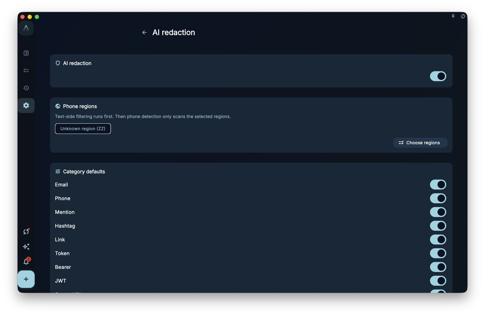

GranoFlow AI features prepare the relevant text you explicitly send, then hand it to an external AI tool. Simply browsing tasks, projects, reviews, or manual pages does not automatically send local data to AI.

## Where To Start

Judge the data scope from the AI feature you are using:

- While writing a task title, title parsing focuses on the title you are entering.
- AI assistant and clipboard entry points first place the current content into the clipboard, then open the external AI tool.
- Entry points with structured return only listen for clipboard results for a short time after you start AI from inside the app. General consultation assistants do not read the clipboard constantly.
- AI redaction settings live in settings and control rule-based replacement and automatic discovery before sending.

## What Happens Before Sending

When you use an AI feature, GranoFlow prepares the fields needed for that feature. If AI redaction is enabled, it only checks the content fields that the feature marks as redactable, then replaces terms currently set to “Redact” with placeholder tokens.

It does not scan the entire local database, and it does not rewrite protocol fields, assistant instructions, system rules, or content unrelated to the current feature.

## AI Redaction Settings

AI redaction settings include the master switch, phone detection regions, and category defaults. Use them before you often send tasks, reviews, or organizing material to an external AI.

<!-- manual-screenshot:id=ai-redaction-settings -->

- When the master switch is off, GranoFlow does not run this redaction replacement before sending.
- Category defaults affect whether automatically discovered terms default to “Redact” or “No redact.” Common categories include email, phone, links, mentions, hashtags, tokens, IP addresses, paths, and money.
- Phone regions affect phone-number detection. The wrong region may reduce detection or make ordinary numbers look like phone numbers.

Redaction is a rule-based aid, not a security guarantee. It may miss unusually written sensitive information or flag non-sensitive text. Review the text before sending.

## Redaction Terms

If you have client names, company names, project codenames, or other fixed sensitive terms, maintain them on the “Redaction terms” page. Terms set to “Redact” are replaced with tokens in outbound content; on return, GranoFlow tries to restore those tokens only in allowed fields.

The redaction terms page has its own guide: read “Redaction terms” before adding, deleting, allowing, or choosing visible versus encrypted cloud sync.

## Results And Boundaries

AI in GranoFlow is an organizing assistant, not an autonomous agent. It can reduce input and cleanup effort, but structure, privacy choices, and final writes remain yours.

- AI output may be incomplete or wrong for the context. Important tasks should follow the fields you confirmed.
- Unconfirmed suggestions do not change tasks or reviews for you.
- Redaction terms and category rules only affect content GranoFlow prepares for external AI. They do not mean the external AI will correctly understand, protect, or delete that information.

## Next Step

If you are concerned about accidental edits, read “Why changes need confirmation.” If you want to maintain fixed sensitive terms, read “Redaction terms.”
