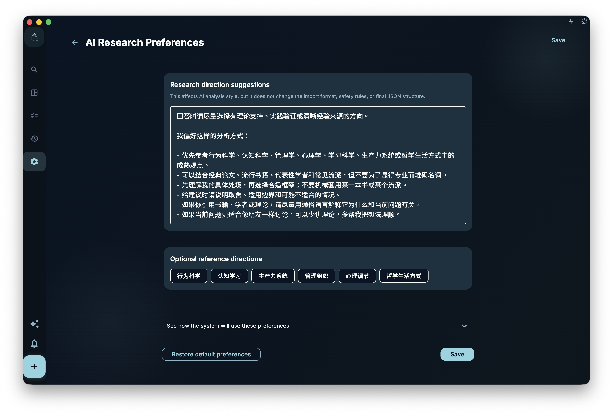

A common concern about AI features: will it automatically change my tasks, or quietly send my data somewhere?

GranoFlow's AI design principle is simple: **AI suggests, you confirm, nothing writes without confirmation**.

## What AI can do in GranoFlow

| Feature | What it does |
| --- | --- |
| Title parsing | Recognizes dates, tags, reminders from task titles |
| Clipboard assistant | Organizes copied text into a task list |
| Helper prompt | Helps you consult external AI about GranoFlow pages |
| AI redaction | Replaces sensitive words before sending to external AI |

## What AI will not do

- ❌ Will not automatically write tasks — all field changes require your confirmation
- ❌ Will not silently read your data in the background
- ❌ Cannot guarantee accuracy — results are suggestions, not facts

## The basic data logic

Normal use (browsing tasks, journaling, reviewing) **does not involve AI at all** — your data stays on device.

Only when you actively trigger an AI feature does the relevant text enter the AI processing pipeline. Redaction settings can replace sensitive words before anything is sent.

If the selected external assistant or web page cannot be opened, GranoFlow keeps the prepared prompt and asks you to try again later; local tasks and reviews are not changed.

:::tip[Want more control over your data?]
Go to "AI redaction" settings to maintain a sensitive-word list, so GranoFlow automatically substitutes them before sending content to external AI.
:::
