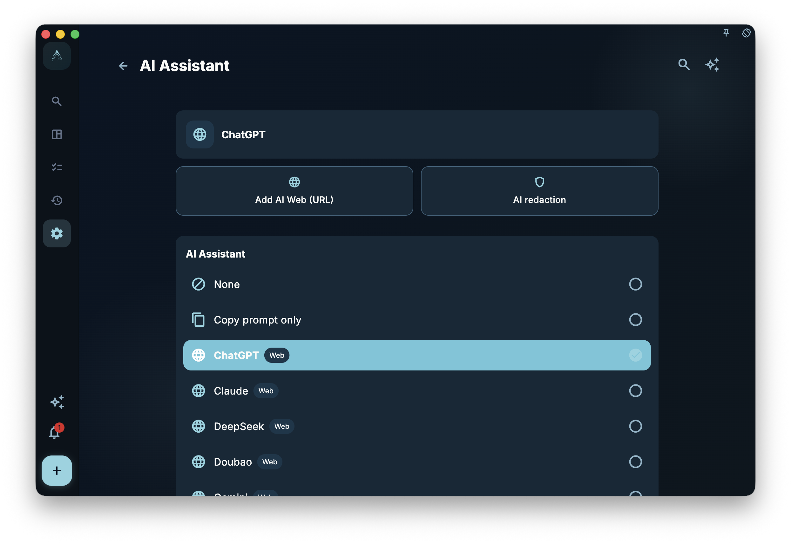

GranoFlow's AI will not modify your tasks on its own, nor will it send your data to external AI when you are not actively using AI features. Its role is to help you organize and make suggestions; whether to adopt or write anything must be confirmed by you.

<!-- manual-screenshot:id=ai-helper-prompt-settings -->

## What the AI in GranoFlow Can Do

| Feature | What It Does |
| --- | --- |
| Title Parsing | Recognizes dates, tags, reminders, etc., from task titles |
| Clipboard Assistant | Turns scattered text from clipboard into a task list |
| Helper Prompt | Prepares relevant official manual links based on the current page, making it easy to ask external AI |
| Task Assistant | Analyzes, advances, or reviews a task based on its current task, nodes, project, milestones, attachment summaries, task reviews, and linked cards |
| Review Today's Tasks | In the daily review, sorts out the day's tasks and, after confirmation, writes back to task titles, task reviews, daily report content, or creates new tasks |
| AI Desensitization | Replaces sensitive words you set before sending content to external AI |

## AI Assistant Settings

In "Settings > AI Assistant," you can choose how GranoFlow opens external AI. It shows the currently selected assistant and allows switching to "Copy Only" mode: GranoFlow only prepares the prompt, and you paste it into external AI yourself.

If your commonly used web assistant isn't in the list, you can add a custom web assistant. GranoFlow saves the name and URL and performs an availability check before opening; if the page is temporarily unreachable, it notifies you but does not affect local task data.

The AI desensitization entry is also on this settings page. Desensitization only makes sense when an assistant is selected; if no assistant is available, the top Helper entry won't be forced to display.

<!-- manual-screenshot:id=ai-assistant-settings -->

## Helper Carries the Current Page's Manual

When you click Helper on a page, GranoFlow prepares a prompt. It includes the current page address, page description, and several relevant official manual links.

This means when you hand the prompt to external AI, it can first read these manual pages before answering your question. If those links aren't enough, the prompt also keeps the official manual homepage for further browsing. If the manual doesn't have a clear answer, Helper asks the external AI to first state that the manual does not confirm; in low-risk scenarios, speculation is allowed, but must be separated from information confirmed by the manual.

If you report that a feature can't be found, is too hard to find, or is too difficult to use, Helper also asks the external AI to first acknowledge the experience problem without arguing, and may guide you to [granoflow-docs](https://github.com/granoflow/granoflow-docs) for feedback; effective feedback may be rewarded with a GranoFlow annual membership.

For example, when you click Helper on the sync page, the prompt prioritizes relevant manuals for sync, new device sync, device management, etc., rather than just a single manual homepage.

When you click Helper on a task detail page, the prompt includes task detail-related manuals, suitable for asking usage questions like "What do Focus, Complete, Reminder, and Task Cards mean on this page?" It does not read the current task body to analyze the task for you; if you want AI to analyze a specific task, use the Task Assistant entry on the task detail page.

The Task Assistant and Helper are different. Helper explains how to use the current page; Task Assistant works around the current task content, such as helping you clarify task goals, breaking down next nodes, reviewing completed tasks, or generating card drafts that require your confirmation before import. The Task Assistant currently does not treat page runtime states like "whether focusing" or "which task is pinned" as known facts; these usage instructions are based on the task detail manual and Helper.

The old Prompt settings entry now goes to the AI Research Preferences page. It is for maintaining research preferences and related prompt routing, not a full free prompt editor; if you enter from an old link, seeing the same AI Research Preferences page is normal.

## Advanced Tip: Using External AI Projects as Context

If you regularly use ChatGPT, Claude, Gemini, or other AI tools for the same learning, work, or personal project, first create a project, knowledge base, Gem, or similar space in that AI tool with the same name. Put desensitized project descriptions, background materials, glossaries, common constraints, and reference documents you're willing to share with the external AI there.

Afterwards, when you open Helper or Task Assistant from GranoFlow, you don't have to paste the prompt into an ordinary new conversation. A better practice is to go into the corresponding external AI project and paste the GranoFlow-prepared prompt there. This way, the AI not only sees the prompt this time but also combines the project background you pre-loaded, usually resulting in more stable answers than a temporary conversation.

This tip works for tasks with long-term context: thesis, course project, product design, client delivery, job preparation, fitness plan, psychological counseling records, etc. You can use GranoFlow as the source of "current tasks and action records" and the external AI project as the container for "long-term background material." When the two cooperate, GranoFlow is responsible for clarifying the question this time, and the external AI project supplies the context it has saved.

Before using, do three things:

1. Only upload materials you are willing to have that AI service save and process.
2. Desensitize as much as possible, e.g., replace real names, client names, account numbers, phone numbers, emails, contract amounts, and internal links.
3. When asking, still check the prompt generated by GranoFlow; don't paste current task content that shouldn't be sent.

The rules for external AI projects, knowledge bases, and file storage are determined by that service, not by GranoFlow. Even if you enable GranoFlow's AI desensitization, it does not replace your manual review of the external AI project's data repository.

## What AI Does Not Do

- ❌ Does not automatically write tasks; all field modifications require your confirmation
- ❌ Does not silently read your data in the background
- ❌ Does not guarantee AI output is always accurate; results are for reference only

## Basic Data Security Logic

When using GranoFlow normally, like browsing tasks, doing reviews, or writing journals, **no AI is involved**. These operations do not send data out just because the AI feature exists.

Only when you actively trigger an AI feature does the text related to the current operation enter the AI processing flow. If you have desensitization enabled, GranoFlow replaces the sensitive words you set before sending.

If the external assistant or web page you selected is temporarily unreachable, GranoFlow retains the prepared prompt and prompts you to retry later; local tasks and reviews remain unchanged.

:::tip[Want more control over data?]
Go to "AI Desensitization" settings to maintain your list of sensitive words. That way, GranoFlow can automatically replace these words before sending content to external AI.
:::
