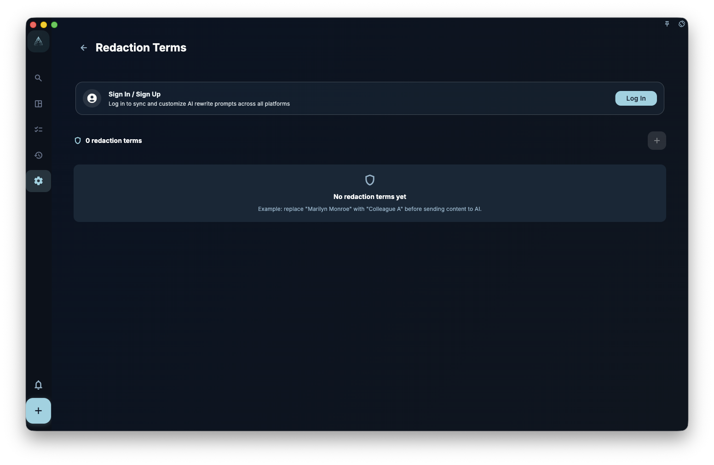

If you do not want client names, company names, project codenames, or similar text sent to external AI as-is, add them to Redaction terms. Before GranoFlow sends content to external AI, it replaces the sensitive text with the placeholder you set, such as replacing "Acme Corp" with `CLIENT_A`; after the AI returns a response, GranoFlow tries to restore the placeholder back to the original text.

<!-- manual-screenshot:id=ai-redaction-terms-settings -->

## What to add

Add fixed terms that you often include in content but do not want sent directly to external AI:

- Client names, company names
- Project codenames, such as internal nicknames
- Fixed email addresses, physical addresses
- Contract amounts, account identifiers
- Other frequently used terms that you consider unsuitable to expose directly to external AI

## How to add a term

1. Open Redaction terms in AI settings.
2. Add a new term.
3. Enter the original text in the sensitive term field, such as "Acme Corp".
4. Enter the replacement placeholder, such as `CLIENT_A` or `PROJECT_X`.
5. Save. The rule takes effect the next time an AI feature needs to send content.

Even if the screenshot does not load, the main idea is simple: one redaction term is one "original text → placeholder" rule.

## Redacted vs Allowed

Each term has two states:

- **Redacted**: before sending content to external AI, GranoFlow replaces the sensitive term with its placeholder; after the AI responds, it tries to restore the placeholder.
- **Allowed**: GranoFlow does not replace this term. Use this when you have confirmed the term is not sensitive and does not need redaction.

If you are unsure, using Redacted is safer. Switch to Allowed only when you are sure the term can be sent as-is.

## Does this guarantee security?

No. Redaction terms are an aid, not a security guarantee.

These are the limits:

- They may miss abbreviations, aliases, typos, or other variants.
- They only process terms you have already defined; they do not automatically scan and identify all sensitive data.
- After external AI receives the redacted content, GranoFlow cannot control how that external AI handles it.

Manually review important content before sending.

:::tip[Members-only feature]
Redaction terms are available to members. Non-members can view the interface but cannot customize it.
:::
