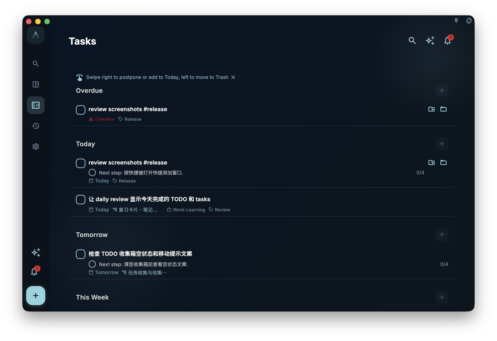

If you want to turn a title like “Meeting with Sarah tomorrow 3pm #work” into organized task details faster, type the full sentence into the title field; GranoFlow will try to recognize time, tags, project/milestone mentions, and reminder information, then show suggestions that only apply after you confirm them.

After you confirm and add it, the task appears in Inbox or Tasks depending on its fields. This screenshot shows a `#release` sample after it has landed in Tasks.

<!-- manual-screenshot:id=ai-title-parsing-quick-add -->

## What title parsing can recognize

As you type a task title, GranoFlow tries to find information that can be organized into task fields. It may recognize:

- **Time expressions**: today, tomorrow, next Friday, March 15, 3pm…
- **Tags**: hashtag tags such as #work or #personal
- **Project/milestone mentions**: via `@` or the "add to project" entry to select available milestones under existing projects; when quickly adding tasks, it does not just attach the task to the project itself
- **Reminder triggers**: phrases such as “remind me,” “don’t forget,” or “remember to”

## What happens after recognition

Recognition results are shown as suggestions first. They **do not write to the task automatically**. You can handle them as needed:

- ✅ Accept all suggestions
- ✅ Accept only some of them, such as adding the tag but not the date
- ✅ Ignore the suggestions and keep the title as typed

If you do not confirm a suggestion, it will not change the task.

## What to do when recognition is wrong

Title parsing is not 100% accurate. If a word is misidentified, or the suggestion is not what you want, you can:

- Ignore that suggestion; if you do not accept it, it will not be written to the task
- Open the task details and manually adjust the correct field

:::note[English date expressions work too]
Writing "tomorrow 3pm" or "next Monday" in your title can also be recognized. You do not have to use Chinese only.
:::
