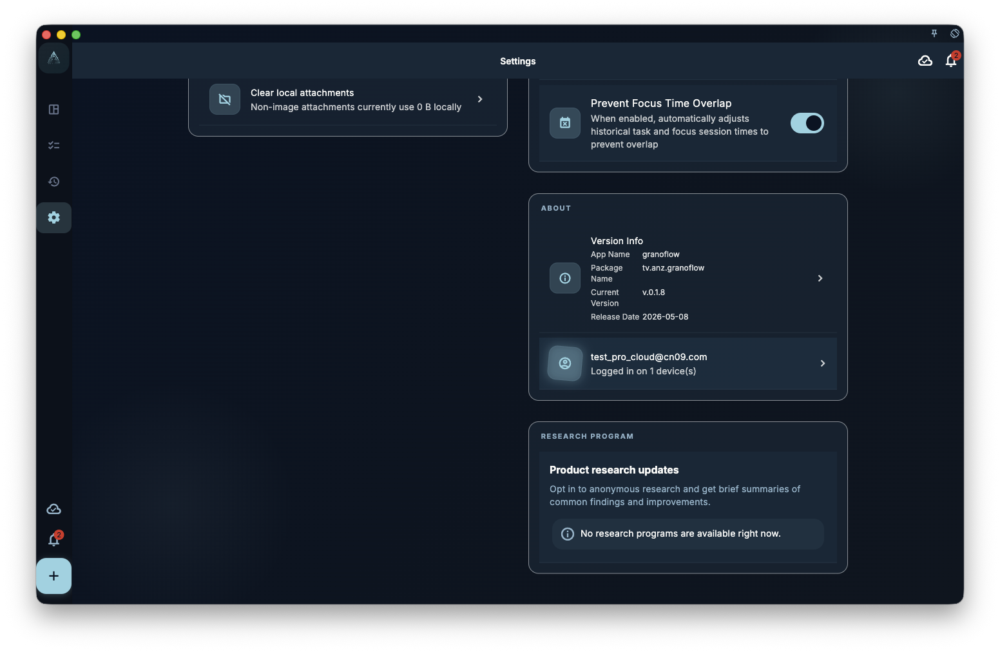

When you attach an image to a task or review entry, it is saved alongside the task — but images have different storage and sync behavior from text.

## Text vs images — how they differ

- **Text tasks**: small, sync fast, nearly real-time between device and cloud
- **Image attachments**: large, sync slower, may still be uploading after the text already synced

This means: you might see a task synced on another device while the image still shows a loading placeholder — that is normal.

## Removing image attachments

Two levels of deletion:

- **Remove from task**: breaks the link between the task and the image, but the local file may still exist on this device
- **Clear attachment cache**: deletes the actual image files from this device, freeing storage

After clearing the cache, if the image was successfully uploaded to the cloud, it can be re-downloaded. If the image was never uploaded, clearing removes it permanently.

## Does backup include images?

Local backups typically include only text data (tasks, projects, review records). **Image files may not be included**. Long-term image retention depends on cloud sync being active and successful.

:::note[Images require network to upload]
Images do not upload offline. If you attach a photo while underground, its cloud upload waits until the next time network is available.
:::
