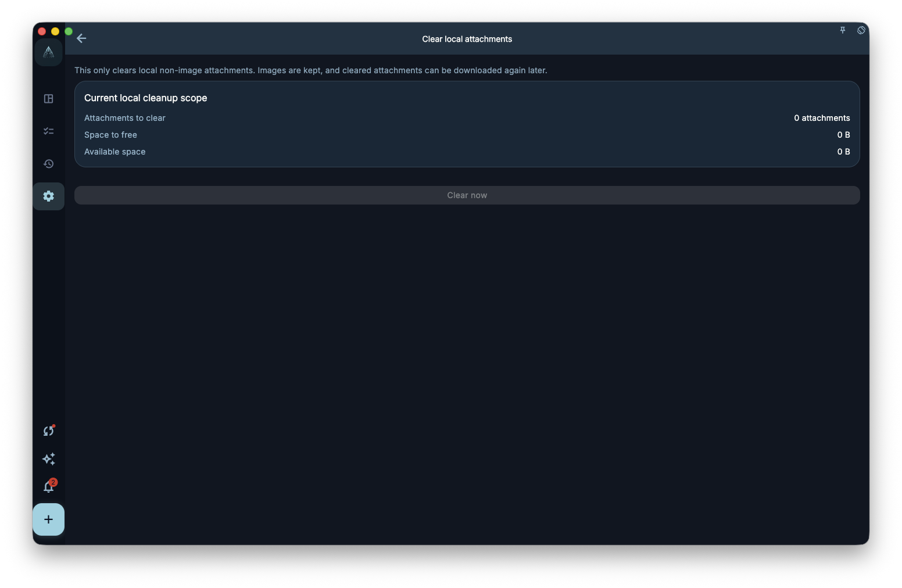

Understand how attachments and images are saved with tasks or records, and their boundaries during sync, backup, and deletion.

## Where To Start

Start from Data, Security, Sync, Backup, or Account settings. First decide whether you are handling everyday sync, device migration, accidental deletion, or account deletion.

<!-- manual-screenshot:id=data-attachments-clear-detail -->

## How To Use It

- Check whether the data is visible on the current device first, then decide whether it needs to sync elsewhere.
- Before encryption, recovery key, backup import, or account deletion actions, read the confirmation text and keep necessary credentials.
- After the action, check current and other devices. For restore, prefer a clear backup file or restore entry point.

## Results And Boundaries

GranoFlow follows a local-first approach: local availability is the base, while sync and backup extend it to multi-device and recovery scenarios. They complement each other but do not replace each other.

- Sync is not backup, and backup does not solve every account or key issue.
- Encryption and recovery keys protect data, but recovery is limited if the key is lost or no usable backup remains.

## Next Step

If you are unsure where to start, use the data and security overview, then return to the matching sync, backup, recovery key, or account page.
