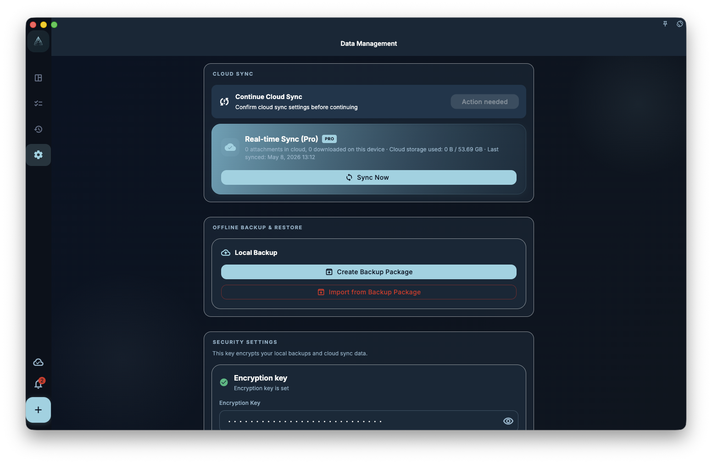

If you want a copy of your data before deleting things, changing devices, or reinstalling the system, manually export a backup from the Data / Backup page in GranoFlow Settings and save the file somewhere you control and can find again.

<!-- manual-screenshot:id=data-backup-restore-management -->

## Backup vs sync

A backup is a copy of your data at one point in time. Sync keeps the current data updated in the cloud or across devices. They solve different problems.

<!-- markdownlint-disable MD060 -->
|  | Backup | Cloud sync |
| --- | --- | --- |
| Keeps historical state? | ✅ Yes, it is a point-in-time snapshot | ❌ It only represents the current state |
| Can recover an older state after accidental deletion? | ✅ Yes, back to the time the backup was created | ❌ Deletions usually sync to the cloud too |
| Requires manual action? | ✅ Yes, you need to export and save the file manually | ✅/❌ Sync runs automatically, but it does not keep historical versions |
<!-- markdownlint-enable MD060 -->

## When to create a backup

Create a backup before situations like these:

- Upgrading to a major new app version
- Switching phones, switching computers, or reinstalling the system
- Deleting many tasks or projects
- Finishing an important phase and wanting to keep a record of that moment

## How to create a backup

1. Open GranoFlow Settings.
2. Go to the Data / Backup page.
3. Choose Export backup.
4. Wait for the export to finish. Do not tap repeatedly or close the page while it is processing.
5. Save the exported backup file somewhere you control, such as iCloud, a local folder, or your computer.

## How to restore from backup

1. Open GranoFlow Settings.
2. Go to the Data / Backup page.
3. Choose Import backup.
4. Select the backup file you saved earlier.
5. After confirming the import, wait for restore to finish. Do not repeat the action while it is processing.

:::caution[Restoring overwrites current data]
Restoring from backup is an overwrite operation. After import, the data on the current device is replaced by the data in the backup file. If you want to keep the latest content on this device, export a current backup first, then import the older backup.
:::
