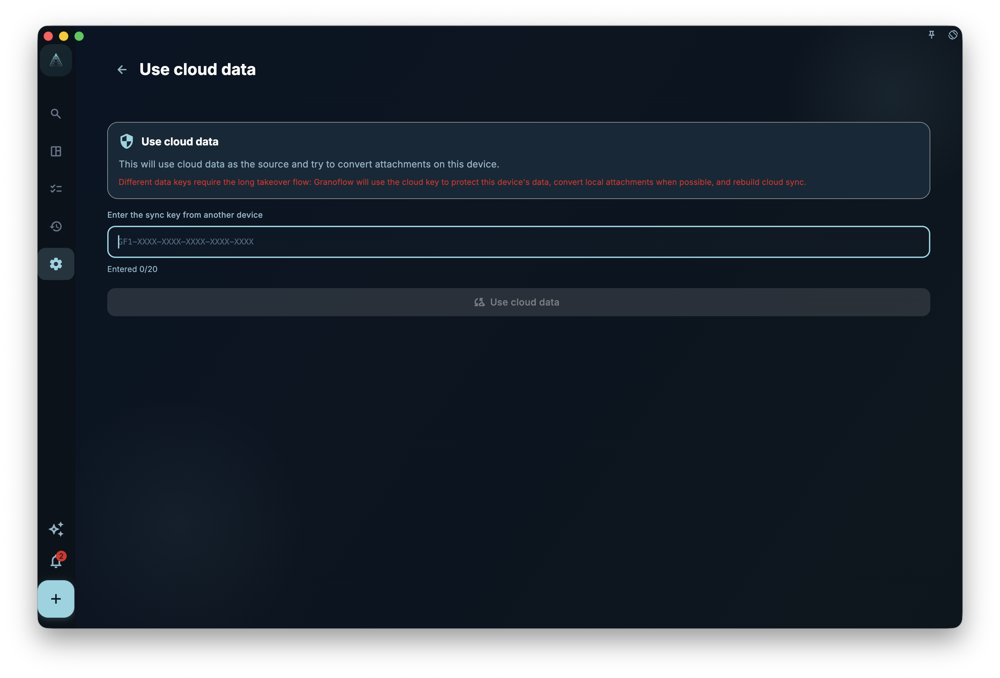

The practical thing to do now is: while you can still open GranoFlow on your old device, save your cloud sync key in a password manager or another safe place. When you change devices, reinstall the app, or see a “sync key mismatch” prompt, GranoFlow may ask for this key; without it, your encrypted cloud data may not open.

<!-- manual-screenshot:id=data-encryption-recovery-key -->

GranoFlow uses end-to-end encryption for cloud sync data. The encryption key works like a safe key: **without it, even GranoFlow’s own servers cannot read your data**. This also means: **if you lose the key yourself, GranoFlow cannot reset or recover it for you.**

## Key vs password — what is the difference

<!-- markdownlint-disable MD060 -->
|  | Login password or verification email | Encryption / sync key |
| --- | --- | --- |
| What it does | Proves who you are | Opens encrypted cloud data |
| If you forget it | Request a new verification email | **Cannot be recovered** |
| If you change it | Only affects sign-in | Affects whether you can access cloud data |
<!-- markdownlint-enable MD060 -->

## Where to find your key

In GranoFlow Settings → Data / Security / Sync, you can view and save the cloud sync key for the current device.

**Save it now:** write the key down or store it in your password manager. Do not keep it only inside GranoFlow, because the time you need the key is often when you have changed devices or can no longer access the old setup.

## When you need the key on a new device

You may need the cloud sync key from your old device when you:

- Switch to a new phone or computer
- Reinstall GranoFlow
- See a “sync key mismatch” prompt

After you enter the correct key, the new device can access the existing encrypted cloud data.

## What happens after entering the key

GranoFlow first checks whether the key can open the current cloud data:

- **Key matches, and cloud and local data are the same data set** → connects to sync directly
- **Key matches, but the local device has new data** → shows a choice screen so you can decide which data to keep
- **Key is wrong** → does not change any data, and asks you to try again

## If you lost the key

Check in this order:

1. **Can you still use the old device?** → Open GranoFlow on it, find the key, and copy it
2. **Is it in your password manager?** → Check the password manager you normally use
3. **Do you still have the old device, but the app will not open?** → Contact GranoFlow support and explain the old device and current situation

If none of these work, the encrypted cloud data may be unrecoverable. Local backups, if you have any, still work.

## When GranoFlow asks for the cloud sync key

If GranoFlow says the keys do not match, enter the complete key for the current cloud data.

After you enter the correct key, GranoFlow checks whether this device and the cloud data belong to the same data set:

- If they are the same data set, GranoFlow only updates the sync key setting on this device.
- If they are different data sets, GranoFlow moves to the “Use cloud data” confirmation flow. Before continuing, make sure you know which data matters more: this device or the cloud.

:::caution[Keys are not passwords and cannot be reset]
If you lose your encryption key, GranoFlow cannot reset or recover it for you. Save your key now instead of waiting until you need it.
:::
