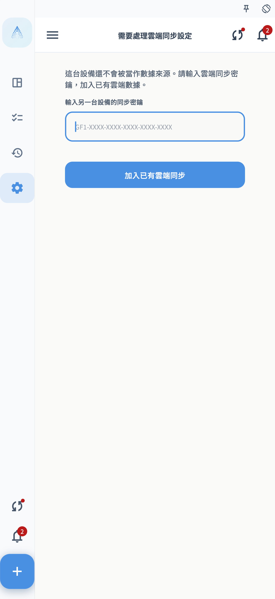
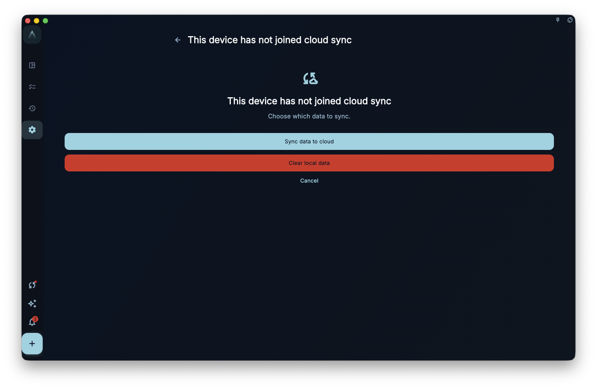
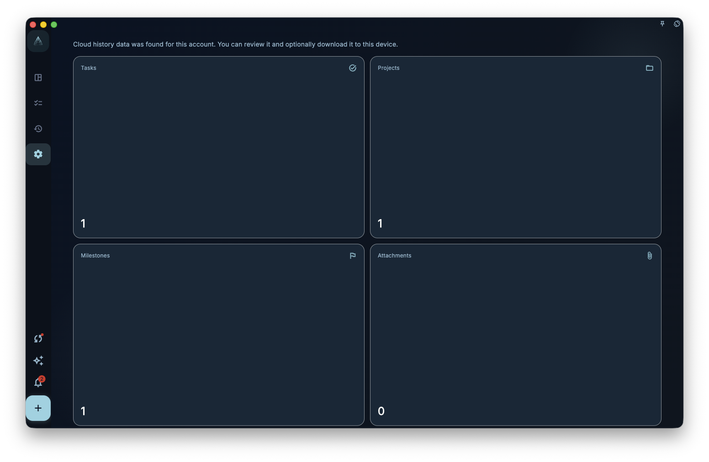
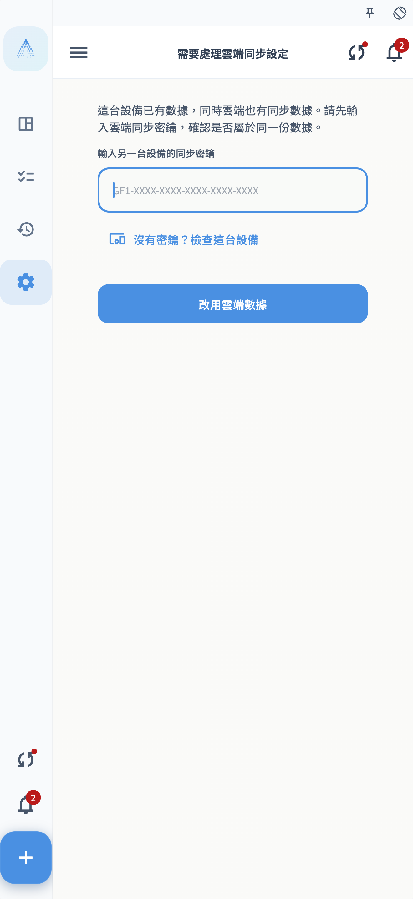

Use this page for one specific situation: your GranoFlow sync data already exists in the cloud, and you installed GranoFlow on a new device so you can bring that cloud data onto it.

If the new device has not added tasks, projects, reviews, or images yet, follow “Syncing an empty device.” If you have already added content on this device, read “When this device already has local data” first.

## Before You Start

Check these 4 things first:

- The old device has synced successfully, or you have previously saved the cloud sync key.
- The new device is signed in to the same GranoFlow account.
- The new device has network access, and the account can read cloud sync data.
- You know where the cloud sync key is. It is not your sign-in password; it is the key that opens encrypted cloud data.

The safest order is: confirm the data is still present on the old device, get the sync key, then work on the new device.

<!-- manual-screenshot:id=data-new-device-sync-old-device-key -->

## Syncing An Empty Device

An empty device means a fresh install, a reinstall, or a device where you have not entered real data yet. Even if GranoFlow has already generated a local key on this device, it is still treated as empty and will not overwrite cloud data with this device.

1. On the old device, open GranoFlow and go to the page where you save or view the sync key.
2. Copy or record the current cloud sync key. Do not use only your sign-in password; it cannot replace the sync key.
3. Install and open GranoFlow on the new device.
4. Sign in with the same account.
5. Open the sync entry. If the page asks you to “Enter the sync key from another device,” paste the cloud sync key from the old device.
6. Choose “Join existing cloud sync,” then wait for verification and download to finish.
7. Return to tasks, projects, reviews, and other pages to confirm that the cloud data appears on the new device.

<!-- manual-screenshot:id=data-new-device-sync-enter-key -->

<!-- manual-screenshot:id=data-new-device-sync-join-existing -->

<!-- manual-screenshot:id=data-new-device-sync-restored-data -->

After this finishes, the device has joined the original cloud sync. Later changes from any device continue through normal multi-device sync.

## What An Empty Device Will Not Do

The goal of this flow is to download existing cloud data, not rebuild cloud sync from the new device.

- It will not replace the cloud sync key just because the new device generated a fresh local key.
- It should not default to high-risk choices such as overwriting cloud data with this device.
- It will not treat a device with no real data as the data source.

If you see choices such as “Sync data to cloud,” “Rebuild cloud sync,” or “Clear local data,” this is no longer the simplest empty-device case. Stop and use the next section.

## When This Device Has Not Joined Cloud Sync

Sometimes GranoFlow finds that the current device uses the same account, but has not joined the current cloud sync yet. The page asks you to choose between “Sync data to cloud,” “Clear local data,” and “Cancel.”

<!-- manual-screenshot:id=data-sync-device-join -->

This page can appear from the sync entry, data management, or the sync status prompt. It is not a normal sync button; it is a one-time choice about which data source to keep.

- Choose “Sync data to cloud” only after confirming that the tasks, projects, reviews, and attachments on this device are the version you want to keep. After confirmation, cloud sync uses this device's data, and other devices are affected later.
- Choose “Clear local data” only after confirming that cloud data is the version you want to keep. After confirmation, this device clears its current local data and local sync settings, then downloads from the cloud.
- Choose “Cancel” to stop this device-join flow. You can check the old device, cloud overview, or backup page first.

None of these choices can guarantee recovery for local attachments that never uploaded, unsynced changes on another device, or encrypted data whose key you did not keep. Before choosing, confirm that the most important data is still visible on this device or the old device.

## Cloud Data Overview

If the account already has cloud history, GranoFlow may show a cloud data overview first. It summarizes roughly how many tasks, projects, milestones, attachments, the last cloud update, and the data time span, so you can decide whether this is the cloud data you were looking for.

<!-- manual-screenshot:id=data-cloud-data-overview -->

This page usually appears from the sync entry after sign-in, especially when the current device cannot upload yet but cloud history is available for download. Its main action is “Download cloud data”; in some upload-capable, higher-risk cases, it may also show “Clear cloud data.”

- “Download cloud data” is a one-time recovery action. It does not automatically enable everyday cloud sync. After downloading, return to tasks, projects, and reviews to check the content.
- “Clear cloud data” requires additional confirmation and may require system verification. After confirmation, cloud sync data is cleared; do not treat this as refresh or reload.
- If the page says local and cloud encryption states differ, handle the key issue in “Encryption and recovery key” first instead of repeatedly downloading.

The overview can only help you identify the approximate scope of cloud history. It cannot guarantee that every attachment has already downloaded to this device, or decide whether another device still has unsynced changes.

## When This Device Already Has Local Data

If you have already added tasks, projects, reviews, or uploaded an image to a task on the new device, syncing existing cloud data is more complex. Local and cloud may both contain data, so GranoFlow needs to determine which side you want to keep.

<!-- manual-screenshot:id=data-new-device-sync-local-image-task -->

Do this first:

1. Do not repeatedly choose “Sync data to cloud” or “Rebuild cloud sync.”
2. Check what important data exists on the old device or in the cloud.
3. If the new content on this device is also important, confirm that you can still see it locally. Export it or keep a separate record if needed.
4. Enter the cloud sync key from the old device when GranoFlow asks, so it can first check whether the cloud data can be opened.

Then decide based on what the page shows:

<!-- manual-screenshot:id=data-new-device-sync-local-data-choice -->

- If you only want cloud data on this device, choose the path that uses cloud data or clears local data. This makes the device use cloud data, and newly added local content that has not synced successfully may not be kept.
- Only choose “Sync data to cloud” or “Rebuild cloud sync” if this device is truly the source you want to keep. Those actions make cloud sync use this device's current data and affect other devices later.
- If you are unsure, cancel, check the old device and sync key, then continue.

Be extra careful with images and attachments: they need the local file, attachment record, and cloud upload state to settle together. Do not assume an image is safely in the cloud only because the task text appears.

## Common Questions

**What if the key cannot open cloud sync settings?**  
Check that you copied the full key, including the beginning, end, and spaces. Make sure it is the cloud sync key, not your account password or unrelated text from a local backup.

**What if I do not have the old device nearby?**  
Use the saved cloud sync key if you kept it earlier. If you have neither the old device nor the key, GranoFlow may not be able to unlock the existing encrypted cloud data.

**I just created one task on the new device. Can I still treat it as empty?**  
No. Once the device has real local data, use the local-data section first and decide whether to keep cloud data, local data, or cancel.

**Why are some images still loading after sync finishes?**  
Tasks and image files do not always finish at the same moment. Sync may restore task and attachment records first, while image files continue uploading, downloading, or loading on demand. Keep the network available and check again after sync settles.

## Next Step

After sync finishes, read “Multi-device sync” to understand everyday syncing. If you are worried about losing the key, read “Encryption and recovery key” and save the necessary credentials.
