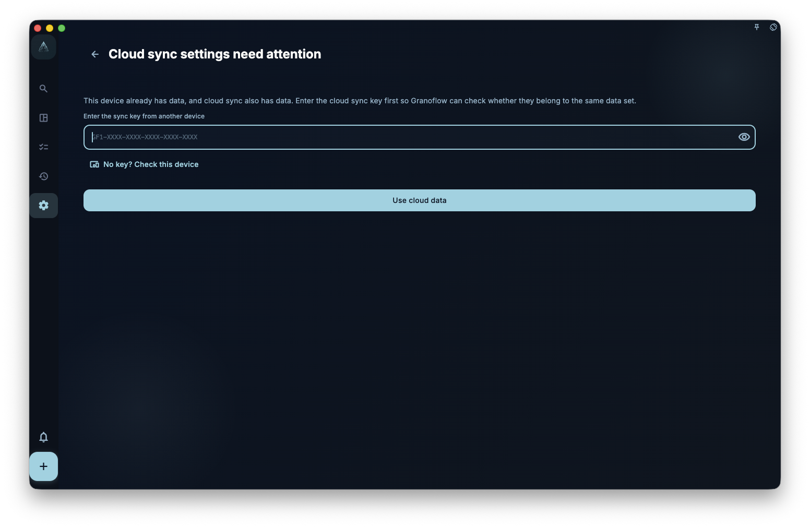
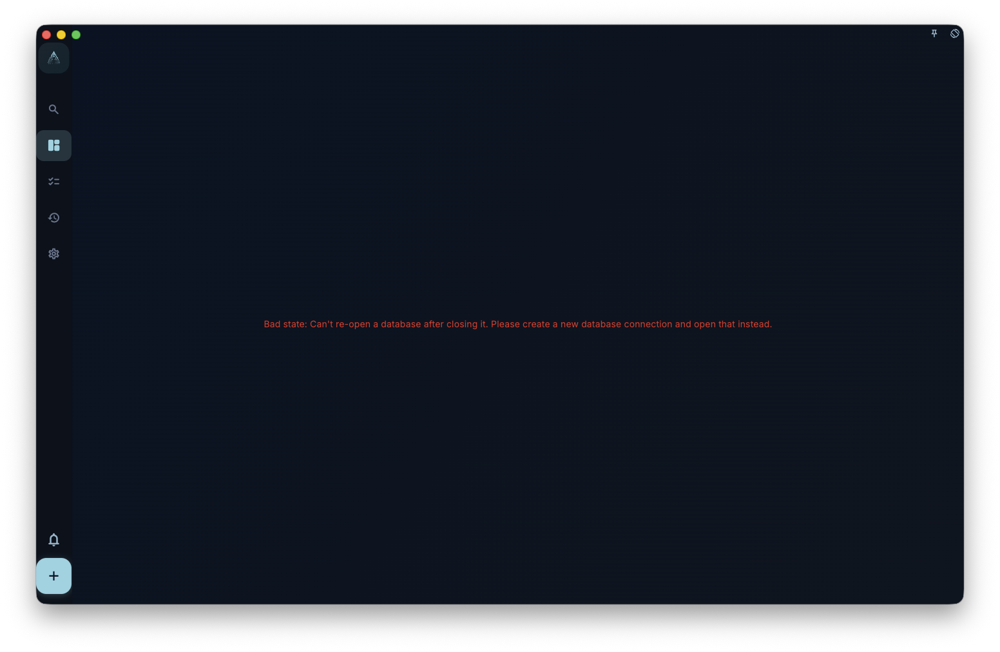
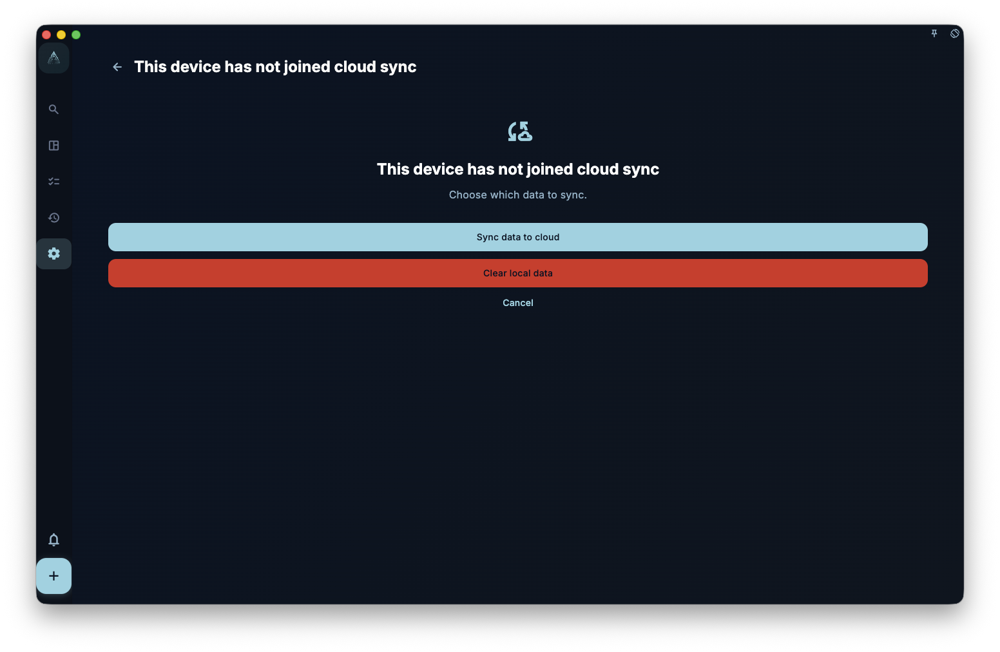

If you got a new phone or computer, or reinstalled GranoFlow, and want to bring back data that was already synced to the cloud: find the cloud sync key from the old device or from your saved records, sign in to the same account on the new device, enter that key, and choose to join the existing cloud sync.

If the new device has not added tasks, projects, reviews, or images yet, follow “Sync An Empty Device.” If you have already added content on this device, read “When This Device Already Has Local Data” first and do not treat it as empty.

## Before You Start

Check these 4 things first:

- The old device has synced successfully before, or you previously saved the cloud sync key.
- The new device is signed in to the same GranoFlow account.
- The new device has network access, and the account can read cloud sync data.
- You have the cloud sync key. It is not your sign-in password; it is the key that opens encrypted cloud data.

The safest order is: first confirm that the data is still on the old device, then copy or record the sync key, and only then work on the new device.

<!-- manual-screenshot:id=data-new-device-sync-old-device-key -->

## Sync An Empty Device

An empty device means a fresh install, a reinstall, or a device where you have not entered real data yet. Even if GranoFlow has already generated a local key on this device, it is still treated as empty as long as you have not added real content. It will not overwrite cloud data with this empty device.

1. On the old device, open GranoFlow and go to the page where you save or view the sync key.
2. Copy or record the current cloud sync key. Do not rely on your sign-in password; it cannot replace the sync key.
3. Install and open GranoFlow on the new device.
4. Sign in with the same account.
5. Open the sync entry. If the page asks you to “Enter the sync key from another device,” enter the cloud sync key from the old device.
6. Select “Join existing cloud sync,” then wait for verification and download to finish.
7. Return to tasks, projects, reviews, and other pages to confirm that the cloud data appears on the new device.

<!-- manual-screenshot:id=data-new-device-sync-enter-key -->

<!-- manual-screenshot:id=data-new-device-sync-join-existing -->

<!-- manual-screenshot:id=data-new-device-sync-restored-data -->

After this finishes, the device has joined the original cloud sync. Later changes from any device continue through normal multi-device sync.

## What An Empty Device Will Not Do

The purpose of this flow is to download existing cloud data to the new device. It is not meant to rebuild cloud data from the new device.

- It will not replace the cloud sync key just because the new device generated a new local key.
- It will not default to using this new device to overwrite cloud data.
- It will not treat a device with no real data as the data source.

If you see choices such as “Sync data to cloud,” “Rebuild cloud sync,” or “Clear local data,” this is no longer the simplest empty-device flow. Stop and use the next section.

## When This Device Has Not Joined Cloud Sync

Sometimes GranoFlow finds that the current device is signed in to the same account, but has not joined the current cloud sync yet. The page asks you to choose between “Sync data to cloud,” “Clear local data,” and “Cancel.”

<!-- manual-screenshot:id=data-sync-device-join -->

This page usually appears from the sync entry in Account or Settings, or from a top/side sync problem indicator. It is not a normal sync button or a “synced” status prompt. It is asking which side’s data you want to keep.

- Choose “Sync data to cloud” only after confirming that the tasks, projects, reviews, and attachments on this device are the version you want to keep. After confirmation, cloud sync uses this device’s data, and other devices are affected later.
- Choose “Clear local data” only after confirming that cloud data is the version you want to keep. After confirmation, this device clears its current local data and local sync settings, then downloads from the cloud.
- Choose “Cancel” to stop this flow. You can check the old device, your sync key record, or a backup page first.

None of these choices can guarantee recovery for local attachments that never uploaded, unsynced changes on another device, or data whose key you did not keep. Before choosing, confirm that the most important data is still visible on this device or the old device.

## Download Existing Cloud Data

If the account has decryptable cloud history, GranoFlow opens the sync progress page and starts recovery directly. This only downloads cloud data to the current device; it does not automatically enable everyday upload sync. After the download finishes, return to tasks, projects, and reviews to check the content.

If GranoFlow needs the original cloud sync key, it shows the lightweight “Enter cloud sync key” entry. You can enter the key to continue recovery, choose “Clear cloud data” to start over, or choose “Pause sync for now” to keep working locally while you look for the key. Pausing does not download, upload, or clear cloud data.

## When This Device Already Has Local Data

If you have already added tasks, projects, reviews, or uploaded an image to a task on the new device, be more careful before syncing existing cloud data. Local and cloud may both contain data, so GranoFlow needs to confirm which side you want to keep.

<!-- manual-screenshot:id=data-new-device-sync-local-image-task -->

Do these first:

1. Do not repeatedly click “Sync data to cloud” or “Rebuild cloud sync.”
2. Check what important data exists on the old device or in the cloud.
3. If the new content on this device is also important, confirm that you can still see it locally. Export it or keep screenshots if needed.
4. When the page asks, enter the cloud sync key from the old device so GranoFlow can first check whether the cloud data can be opened.

Then decide based on the choices shown on the page:

<!-- manual-screenshot:id=data-new-device-sync-local-data-choice -->

- If you only want cloud data on this device, choose the path that uses cloud data or clears local data. This makes the device use cloud data, and newly added local content that has not synced successfully may not be kept.
- Only choose “Sync data to cloud” or “Rebuild cloud sync” if this device is truly the source you want to keep. These actions make cloud sync use this device’s current data and affect other devices later. Do not treat them as normal download buttons.
- If you are unsure, cancel, check the old device and sync key, then continue.

Be extra careful with images and attachments. An image is only stable when the local file, attachment record, and cloud upload state have all settled. Do not assume an image is safely in the cloud only because the task text appears.

## Common Questions

**What if the key cannot open cloud sync settings?**
Check that you copied the full key, especially the beginning, end, and spaces. Make sure it is the cloud sync key, not your account password or unrelated text from a local backup file.

**What if I do not have the old device nearby?**
Use the saved cloud sync key if you kept it earlier. If you have neither the old device nor the key, GranoFlow may not be able to unlock the existing encrypted cloud data.

**I just created one task on the new device. Can I still use the empty-device flow?**
No. Once this device has real local data, use “When This Device Already Has Local Data” first and decide whether to keep cloud data, local data, or cancel.

**Why are some images still loading after sync finishes?**
Tasks and image attachments may not finish at the same time. Normal sync may restore task and attachment records first, while image files continue uploading, downloading, or loading on demand. Keep the network available and check again after sync settles.

## Next Step

After sync finishes, read “Multi-device sync” to understand everyday syncing. If you are worried about losing the key, read “Encryption and recovery key” and save the necessary credentials.
