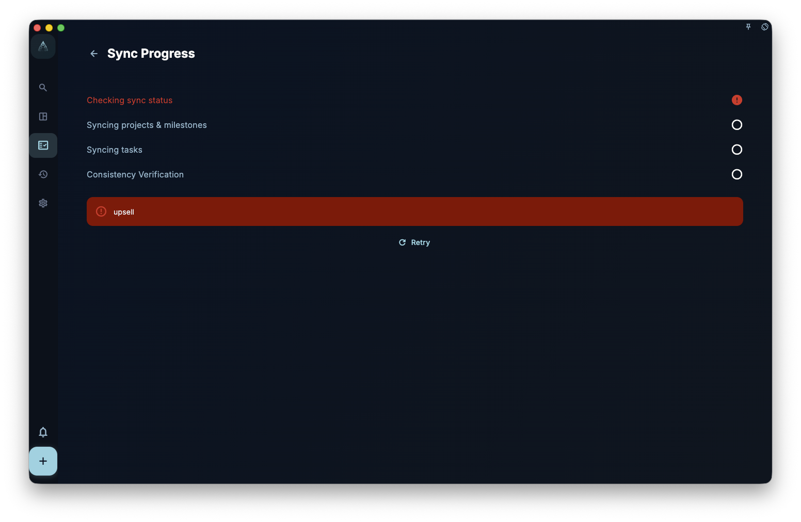

Cross-device sync means this: when you add, change, or delete something on one device, GranoFlow tries to make the other devices signed in to the same account match that state. It helps you keep using GranoFlow across devices, but it is not a backup for recovering accidentally deleted content.

## What syncs, and what does not

✅ What syncs:

- Tasks, such as title, due date, tags, and status
- Projects and milestones
- Review records
- Images and attachments, when the network allows

⚠️ The important part: sync is not a backup.

- **Delete something and it deletes everywhere**: sync is bidirectional, so deletion does not stay on just one device.
- **No version history**: sync does not save “what things looked like 3 days ago.”
- **Images may appear later**: text may finish syncing first, while images and attachments may follow later.

## Common sync statuses

| Status | Meaning |
| --- | --- |
| Syncing | Uploading or downloading changes. |
| Synced | This device matches the cloud. |
| Waiting | Changes are queued, usually because of the network. |
| Error | Sync hit a problem, so check your account or key. |

## Offline and service unavailable states

If you temporarily have no network connection, GranoFlow’s local data remains usable. You can still capture tasks, organize projects, write reviews, search, and export local backups.

If you are not signed in, do not have an active membership, or the sync service cannot be reached, cloud sync is temporarily unavailable. When you tap an online feature, the app will ask you to try again later; data already on this device remains usable.

If your device has internet but the sync service is temporarily unavailable, the app will not block local use. Data already on this device remains editable; changes that need to upload to or download from the cloud can sync again later.

## Adding a new device to sync

If you get a new phone, or reinstall the app, and want to connect to your existing cloud data, you need the **cloud sync key** from your old device.

See the full walkthrough → [Sync existing cloud data to a new device](/manual/data-security-and-recovery/new-device-sync/)

:::caution[Sync does not replace backup]
Export local backups regularly. Tasks you delete accidentally cannot be recovered through sync, because the cloud and your other devices delete them too.
:::
