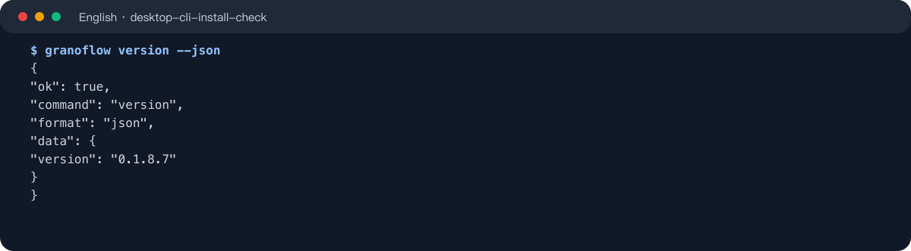
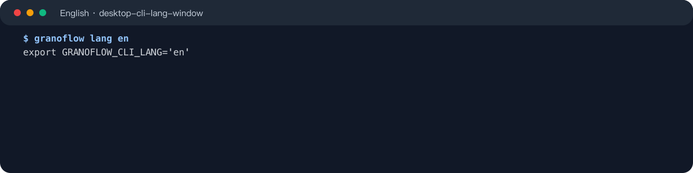
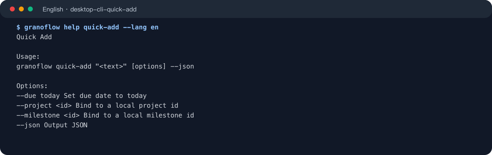
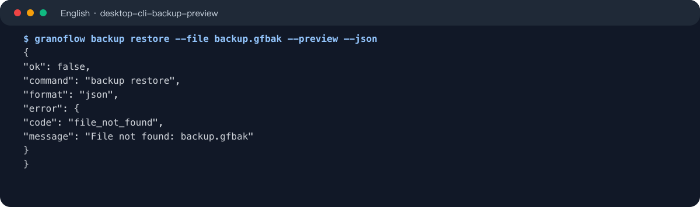
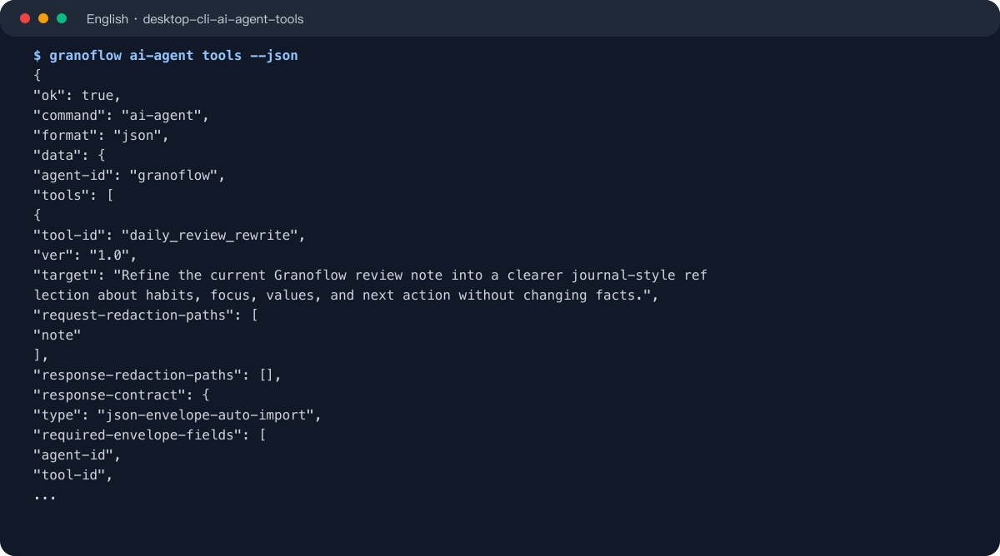

The command line tool is for users who want to open GranoFlow from a terminal, script, or automation flow. Confirm the command first, then copy the examples below. Screenshots show the output shape; the copyable commands are the source to follow.

## Install And Check

After installing the desktop app, open Settings and use Command Line Tool to check the installation or command alias status for your platform, system redaction, and token verification. Release builds ship a compiled `granoflow` command, so users do not need the Dart SDK.

- The Windows installer registers the terminal command. To repair it, rerun the installer.
- On macOS, Settings can install or repair `/usr/local/bin/granoflow`.
- Linux AppImage users configure a command alias manually; Settings provides the copyable command.
- Android and iOS do not show the command line tool entry.

```bash
granoflow version --json
```



Common discovery commands:

```bash
granoflow
granoflow help
granoflow help version
granoflow version
```

## Output Language

`--lang` changes one command. `granoflow lang <locale>` prints one shell command for the current terminal window; after you run that line, only this terminal window changes language. Closing the window clears it, and the app language is unchanged.

```bash
granoflow --lang en help version
eval "$(granoflow lang en)"
granoflow lang en | Invoke-Expression
```



Supported locales are `en`, `zh-CN`, `zh-HK`, and `zh-TW`.

## Basic Commands

All current commands support `--json`. JSON mode prints only a JSON envelope, with no human prompt, progress log, or token value mixed in.

```bash
granoflow status --json
granoflow open --json
granoflow open today --json
granoflow logout --json
```

`granoflow open` without a page tries to start the desktop app. `status`, `open today`, and `logout` need the running GranoFlow app. If the app is not reachable, the command returns a stable error instead of bypassing the app and reading the local database directly.

## Command Reference

Use this list when you only need to choose the right command:

| Command | Use | Needs the running app |
| --- | --- | --- |
| `help` | Show general help or help for one command | No |
| `version` | Show the CLI version | No |
| `lang` | Set the output language for the current terminal window | No |
| `open` | Open Home, Inbox, Today, Projects, Review, Settings, or Account | Depends on use |
| `status` | Print a redacted status summary from the running app | Yes |
| `quick-add` | Send one text item to the app to create a task | Yes |
| `logout` | Clear the local app session | Yes |
| `export` | Export a user data package | Yes |
| `import` | Import a user data package | Yes |
| `backup create` | Create a local backup package | Yes |
| `backup restore --preview` | Preview the impact of restoring a local backup package | Yes |
| `backup restore --confirm` | Restore a local backup package | Yes |
| `ai-agent tools` | List available AI automation tools | No |
| `ai-agent system-template` | Print the system prompt template for one AI tool | No |
| `ai-agent package` | Generate a controlled JSON package for an external AI flow | No |
| `ai-agent <resource> request` | Build an AI request package from local context | Depends on resource |
| `ai-agent <resource> validate` | Validate AI response JSON | No |
| `ai-agent <resource> apply` | Validate and apply an AI response | Depends on resource |
| `ai-agent assets cleanup` | Clean up AI automation asset references | No |

AI automation resources include `task`, `milestone task-draft`, `daily-review rewrite`, `journal daily`, `journal weekly`, `journal monthly`, `domain-values`, and `work-learning report`.

## Open And Quick Add

Use `open` to jump to common pages. Use `quick-add` to send a text task to the running app.

```bash
granoflow open inbox --json
granoflow open today --json
granoflow quick-add "Draft weekly review notes" --json
granoflow quick-add "Check backup status today" --due today --json
```



`quick-add` does not write directly to the local database when the app is unavailable. Open the GranoFlow desktop app, then retry the command.

## Import, Export, And Backup

Data commands also run through the active app, so they reuse the app's export, import, backup, sync-risk, and attachment checks.

```bash
granoflow export --scope local --out granoflow-export.gflow --json
granoflow import --file granoflow-export.gflow --json
granoflow backup create --out granoflow-backup.gfbak --json
granoflow backup restore --file granoflow-backup.gfbak --preview --json
granoflow backup restore --file granoflow-backup.gfbak --confirm --backup-secret-file backup-secret.txt --json
```



Use `--preview` to inspect the backup package first, then use `--confirm` to restore. Backup secrets are accepted only through `--backup-secret-file`, so the secret does not enter shell history, process lists, or logs.

## AI Automation

`ai-agent` is for users who want to hand controlled GranoFlow JSON packages to an external AI or automation flow. The CLI generates, validates, and applies controlled JSON packages; it does not call an external model for you, and it does not fake local data when the local store cannot be read safely.

```bash
granoflow ai-agent tools --json
granoflow ai-agent diagnostics local-store --json
granoflow ai-agent system-template single_task_ai --json
granoflow ai-agent package single_task_ai --input data.json --json
```



Resource commands use full paths:

```bash
granoflow ai-agent task request --id <task-id> --json
granoflow ai-agent task validate --input reply.json --json
granoflow ai-agent task apply --input reply.json --json
```

## Safety Settings And Next Step

- Open Command Line Tool in Settings to check installation, system redaction, and token verification.
- Use `--json` for machine-readable output. Use normal help for human reading.
- Before import, restore, or AI apply commands, inspect the preview or validation result first.
- If a command says the app is unreachable, start the GranoFlow desktop app and retry.
