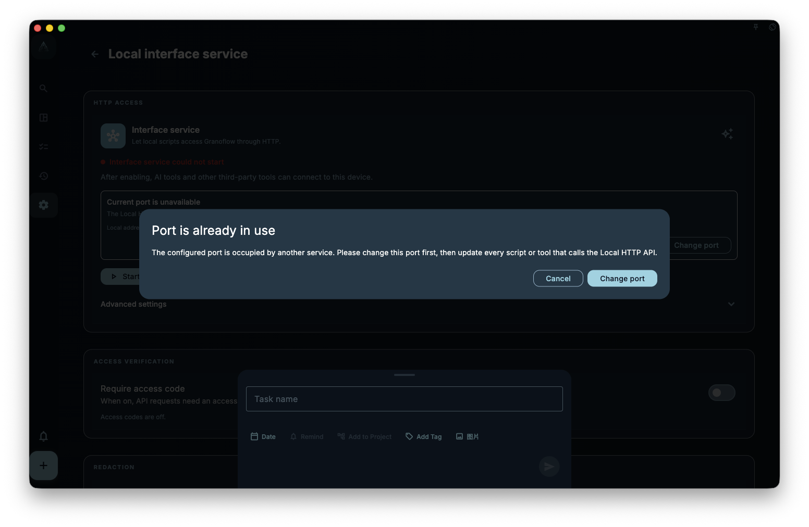

GranoFlow desktop exposes its automation surface through the Local HTTP API. It listens on the loopback address `http://127.0.0.1:<port>` so scripts, AI assistants, and command-line clients can use the automation capabilities that the app has made public.

The `granoflow` CLI is an optional client for this API. It has been rewritten in Rust and is distributed as a separate download. It is not installed with the macOS, Windows, or Linux desktop app. In other words, after installing the desktop app you can already enable the Local HTTP API inside the app; if you also want the `granoflow` terminal command, install the CLI separately.

The Local HTTP API binds to `127.0.0.1` by default. It is not automatically exposed to your LAN or the public internet. To debug the local API from a `granoflow.com` documentation page, enable official documentation debugging in the app and use the one-hour access code. Documentation pages are no longer trusted for business API access by default. Allowing any device origin also requires access-code protection first.

## Start Here

- To understand the model first, read [How the Local HTTP API Works](/manual/en/desktop/cli-how-it-works/)
- To check access codes, local access, App Lock, and secret boundaries, read [Security Settings and Secret Boundaries](/manual/en/desktop/cli-security-and-settings/)
- To look up CLI commands and HTTP endpoints, read [Command Reference and HTTP Mapping](/manual/en/desktop/cli-command-reference/)
- To combine calls in real scenarios, read [Workflows](/manual/en/desktop/cli-workflows/)
- To use scripts or AI assistants, read [JSON, Environment Variables, and Direct HTTP Calls](/manual/en/desktop/cli-json-and-scripting/)
- If something fails, read [Troubleshooting](/manual/en/desktop/cli-troubleshooting/)

## Install and First Check

Install and open the GranoFlow desktop app first, then enable the Local HTTP API from the local interface service settings page. This only enables the local API inside the app. It does not install the `granoflow` terminal command, write PATH, add an MSIX App Execution Alias, or create a `/usr/local/bin/granoflow` symlink.

<!-- manual-screenshot:id=desktop-command-line-tool-settings-main -->


If you only want to check whether the API is reachable, use curl directly:

```bash
curl -s http://127.0.0.1:56789/v1/health
curl -s http://127.0.0.1:56789/v1/version
```

If you have installed the CLI separately, check the connection configuration it sees:

```bash
granoflow config --json
granoflow health --json
```

The default API address is `http://127.0.0.1:56789`. If you changed the port in the app, the CLI must use the same address. You can set it with the config file, `--api-base-url`, or `GRANOFLOW_API_BASE_URL`.

## Common Misunderstandings

- The desktop app does not install, repair, or uninstall the CLI. CLI download, upgrade, signing, and PATH setup are handled by the website or release notes.
- The CLI does not read or write the GranoFlow database directly. Task, project, review, and card writes are forwarded to the running Local HTTP API and handled by the app service layer.
- `granoflow backup decrypt/encrypt` is an offline backup-package conversion tool. It does not depend on the running app, and it is not the same as creating an app backup or restoring data into the app.
- Public capabilities are defined by OpenAPI and CLI help. The old Dart CLI, in-app CLI installer, and `bin/granoflow.dart` entrypoint have retired.

## Current Status

Current public CLI packages are released separately by platform:

- macOS Apple Silicon: signed/notarized zip
- Linux x64: tar.gz
- Windows x64: unsigned zip first, then a signed zip uploaded by the Windows signing device

There is no macOS Intel CLI package. Desktop app installers do not include these CLI assets.

## Reference: Rules and Boundaries

This section is for checking boundaries; it is not required for the first check above.

- Public Local HTTP API endpoints are defined by the OpenAPI document.
- Public CLI commands are defined by `granoflow help --json` and this manual's command reference.
- Desktop installers on all three platforms must not write PATH, inject an MSIX App Execution Alias, embed a macOS CLI helper, or offer an in-app CLI install button.
- Protected endpoints still pass through the local API master switch, origin checks, App Lock, nonce, and access-code protection.

## Next

Now that the Local HTTP API and the standalone CLI are separate in your mind, the next page explains how they work together and why many automation issues should start from the local address and permission boundary.
