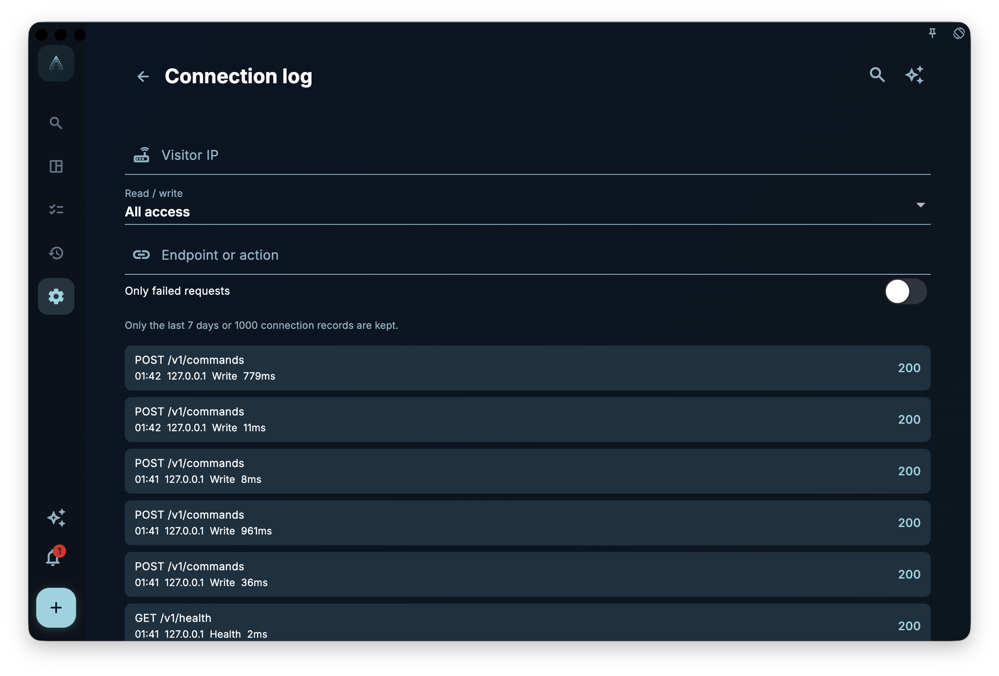

GranoFlow Desktop's main entry for automation is its local HTTP API. It listens on the loopback address
`http://127.0.0.1:<port>` and is used by scripts, AI assistants, or command-line clients to read and write the
App's publicly exposed automation capabilities.

The `granoflow` CLI is an optional client for this API. It is rewritten in Rust and distributed as a standalone package, not bundled with the macOS, Windows, or Linux desktop installers. In other words, after installing the desktop App, you can already enable the local HTTP API inside the App; if you also want to use the `granoflow` command in your terminal, you need to install the CLI separately.

The local HTTP API binds only to `127.0.0.1` by default; it does not automatically expose to LAN or the internet. If you need to debug the local interface from a `granoflow.com` documentation page, you must temporarily enable official docs debugging in the App and use a 1-hour access code. It no longer allows documentation pages to access business interfaces by default. Allowing requests from any device also requires enabling access code protection first.

## Start with This Navigation

- To understand how it works first: read [Local HTTP API How It Works](/manual/en/desktop/cli-how-it-works/)
- To confirm the differences between access codes, local access, App Lock, and keys: read [Security Settings and Key Boundaries](/manual/en/desktop/cli-security-and-settings/)
- To look up CLI commands and HTTP endpoints: read [Command Reference and HTTP Mapping](/manual/en/desktop/cli-command-reference/)
- To combine calls based on real scenarios: read [Workflows](/manual/en/desktop/cli-workflows/)
- To use with scripts or AI assistants: read [JSON, Environment Variables, and Direct Calls](/manual/en/desktop/cli-json-and-scripting/)
- For errors: read [Troubleshooting](/manual/en/desktop/cli-troubleshooting/)

## Installation and First Check

First, install and open GranoFlow Desktop, then enable the local HTTP API on the Local Interface Service page in settings. This step only enables the local interface inside the App; it does not install the `granoflow` terminal command, nor does it write to PATH, MSIX App Execution Alias, or `/usr/local/bin/granoflow` symlink.

<!-- manual-screenshot:id=desktop-command-line-tool-settings-main -->


If you just want to confirm the interface is reachable, you can directly use curl:

```bash
curl -s http://127.0.0.1:56789/v1/health
curl -s http://127.0.0.1:56789/v1/version
```

If you have already installed the CLI separately, you can also check the connection config that the CLI reads:

```bash
granoflow config --json
granoflow health --json
```

The default API address is `http://127.0.0.1:56789`. If you changed the port in the App, the CLI needs to use the same address; you can specify it via config file, `--api-base-url`, or `GRANOFLOW_API_BASE_URL`.

## Common Reader Misunderstandings

- The desktop App does not install, fix, or uninstall the CLI. Downloading, upgrading, signing, and PATH configuration of the CLI are handled by the official website or release notes.
- The CLI does not directly read or write the GranoFlow database. Write operations for tasks, projects, reviews, and cards are forwarded to the running local HTTP API, which is handled by the App service layer.
- `granoflow backup decrypt/encrypt` is an offline backup package conversion tool that does not rely on a running App; it is not equivalent to "creating an App backup" or "restoring to the App."
- Public capabilities are defined by the OpenAPI and CLI help. The old Dart CLI, in-app CLI installer, and `bin/granoflow.dart` entry have been retired.

## Current Status

Current publicly available CLI packages are distributed per platform:

- macOS Apple Silicon: signed/notarized zip
- Linux x64: tar.gz
- Windows x64: unsigned zip first, then signed zip from Windows signing device

No macOS Intel CLI package is provided. The desktop App installers also do not include these CLI assets.

## Reference: Rules and Boundaries

This page is for checking boundaries; it does not affect completing the earlier first check.

- The public endpoints of the local HTTP API are defined by the OpenAPI documentation.
- The public commands of the CLI are defined by `granoflow help --json` and this manual's command reference.
- The three desktop platform installers must not write to PATH, inject MSIX App Execution Alias, embed a macOS CLI helper, or provide an in-App button to install the CLI.
- When accessing protected endpoints, the local interface master switch, source check, App Lock, nonce, and access code protection still apply.

## Connection Logs for Troubleshooting Local Access

If the command line or browser can open the interface but the results differ from expectations, enter the "Connection Logs" from the Local Interface Service page. The connection logs record recent access IP, HTTP method, endpoint, read/write type, duration, and status code, with filtering by IP, endpoint, read/write type, and "only failures."

This page is suitable for answering questions like:

- Did the request actually reach the current device?
- Is the access coming from `127.0.0.1` or from a LAN device?
- Are failures concentrated on a particular endpoint?
- Are errors happening on health checks, read requests, or write requests?

Connection logs are only for local troubleshooting, not cloud auditing, and do not replace system-level firewalls or account security records. When taking screenshots, providing feedback, or asking for help, be careful not to expose real LAN addresses, access codes, tokens, device names, or account information.

<!-- manual-screenshot:id=local-api-access-log -->


## Next Steps

Now you understand the relationship between the "Local HTTP API" and the "Standalone CLI." The next page covers how they work together and why many automation questions should start from the loopback address and permission boundaries.
