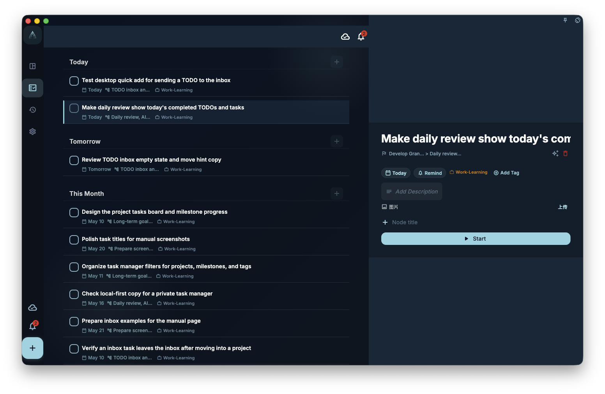

When you are looking for something in the desktop app, start on the left to switch pages, use the middle area for the task list or current page, and, on a wide enough window, click a task to see its details on the right without leaving the list.

## Widescreen layout

The biggest difference between desktop and mobile is the wider screen. On a wide screen, GranoFlow can show navigation, the list, and task details in the same window, so you do not have to switch back and forth as much.

- **Left sidebar**: This is the navigation area. Use it to switch between views such as Inbox, Projects, Review, and more.
- **Center content area**: This shows the task list or the page you currently have open.
- **Right detail panel** (on wide screens): After you click a task, its details open on the right. This lets you keep the list visible while you view or handle the task.

If the window is narrow, the desktop app collapses the sidebar and behaves more like the mobile app. If you cannot find the left sidebar, try making the window wider or look for the collapsed menu entry.

## Keyboard first

The desktop app is well suited to fast keyboard operation. You do not need to memorize every shortcut; start with the common ones.

- **Quick-add task**: Usually opened with a global shortcut. You can configure this shortcut in Preferences.
- **Navigate the list**: Use the arrow keys to move between tasks.
- **Complete a task**: Press the corresponding shortcut on a task. The exact key depends on what the interface shows or how you have configured it.

If a shortcut conflicts with another app, change it in GranoFlow Preferences to a combination that feels natural and is harder to press by mistake.

## Drag to reorder

On desktop, you can drag tasks directly to change their order. You can also drag tasks into different projects or time slots to rearrange where they belong.

Before dragging, make sure you are dragging the task itself, not opening its details, selecting text, or clicking another button. If the task does not move, the current view may not support that kind of ordering, or the task may not be movable to that target location.

:::tip[Configure your global shortcut]
You can customize the global summon shortcut in GranoFlow Preferences. Once it is configured, press that shortcut from another app to open GranoFlow.
:::
