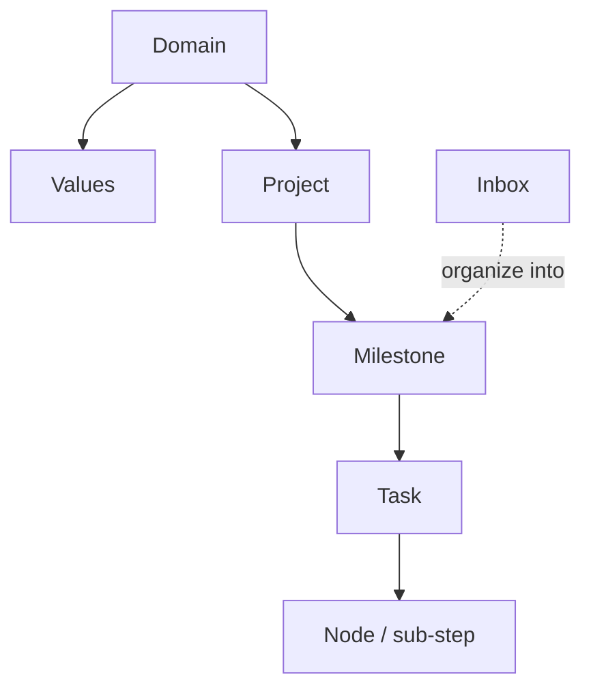

Do not know what a word means? This page covers everything, two or three sentences at a time.

Here is how everything relates to each other:

---

## Life structure

### Domain

Domains are the broad areas of your life — things like "Work," "Health," "Family," or "Learning."

Domains do not hold tasks directly. Think of them as zones on a map: projects belong to a domain, and in review you can see where your time and energy actually went.

### Values

A value is a long-term standard you hold for a domain — for example, "In work: only do things that have real impact."

Values are not tasks and cannot be completed. Their role is to give you something to compare your actions against during review.

### Project

A project is a container for a goal you are working toward over time, like "Apartment move," "Finish dissertation," or "App v2."

Tasks live inside projects. Inbox tasks disappear from the inbox the moment you assign them to a project. Projects can be archived or completed, but the system will prompt you to handle any active tasks underneath them first.

### Milestone

A milestone is a phase within a project — a checkpoint that breaks a big goal into trackable stages, like "First draft done" or "Testing passed."

Tasks inside a milestone must all be finished before the milestone can be closed. This keeps you from ever feeling like you are walking down an endless road.

### Task

A task is the basic unit of action in GranoFlow — the specific thing you are going to do.

A task can have a title, due date, reminder, tags, project, milestone, description, and status. Statuses include: to-do, in progress, completed, archived, and trash. Completion records the exact time it was finished.

### Node

A node is a step inside a task — useful when one task is actually several things.

For example, the task "File taxes" might have nodes "Gather receipts," "Fill out form," and "Submit." When all nodes are complete the parent task completes automatically. Adding an unfinished node brings the parent back to to-do.

### Inbox

The inbox is a holding area for tasks that have not been scheduled or assigned yet.

Only tasks with no due date, no project, and no milestone appear in the inbox. Give a task a date or assign it to a project and it leaves automatically. Think of the inbox as a note stuffed in your pocket — safe for now, sort it out later.

---

## Work rhythm

### Planning

Planning means turning a vague idea into something with a date, project, or both.

You can plan in quick-add, in the inbox, or in task detail. The `#` `@` `~` shortcuts in the input field are shortcuts, not auto-saves — everything needs your confirmation.

### Execution

Execution means actually doing the task. You can use focus timing, pinned tasks, or background sound alongside it.

When a task is completed, GranoFlow first closes any open focus sessions, then records the completion time — keeping review stats clean.

### Completion

Completion records a timestamp on the task.

Daily review uses this timestamp, not the due date. Tasks finished before 3 AM count toward the previous calendar day.

### Archive

Archiving means sealing something away — it leaves your active views but stays accessible.

Projects, milestones, and tasks can all be archived. If there are active tasks underneath, the system asks how you want to handle them first.

### Daily review

Daily review is a page that shows everything you actually completed on a given day, by completion time.

Days with nothing completed show a quiet empty state — no guilt graphs.

### Retrospective

A retrospective is a longer-range look at your input, progress, and patterns — weekly, monthly, or across a project.

The goal is not counting completions. It is understanding where you invested your attention and whether that matches your priorities.

---

## AI assistance

### AI assistant

The AI assistant is the external tool you choose — ChatGPT, Claude, Gemini, DeepSeek, or any other.

GranoFlow does not embed an AI that silently edits your data. It prepares a prompt, copies it to your clipboard, and opens your chosen AI.

### Prompt

A prompt is the instruction text GranoFlow sends to your AI, describing what it should ask, organize, and return.

You can edit templates. Blank or broken templates cannot be saved.

### Clipboard return

Clipboard return is the flow for bringing AI-generated results back into GranoFlow.

AI output is never written silently. You copy the result back, GranoFlow identifies the format and shows a confirmation, and import only happens if you approve. Content you have already imported or declined will not prompt you again.

---

## Data and security

### Local-first

Local-first means GranoFlow's core data lives on your device — offline use works normally.

Data only enters encryption when it leaves the device (backup, cloud sync).

### Cloud sync

Cloud sync keeps your devices aligned. Before syncing, the system checks your account, membership, and encryption key.

If anything does not match, syncing is paused with guidance — not silently overwritten.

### End-to-end encryption (E2EE)

End-to-end encryption means data is encrypted before it leaves your device. The server stores ciphertext only and cannot read your tasks.

Local use prioritizes speed. Backup and cloud upload go through the encryption process.

### Encryption key

The encryption key is the credential that unlocks your encrypted backup and cloud data. It is **not** your login password.

If you lose the key, your encrypted data cannot be recovered — not even by GranoFlow support.

### Backup and restore

Backup exports everything to a `.flow.grano` file, protected by your encryption key.

Restore imports that file back into GranoFlow, requiring the same key. If attachments were not fully downloaded at backup time, they may be missing.

### App lock

App lock adds a local authentication step (Face ID, fingerprint, or PIN) when you open GranoFlow.

It reduces the risk of someone briefly picking up your device and reading your notes. It does not protect against a fully compromised device.

---

## Account and entitlements

### Account

Your account handles sign-in, sync, device management, and subscription recognition. Sign-in uses email verification codes.

You can use local features without signing in, but the cloud sync entry point will prompt you to sign in first.

### Membership and entitlements

Membership (Pro or Angel Member) means you have paid for core benefits. Entitlements are confirmed by the server, not the client.

They affect cloud sync, storage quota, and attachment download. A subscription linked to a different account does not automatically apply to your current one.

---

## Interface and devices

### Desktop vs mobile

Desktop (Windows / macOS / Linux) is better for extended organizing, project management, and review. Mobile (iOS / Android) is better for quick capture and on-the-go access.

### System tray

On desktop, closing the window may just hide GranoFlow to the tray — focus timers keep running. To fully quit, use the tray menu.

### Sidebar mode

Desktop can run as a narrow sidebar docked to the edge of your screen, visible alongside whatever else you are working on.
