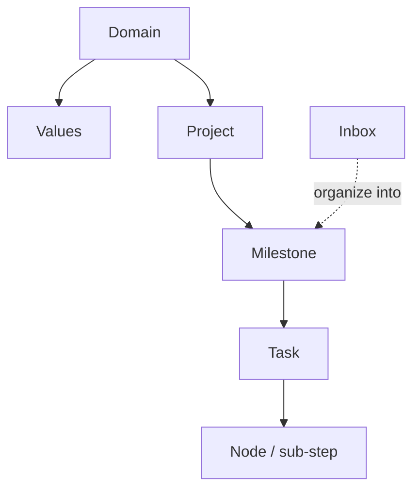

If you see a term in GranoFlow and do not know what it means, use this page to check what it is, where it is used, and how it connects to the rest of the app.

The main structure is simple: domains contain values and projects, projects contain milestones, milestones contain tasks, and tasks can contain nodes. Inbox tasks can later be organized into a project or milestone.

---

## Life structure

### Domain

A domain is a broad area of your life, such as "Work," "Health," "Family," or "Learning."

It is not a task folder, and tasks do not live directly inside it. Think of it as an area on your life map: projects belong to a domain, and reviews show where your effort has been going.

### Values

A value is a long-term standard you want to follow inside a domain, such as "At work, only do things that have real impact."

It is not a task, cannot be completed, and does not check anything off automatically. Its job is to help you ask, during review, whether your actions matched your own standards.

### Project

A project is a container for a goal that takes time to move forward, such as "Move apartment," "Finish dissertation," or "Build App v2."

Tasks can belong to projects. Once an inbox task is assigned to a project, it automatically leaves the inbox. Projects can be archived or completed; if there are still active tasks inside, the system asks you what to do with them first.

### Milestone

A milestone is a stage inside a project. It breaks a large project into smaller checkpoints, such as "First draft done," "Testing passed," or "Launch."

A milestone can contain tasks. It can be closed only after its tasks are complete. This gives long projects clear stages instead of making them feel like one endless piece of work.

### Task

A task is the basic unit of action in GranoFlow: the specific thing you are going to do.

A task can have a title, due date, reminder, tags, project, milestone, and description. Task statuses include to-do, in progress, completed, archived, and trash. Completing a task records a completion time; uncompleting it clears that time.

### Node

A node is a sub-step inside a task, used to break down a complicated task.

For example, the task "File taxes" could have nodes like "Gather receipts," "Fill out form," and "Submit." When all nodes are complete, the parent task completes automatically. If you add a new unfinished node, the parent task returns to to-do.

### Inbox

The inbox is a temporary place for tasks you want to capture now and organize later.

Only tasks with no due date, no project, no milestone, and a status of to-do or in progress appear in the inbox. Once you add a date or assign the task to a project, it leaves the inbox automatically. Think of it like a note in your pocket: put it there first, sort it out later.

---

## Work rhythm

### Planning

Planning means turning a vague idea into an actionable task with a date, a project, or at least clearer details.

You can plan from quick-add, inbox cleanup, or task details. The `#` `@` `~` shortcuts in the input field are shortcuts, but anything that writes data still needs your confirmation.

### Execution

Execution means doing the task itself.

You can use it with focus timing, pinned tasks, or background sound. When a task is completed, GranoFlow first closes related focus sessions, then records the completion time, so review data does not get confused by messy time ranges.

### Completion

Completion means the task is done and a completion time is recorded.

Daily review uses the day the task was actually completed, not its due date. Each new review day starts at midnight, so tasks completed after midnight belong to the new day.

### Archive

Archiving means the item is sealed away from current work views, while its record is still kept for later reference.

Projects, milestones, and tasks can all be archived. If there are active tasks underneath, the system asks you what to do with them first.

### Daily review

Daily review is the page for seeing what you actually completed on a given day.

It counts by completion time, not due date. If nothing was completed that day, the page shows a quiet empty state instead of a stressful empty chart.

### Retrospective

A retrospective is a longer look at your effort, progress, and patterns.

You can do this in weekly review, monthly detail, and similar views. The point is not just how many tasks you finished; it is whether you worked on what mattered and whether your effort was balanced.

---

## AI assistance

### AI assistant

The AI assistant is the external AI tool you choose, such as ChatGPT, Claude, Gemini, or DeepSeek.

GranoFlow does not include a hidden AI that silently edits your data. It prepares a prompt, copies it to your clipboard, and opens the AI tool you selected.

### Prompt

A prompt is the instruction text GranoFlow gives to the external AI. It tells the AI what to ask, what to organize, and what format to return.

You can edit prompt templates, but the system blocks blank or broken templates from being saved.

### Clipboard return

Clipboard return is the process of copying AI-generated results back into GranoFlow.

AI replies are not written into your tasks automatically. After you copy the result back, GranoFlow identifies the format and shows a confirmation. The content is imported only after you approve it. Content you already declined or imported will not keep popping up.

---

## Data and security

### Local-first

Local-first means GranoFlow's core data is stored on your device first, so the app can work without relying on a server.

You can capture tasks, organize them, and review them offline. Data enters the encryption flow only when it leaves the device, such as during backup or cloud sync.

### Cloud sync

Cloud sync aligns your local data with cloud data so different devices can show the same content.

Before syncing, the system checks whether the account, membership status, and encryption key match. If something does not match, it pauses and guides you to confirm instead of silently overwriting data.

### End-to-end encryption (E2EE)

End-to-end encryption means data is encrypted before it leaves your device, and the server stores ciphertext.

This means GranoFlow's server cannot read your task content. Local search and everyday use prioritize speed; backup and cloud upload go through the encryption process.

### Encryption key

The encryption key is the credential that unlocks encrypted backups and cloud data. It is **not** your login password.

The key matters. If you lose it, old backups or matching encrypted cloud data cannot be unlocked. GranoFlow reminds you several times to save the key, but the server cannot recover a lost key for you.

### Backup and restore

Backup exports all data on the device into a `.flow.grano` file protected by your encryption key.

Restore imports that backup file back into GranoFlow and requires the key used when the backup was created. If attachments were not fully downloaded at backup time, the backup may not contain complete attachments.

### App lock

App lock adds a local authentication step when you open the app, such as Face ID, fingerprint, or PIN.

It reduces the risk of someone briefly picking up your device and reading your content. It is not complete protection; if the device itself is compromised, app lock cannot stop that.

---

## Account and entitlements

### Account

Your account is used for sign-in, sync, subscription recognition, and account recovery.

The main sign-in method is currently email verification codes. You can use local features without signing in, but cloud sync will guide you to sign in first.

### Membership and entitlements

Membership, including Pro or Angel Member, means you have purchased official benefits.

Entitlements are confirmed by the server, not decided by the client. They affect cloud sync, storage quota, attachment re-download, and related features. If a subscription is linked to another account, the current account does not automatically receive those entitlements.

---

## Interface and devices

### Desktop vs mobile

Desktop, meaning Windows, macOS, and Linux, is better for longer organizing sessions, project management, and review.

Mobile, meaning iOS and Android, is better for quick capture and on-the-go use.

### System tray

On desktop, closing the window may only hide GranoFlow to the system tray, while it keeps running in the background.

In that case, focus timers keep running. To fully quit, choose "Quit" from the tray menu.

### Sidebar mode

On desktop, GranoFlow can become a narrow window docked to the edge of your screen.

This lets you check or tick off tasks while working on something else.
