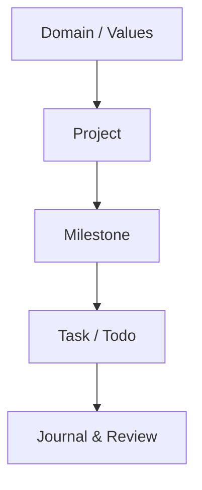

You can use GranoFlow as a simple Todo app — capture a task, check it off, move on. But it is closer to a structured life journal.

Every task can connect to a project, and every project can tie back to an area you care about (like "health," "writing," or a side project). When you sit down for a daily or weekly review, you are not just looking at a crossed-out list — you are asking whether you have been moving in the direction you actually want.

That is the real difference from an ordinary task manager.

## Tasks are just the entry point

Want to capture something quickly? Open GranoFlow, type, done in seconds.

When you have more time, decide which project it belongs to and when you want to do it. Think of it like dropping a receipt in your pocket — it is safe for now, you will sort it out later. GranoFlow does not push you to organize everything the moment you capture it.

Tasks are the clues, projects are the containers, and your values give it all direction.

## More than a to-do list

Most to-do tools start and end with today. GranoFlow has more depth:

Here is how everything connects, from big goals down to daily tasks:

This means that even if you only finished three things in a week, you can see whether those three things actually moved you closer to your goals — instead of just knowing you were busy.

## Review without the guilt trip

GranoFlow has daily and weekly review built in, but it is not a streak tracker.

It is more like a light journal assistant — you note what happened, how it felt, what you want to do next, and then you close it. No shame, no pressure, no streak to break.

## Your data stays with you

GranoFlow is local-first: your data lives on your device and works offline. Sync, backup, and encryption are controls you manage, not hidden background processes.

The AI features help you organize your review notes, but every decision stays yours.

:::note[New here?]
The only thing you need to know when you first open GranoFlow: tap **+** to add a task. Explore the rest when you feel like it.
:::
