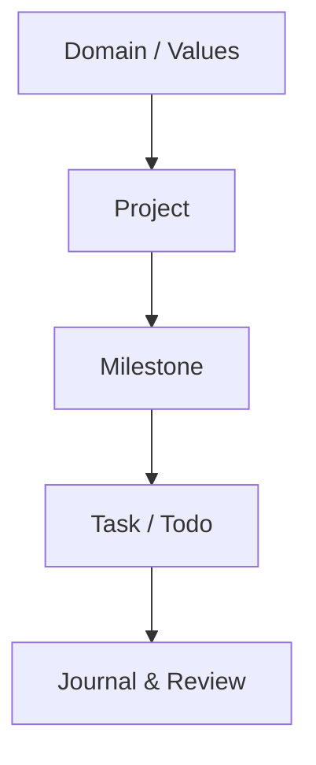

GranoFlow is a local-first personal planning app. You can start by using it like a Todo app: write down tasks, plan when to do them, and check them off. Later, you can connect those tasks to projects, milestones, values, and reviews, so you can see whether your daily work is moving something important forward.

## Tasks are just the entry point

The simplest way to use GranoFlow is this: when something comes to mind, add it as a task. You do not have to organize everything right away.

When you have more time, you can decide which project the task belongs to, which milestone it relates to, and when you want to handle it. In GranoFlow, a task is not just an isolated item on a list. It is an entry point for putting everyday work back into a larger life structure.

## More than a to-do list

A normal Todo tool usually answers one question: what do I need to do today?

GranoFlow helps you look one level deeper: which project does this task belong to? Which milestone is that project moving toward? Does this work connect to a direction you care about?

Here is the common structure inside GranoFlow:

This means that even if you only finish a few things in a week, you can look back and ask: did they only keep me busy, or did they move a project forward?

## Review without the guilt trip

GranoFlow is also a review tool. Daily reviews and weekly value notes are not there to create streak pressure or turn a pause into a failure.

You can use them to record what happened, what you were thinking, and what you want to adjust next. The point of review is to see the facts more clearly, not to blame yourself.

## Keep your planning space private

GranoFlow follows a local-first product approach. Core records start on your device; sync, backup, and encryption each have clear boundaries.

AI-assisted review can help you organize your thoughts, but it is only assistance. Whether to accept a suggestion, how to adjust, and what to do next are still your decisions.

:::note[New here?]
The first thing to know when you open GranoFlow: tap **+** to add a task. You can explore the rest when you actually need it.
:::
