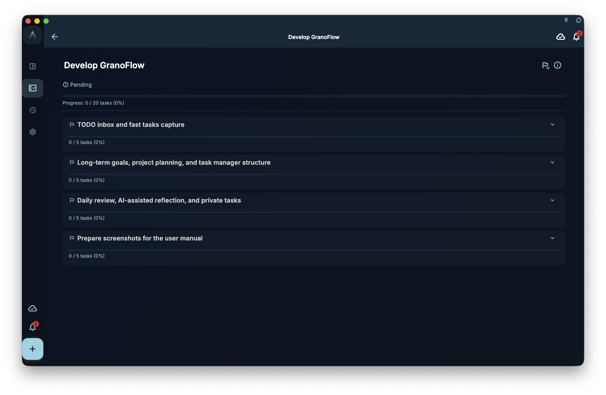

This chapter turns Tiny Habits, the Fogg Behavior Model, and micro habits into a GranoFlow practice: low-friction tasks, natural prompts, completion feedback, and daily review. It connects habit formation to long-term projects instead of streak pressure.

Tiny habits make action easier.

But if a habit only remains "I checked the box today," you may soon ask:

> Why am I doing this?

GranoFlow's value is connecting tiny habits back to long-term projects, values, and review so they do not remain isolated actions.

## Work back from the tiny habit to a project

After a tiny habit appears a few times, ask:

> What longer effort does this action belong to?

For example:

| Tiny habit | Possible project |
| --- | --- |
| Stretch for 2 minutes after dinner | Build a three-month basic exercise rhythm |
| Listen to English for 3 minutes each day | Restart English listening input |
| Write down one completed thing before bed | Build a daily review rhythm |
| Organize one inbox task after opening the computer | Reduce work startup friction |

If the action really will continue, create a project in GranoFlow. A project does not need to be large. It simply holds a direction that continues for a period of time.

<!-- manual-screenshot:id=projects-milestones-detail -->


## Use milestones to reduce pressure

Habit formation is often written as an endless goal:

> Exercise forever  
> Study English every day  
> Always stay disciplined

That is heavy.

Use stages instead:

- Week 1: only establish the trigger
- Week 2: keep the smallest version
- Week 3: observe whether the timing needs to change
- Week 4: decide whether to continue, expand, or let it go

That is what milestones are for. They do not ask you to keep going forever. They tell you what to observe in the current stage.

## Use review to decide whether it fits

Not every habit is worth continuing.

Some tiny habits are easy but not meaningful.  
Some habits look correct but conflict with your actual rhythm.  
Some habits work at first, then need a new time, prompt, or action.

In review, ask:

- Did this habit actually lower friction?
- Does it connect to a direction I value?
- When it failed, was the behavior too large or the prompt unnatural?
- Is it still worth continuing, or should I try another version?

GranoFlow review is not there to prove that you did everything every day.

It helps you see whether the habit design fits real life.

## Return after an interruption

Tiny Habits practice does not need to treat interruption as failure.

In GranoFlow, you can restart with a short review:

```text
What was the previous tiny habit?

Why did it stop?

What is the smallest version I am willing to restore now?
```

For example:

```text
The previous habit was stretching for 2 minutes after dinner.

It stopped because dinner time became unstable.

I will restart with 1 minute of stretching before bed.
```

This is gentler than "start another 30-day streak," and it is closer to real life.

## A complete structure

You can use GranoFlow like this:

> Domain: body and energy  
> Value: I want to care for my body instead of constantly draining it  
> Project: build a three-month basic exercise rhythm  
> Milestone: in week one, only establish the trigger  
> Task: before bed, stretch for 1 minute  
> Review: this is small, but bedtime is more stable than after dinner, so I will keep observing

This is where GranoFlow and Tiny Habits meet:

Tiny Habits helps you make the behavior small enough to begin.  
GranoFlow helps you place that small behavior inside a longer structure and review whether it is worth continuing.

## Next

If you have not created your first tiny habit yet, return to [Build one tiny habit in 5 minutes](/en/habit-formation-tiny-habits/practice-loop/).

If you want to connect habits and projects more deeply, continue with [Projects and milestones](/en/value-to-action/projects-and-milestones/) and [Review](/en/value-to-action/review-reflection/).
