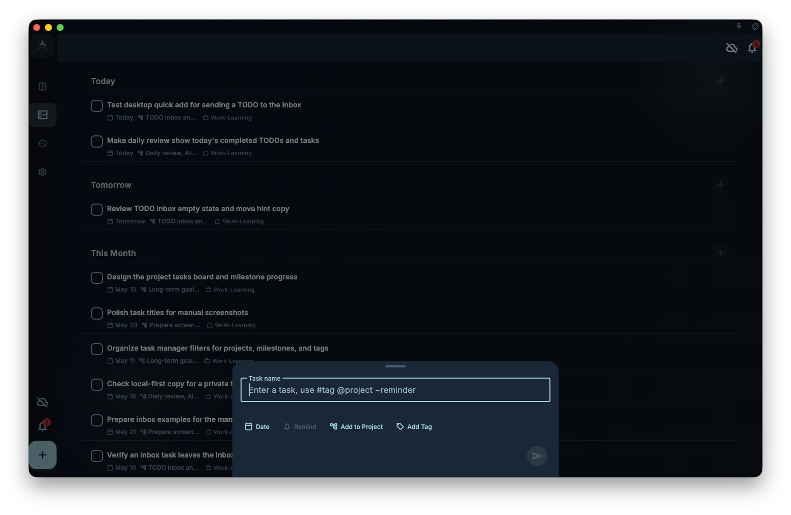

This chapter turns Tiny Habits, the Fogg Behavior Model, and micro habits into a GranoFlow practice: low-friction tasks, natural prompts, completion feedback, and daily review. It connects habit formation to long-term projects instead of streak pressure.

This page gives you a short practice.

The goal is not to build a complete habit system at once. The goal is to complete one tiny habit loop in GranoFlow in about 5 minutes:

> Choose a direction → write a small task → find a prompt → complete it → review

## Step 1: Choose a real direction

Do not begin with "what impressive habit should I build?"

Ask instead:

> What part of my life do I want to make a little steadier?

For example:

- Body and energy
- English learning
- Writing
- Bedtime cleanup
- Daily review
- Project momentum

The direction can be ordinary. Habit formation often fails when the first version is too grand.

## Step 2: Shrink it into a task

Write a task in GranoFlow that is small enough to start.

<!-- manual-screenshot:id=interface-quick-add-main -->


Instead of:

> Keep exercising

Write:

> After dinner, stretch for 2 minutes

Instead of:

> Improve my English

Write:

> Listen to English for 3 minutes

Instead of:

> Review every day

Write:

> Before bed, write down one thing I completed today

The test is simple: if you still want to avoid it, the task may not be small enough.

## Step 3: Give it a natural prompt

Tiny Habits puts a lot of weight on prompts. A behavior without a trigger can easily be pushed aside by the day.

You can include the trigger directly in the task title:

- After breakfast, read 1 page
- Before shutting down the computer, write tomorrow's first task
- After brushing teeth, stretch for 1 minute
- After opening GranoFlow, organize one inbox task

The prompt does not need to be complex. It works best when it follows something you already do.

## Step 4: Complete only the smallest version

Do the smallest version, then mark the task as completed.

Do not turn 2 minutes into 30 minutes on the first day just to prove that you have finally changed.

The value of a tiny habit is lower starting friction. You can do more if you want, but the version you record in GranoFlow should still be small enough that you are willing to return tomorrow.

## Step 5: Write a short review

At the end of the day, three sentences are enough:

```text
What tiny habit did I complete today?

What moment did it follow?

Was this version easy enough to continue?
```

For example:

```text
I stretched for 2 minutes after dinner.

It followed cleaning up the dishes, so the prompt felt natural.

The action was small enough. I can continue tomorrow.
```

Review is not a test of perfect consistency.

It is a way to observe whether the habit design works: Is the behavior small enough? Is the prompt natural? Do you feel willing to come back after doing it?

## Do not stack too many habits

Start with one.

GranoFlow can hold many tasks, projects, and reviews, but habit formation does not need to fill your whole life at once. Let one tiny behavior show up steadily before deciding whether to expand it.

Next, read [Connect tiny habits back to long-term projects](/en/habit-formation-tiny-habits/from-habit-to-project/).
